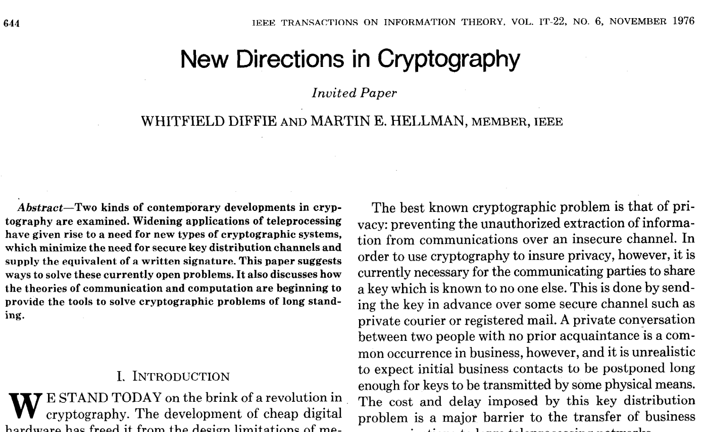
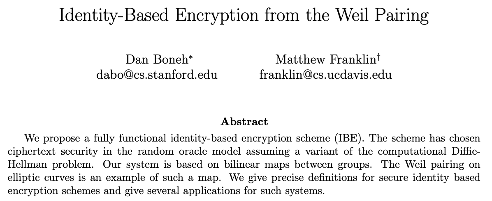

# VETKeys Primer

The **VETKeys** feature is in ongoing development on the Internet Computer (IC). It stands for ‘**V**erifiable **E**ncrypted **T**hreshold Keys’ and enables a number of cryptographic functionalities on the IC. The primary motivation for VETKeys is to facilitate onchain encryption, as such we focus this primer with that example in mind. 

One thing less discussed about the VETKeys feature is how we got here in terms of cryptography. The goal of this post is to lay some crypto background so that you can better understand the VETKeys talks, paper, and future posts. Note that understanding these foundations of VETkeys will *not* be necessary to use them for building applications, but we explain for those who are interested to dive deeper and want to understand the background. Let’s start at the start. 

## Crypto primitives
In cryptography, a ‘[primitive](https://en.wikipedia.org/wiki/Cryptographic_primitive)’ is a kind of foundational building block that can be used solely for its given functionality, or to build other, more complex, cryptographic tools and protocols.
Some examples of the core primitives include: 
* Block ciphers (eg. [AES](https://en.wikipedia.org/wiki/Advanced_Encryption_Standard))
* Hash functions (eg. [SHA3](https://en.wikipedia.org/wiki/SHA-3), [BLAKE3](https://en.wikipedia.org/wiki/BLAKE_(hash_function)#BLAKE3))
* Key exchange (eg. [Diffie-Hellman](https://en.wikipedia.org/wiki/Diffie%E2%80%93Hellman_key_exchange))
* Signature schemes (eg. [ECDSA](https://en.wikipedia.org/wiki/Elliptic_Curve_Digital_Signature_Algorithm), [BLS](https://en.wikipedia.org/wiki/BLS_digital_signature))
* Public key encryption schemes (eg. [RSA](https://en.wikipedia.org/wiki/RSA_(cryptosystem)), [ElGamal](https://en.wikipedia.org/wiki/ElGamal_encryption))

VETKeys introduces *new primitives*, and most notably **VETKD**. VETKD extends an older primitive called identity based encryption (IBE), which itself is an extension of public key encryption.

## Public key encryption (PKE)
*"We stand today on the brink of a revolution in cryptography"*, possibly the greatest opening line of any crypto paper, was penned by Whit Diffie and Martin Hellman in 1976 in their New Directions paper introducing public key cryptography. 

As everyone uses PKE everyday, it's assumed that you have some intuition about what it is, but we describe it here to set the stage for what we build later. PKE allows to communicate confidentially over a public channel by encrypting messages. Suppose Alice wants to send an encrypted message to Bob, a PKE scheme will run somewhat as follows: 

* Bob uses a key generation algorithm $\mathsf{KG}$ to generate a private and public key pair $(\mathit{sk_{bob}, pk_{bob}})$.
* Bob stores his public key online (eg in a public key infrastructure (PKI)).
* Alice retrieves Bob's public key $\mathit{pk_{bob}}$ (eg from the PKI) and uses it to encrypt a message to Bob using an encryption algorithm $\mathsf{Enc}$ and sends the resulting ciphertext to Bob.
* When Bob wants to decrypt the ciphertext from Alice, he uses his secret key ${\mathit{sk_{bob}}}$ with a decryption algorithm $\mathsf{Dec}$ to decrypt and retrieve the message.

:::info
The standard practice in public key cryptography is to generate a secret key, and from that, derive a public key. This gives little control over how the public key *looks* and results in us needing to rely on a trusted public key infrastructure (PKI) to manage mappings between users and their public keys. This can get complicated very quickly (have you ever tried to send an encrypted email?) and discourages use of crypto in practical applications.
::: 

## Identity based encryption (IBE)
As many things in cryptography, IBE was introduced by Adi Shamir [Shamir84]. Providing a concrete instantiation remained an open problem from its introduction 1984 to 2001, when there was a breakthrough in of Number Theory which gave some new mathematical tools to build with. Two IBE schemes were proposed, based on different hard problems. Here we will focus on the IBE introduced by Dan Boneh and Matthew Franklin which we will refer to as [BF01].

IBE addresses some of the usability issues with PKE. It allows to take an arbitrary string as the public key (say “alice@email.com” or “@alicetweets”) and derive the secret key from that.

To see how an IBE scheme can work, let's consider the following scenario. Suppose Alice wants to encrypt a message to Bob using $\mathit{id_{bob}}$. The typical scenario requires that there is a trusted Key Deriver (KD), and runs as follows:

* KD runs the IBE key generation algorithm to generate a master (private and public) key pair ($\mathit{msk, mpk}$).
* Alice runs the IBE encryption algorithm to encrypt a message to Bob using $\mathit{id_{bob}}$ and KD’s $\mathit{mpk}$ and sends the resulting ciphertext to Bob.
* Bob authenticates $\mathit{id_{bob}}$ to KD and requests a corresponding decryption (private) key ($\mathit{sk_{bob}}$). 
* KD derives $\mathit{sk_{bob}}$ from $\mathit{id_{bob}}$ using $\mathit{msk}$ and then sends it to Bob.
* Bob uses $\mathit{sk_{bob}}$ and $\mathit{id_{bob}}$ to decrypt the ciphertext from Alice to retrieve the message.

:::info

There is a crucial point to note about this type of IBE scheme; A central authority derives (decryption) keys. As we find ourselves in the blockchain world, naturally we are not keen to work with a trusted third party, so one core goal is to decentralize the key derivation procedure of IBE.

:::

## VETKD
Considering that blockchains are very public places where transparency has been a crucial factor in gaining integrity and availability, it is not immediately obvious how one would achieve confidentiality or privacy in a non-competing way. This is the mission of VETKD.

### The threshold setting
Note that we care most about the secret ***key derivation*** here, as that is the most sensitive part which we want to protect from one central (potentially untrusted, unauthorized, or compromised) party, and hence the **KD** in VETKD. To deal with the centralization point, we need to move into the distributed setting.  Assuming there is no one trusted party, we distribute trust amongst multiple parties, and require that some *threshold* of them collaborate on shares of the master secret key to derive decryption keys.

How do parties **get shares** of the master secret key? This is done by leveraging a distributed key generation (DKG) protocol, where a threshold of honest parties (or nodes) work together to obtain a set of master key shares. Assuming no collusion between nodes, at no point does any one node hold the full private key.
Click around to learn more about [threshold cryptography]( https://en.wikipedia.org/wiki/Threshold_cryptosystem), [DKG](https://en.wikipedia.org/wiki/Distributed_key_generation) and chapter 22 in the [Boneh-Shoup book](http://toc.cryptobook.us/).

It’s clear from above that we don't want a centralised key derivation process and this is why we need the **T** for the KD process, but what about **V** and **E**? Perhaps this is best highlighted by a scenario.

### Syntax
Suppose Alice wants to send an encrypted message (across a public blockchain) to Bob. We know that key management is hard, especially in the Web3 setting, so it’s desirable to be able to *derive keys on demand*. The scenario runs as follows:

* Nodes in the network participate in the $\mathsf{DKG protocol}$ to obtain shares of a master secret key ($\mathit{msk}$) and a master public key ($\mathit{mpk}$). This results in each node $i$ holding key shares $(\mathit{msk_i, mpk_i})$.
* Alice encrypts a message under Bob's identity $\mathit{id_{bob}}$ and the master public key $\mathit{mpk}$ and sends the resulting ciphertext to Bob.
* Bob wants to decrypt and authenticates $\mathit{id_{bob}}$ to the IC and requests to derive a decryption key. Stop! 

Note that if we continue in this scenario, the nodes will derive a decryption key and send the shares to Bob.. but, in a public network, those shares can be seen and can be combined by an observer. We require that derived key shares are encrypted for transport so that any observer or malicious nodes cannot combine them to obtain $\mathit{sk_{bob}}$. So, let’s continue.

* Bob wants to decrypt and authenticates $\mathit{id_{bob}}$ to the IC. He uses a transport key generation algorithm $\mathsf{TKG}$ to generate and send a transport public key $\mathit{tpk}$ and requests to derive a decryption key. By sending $\mathit{tpk}$ Bob gives the nodes a way to encrypt their responses to him.
* If Bob’s authentication to $\mathit{id_{bob}}$ passes (likely performed by a dapp), nodes in the network use an $\mathsf{EKDerive}$ algorithm derive decryption key shares using $\mathit{msk}$ and $\mathit{id_{bob}}$ and encrypt them under $\mathit{tpk_{bob}}$. Note, this is the **E** requirement in VETKD.

In a threshold system, sufficiently many key shares are required to produce a valid key. In this case it is useful to know when or if we have sufficiently many valid key shares so that the process can stop.

* Anyone can use an $\mathsf{EKSVerify}$ algorithm to verify that the encrypted keys shares do indeed contain a legitimate decryption key share, and thus can know when 'enough' valid shares exist. This explains the **V** requirement in VETKD.
* Nodes can also combine encrypted shares to produce the full encrypted derived key $\mathit{ek}$ using a $\mathsf{Combine}$ algorithm. 
* An $\mathsf{EKVerify}$ algorithm allows anyone to verify that $\mathit{ek}$ does indeed contain a legitimate derived key for $\mathit{id_{bob}}$ under $\mathit{mpk}$ encrypted under $\mathit{tpk_{bob}}$. 
* Finally, a recovery algorithm $\mathsf{Recover}$ enables Bob to decrypt the derived key corresponding to $\mathit{id_{bob}}$ under $\mathit{msk}$ using Bob’s TSK.
* Bob can now decrypt.

This picture is taken directly from the paper, where you can read the full scenario.

All algorithms mentioned ($\mathsf{DKG, TKG, EKDerive, EKSVerify, Combine, EKVerify, Recover}$) form the *syntax* that describes the VETKD primitive. To describe a primitive fully, it's needed also to note the correctness (a description of the primitive's intended behavior), security (under what kinds of attacks from which kinds of adversaries will the primitive remain secure), and a construction (a description of how we can construct a protocol that captures the desired syntax, correctness and security). Correctness and Security differ depending on the application (signatures, IBE, etc) so we defer to the paper to get an overview of these.

### Construction
Now we see the aim for VETKD, and how it can be described. The next natural question is to ask how we can build such a primitive. Which building blocks do we need?

At a first glance, we could guess that we will need a distributed key generation scheme to generate and distribute master secret key shares among the nodes. We could also guess that we'll need a public key encryption scheme to encrypt derived key shares under the transport key of the user. The main question that remains is how to derive decryption keys.

Crucially, An observation buried in [BF01] gives us the answer. Moni Naor noted that an IBE scheme can be directly converted into a signature scheme. Considering the key derivation of Boneh-Franklin IBE specifically, the resulting signature scheme happens to be BLS.

### BLS signatures
Digital signatures are used everywhere in cryptography and in the blockchain world to attest to the authenticity of a message, transaction, or other pieces of information. As they are so prevalent, it’s really worth spending time getting to know them. You can get a high level view on wikipedia ([Digital Signatures](https://en.wikipedia.org/wiki/Digital_signature) and [BLS](https://en.wikipedia.org/wiki/BLS_digital_signature)), and dive into the [Boneh-Shoup book](http://toc.cryptobook.us/) when you want more formal details.

BLS signatures are a particular type of digital signature introduced in by Dan Boneh, Ben Lynn, and Hovav Shacham in 2001. 

The main feature of BLS signatures is that they’re very short, unique, fast to compute, aggregatable, and easy to port to the distributed setting (relative to other signature schemes at least..). This makes them a great candidate signature scheme for the blockchain setting. 
As with any signature scheme, BLS comprises three algorithms; a (potentially distributed) key generation algorithm ((D)KG), a signing algorithm (Sign) and a verification algorithm (Verify). In the threshold setting, this is extended to include a fourth combination algorithm (Combine).
Threshold BLS signatures are used a lot on the Internet Computer, so let’s use that as the motivating example for the scenario. Suppose nodes in a subnet want to convince Alice that a particular message is being sent from the IC. At a very high level, the scenario will run as follows:
* Nodes in the network participate in the DKG process and obtain (private) key shares.
* Each node computes a signature share on a message $m$ using its share of the signing key. 
* Nodes participate in a $\mathsf{Combine}$ process to combine signature shares and produce a single signature which is then sent to Alice.
* Alice uses a verification algorithm $\mathsf{Verify}$ to check whether the signature sent from the nodes verifies under the public key of the Internet Computer.

We noted above that IBE implies signatures. From the [BF01] paper the intuitive construction is to set the private key for the signature scheme to be the master key of the IBE. Then set the public key for the signature scheme to be the system parameters of the IBE. Then the signature on a message M is the IBE Decryption key for ID = M. In the VETKD scenario, the master key of the IBE scheme is a BLS signature key secret shared over the nodes. The derivation identity will be threshold signed, resulting in a signature that can act as a symmetric encryption key, but also as a Boneh-Franklin decryption key.

### Putting everything together
VETKD is a new primitive that can be used to extend identity based encryption in a decentralized setting. The main tools needed to build VETKD are a DKG, a PKE (we use ElGamal), and threshold BLS signatures, and are used to obtain keys as follows: 

* Master key - DKG issued BLS signing key
* Transport keys - ElGamal key pair
* Encrypted key share - BLS signature shares on the identity, encrypted under ElGamal public key
* Combined encrypted key - A threshold of valid encrypted key shares are combined (in the blockchain scenario likely by a block maker) to give the encrypted derived key
* Decryption key - ElGamal decryption of combined encrypted derived key

Having these VETKeys opens a goldmine of functionality. There are further descriptions the VETKey family, i.e. extending VETKD to VETIBE, to VETSigs, to a VETPRF, and VETVRF. Future posts can go into details on these.

## Remarks
This page contains a high level view and description of VETKD and its building blocks. The goal of this page is to build intuition for developers building on the IC, who are interested to know more about the technical choices, but who may lack the cryptographic background necessary to read research papers (for now). 
It also shows one possible way of building VETKD, there are others, some with fancy features, that are described more in the paper. There are many use cases and motivations for building VETKD, these are discussed in [the video](https://youtu.be/baM6jHnmMq8) and can be written up if you like. There are also extensions that could be built depending on what is needed in the community. Finally, note that this page is hosted onchain.

## References
* [BS23](http://toc.cryptobook.us/) - The Boneh-Shoup Book.
* [BF01](https://crypto.stanford.edu/~dabo/papers/bfibe.pdf) - The IBE paper.
* [BLS01](https://www.iacr.org/archive/asiacrypt2001/22480516.pdf) - The BLS paper.
* [DH76](https://ee.stanford.edu/~hellman/publications/24.pdf) - Diffie and Hellman's New Directions paper.
* [VETKD Youtube](https://youtu.be/baM6jHnmMq8) - The VETKD Community Conversation intro.

## Participate
There is only so much we can do in terms of producing nice crypto tools. It’s up to you to pick them up and use them to address real world privacy issues faced in Web3. The best way to succeed in this industry is to engage. So! Let us know what you’re building and if you think VETKD could be useful for your project. We’re happy to hear feedback and to explain more things if you need them. Currently the easiest way to engage is to join the discussion on the [forum](https://forum.dfinity.org/t/threshold-key-derivation-privacy-on-the-ic/16560). Also, like, share, subscribe, and all the rest.
