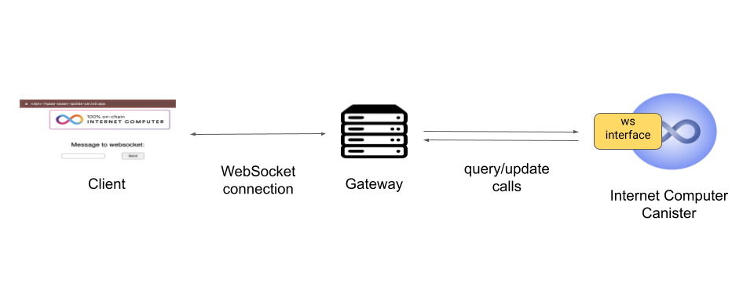

Today, users expect web applications to be fast and snappy: an exchange should update
the prices in real-time, edits of colleagues should appear immediately when collaborating
on a document, and comments on social media platforms should update continuously.

To provide such a user-experience, modern web applications usually rely on WebSockets,
which allow to establish a long-lived, full-duplex connection between the frontend
and backend of an application. This allows for both sides to send data, for example
the latest exchange rates, in real-time.

## Challenges

While WebSockets are a standard in the web2 world, they have unfortunately not yet
found their way to web3. We aim to change that and bring WebSockets to the Internet Computer.

Unfortunately, this is not a straightforward undertaking due to the decentralized
nature of the Internet Computer, where the backend does not just run on a single
centralized entity, but on multiple replica nodes in a subnet. To enable WebSockets
on the Internet Computer, we need to address the following two main challenges:

_One-to-one connections_ - WebSockets are one-to-one connections: the frontend establishes
a connection with a single centralized backend. An application on the Internet Computer
however is running distributed across multiple replica nodes in a subnet. In order
to enable WebSockets, there needs to be a point of consolidation, which provides a
single contact point for the frontend.

_Long-lived connections_ - WebSockets remain open for long periods of time. The
canisters on the Internet Computer however follow the actor model, which accepts
a message, processes it and replies.

To get started and gain experience, we decided to take one step at a time and first
build a proof-of-concept instead of trying to directly integrate WebSockets fully
into the Internet Computer.

## Architecture

The centerpiece of our proof-of-concept is the WebSocket gateway. It runs on a
dedicated machine and sits between the frontend, the client’s browser, and the
backend, the canister on the Internet Computer as the following figure shows.

The gateway provides a WebSocket endpoint for the frontend and maintains the connection,
while it interfaces with the backend on the Internet Computer through query and update calls.

The gateway sends messages coming from the frontend as update calls to the backend
and it continuously polls the backend for new messages for the frontend.

Despite being a centralized point of failure, the gateway draws on the Internet Computer
to fulfill its’ role trustlessly: both the frontend and the backend sign their messages
such that the gateway cannot tamper with them.

## Try it out!

We have released [the proof-of-concept on Github](https://github.com/dfinity/ic-websocket-poc)
and invite you to try it out yourself! Use it as an inspiration for your own projects and
build upon it! Please note that this is a proof-of-concept and requires further
improvements to enhance security and stability for any use in production. We have
started a thread in the developer forum and are looking forward to seeing all the
applications you built and your feedback.
