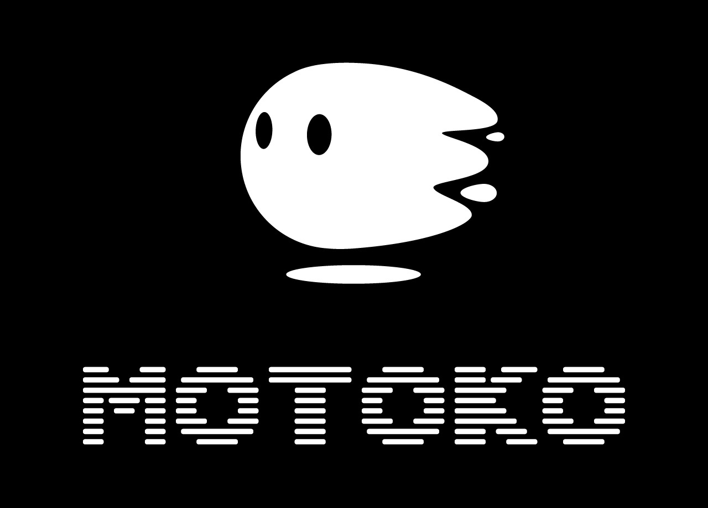

# Motoko update: March 21, 2023

Hello Motoko devs! 👋

Welcome back to the latest Motoko update post, where we have some engaging news to share with you!

If you happened to miss our previous update, don't worry, you can catch
up [here](https://forum.dfinity.org/t/new-let-binding-and-serialization-improvements-motoko-updates/18850). We discussed
the innovative `let-else` binding and significant improvements to Candid deserialization.

Today, we're excited to delve into a newly released threshold canister and some fascinating benchmarking reports!

## Motoko threshold canister: open-source and ready to go!

We're thrilled to announce that the [threshold canister](https://github.com/dfinity/threshold) is now open-source and
available for your projects! This powerful canister enables groups of principals to make democratic decisions with ease.
Participants can submit proposals to execute calls based on desired behavior, provided the proposal garners a specific
threshold of votes.

In a real-world application, the threshold canister is already streamlining DFINITY's vote delegation in the recently
decentralized OpenChat SNS to individuals within the DFINITY Foundation. This approach not only further decentralizes
voting power but also ensures the loss or incapacitation of a single individual won't result in the loss of voting power
for the entire foundation. With the canister now open-source, your organization can benefit from the same delegation
capabilities!

Composed of a mere 200 lines of Motoko, this canister exemplifies the unique advantage of Motoko for crafting concise
and robust code. Feel free to adopt a shared threshold voting scheme for your use-case by deploying with an initial
signers list. We welcome any feedback you have on this canister in the public repository.

## Canister-profiling: uncover the secrets of ICP canister performance

Eager to compare data structure performance on ICP, or perhaps the performance of entire languages or canisters? Look
no further than our [canister-profiling](https://github.com/dfinity/canister-profiling) repository.

There, you'll find cycle usage per benchmark (linked under the "Performance" section of the README). Additionally,
performance reports feature links to flamegraphs that provide detailed visualizations of where your cycles are being
spent. Take a look at this example graph for a toy DAO we use to obtain benchmark scores:

These benchmarks apply not just to Motoko, but to any canister, including those written in Rust.

Feel free to submit [PRs](https://github.com/dfinity/canister-profiling/pulls) containing custom benchmarks to utilize
this powerful tool for your own canister development.

As always, we value your feedback on our tools, so please file GitHub issues for any requests. Thank you!

## Till next time!

Keep exploring, and stay tuned for more updates!

– DFINITY Languages team
