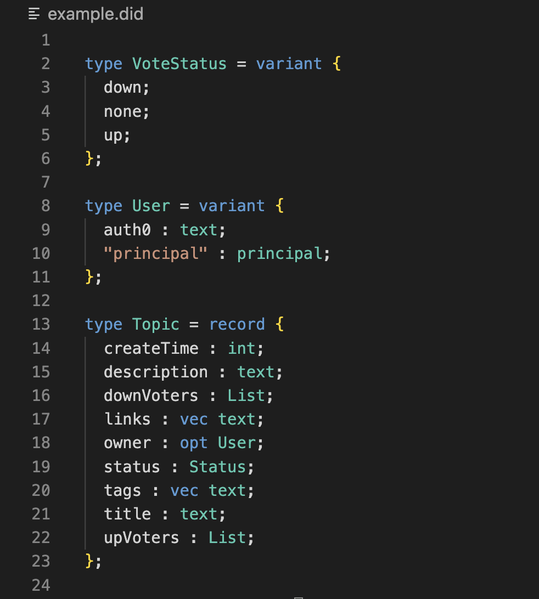

# Motoko update: April 17, 2023

Hey Motoko developers! 👋

Welcome back to the latest Motoko update post!

If you happened to miss our previous update, you can catch up [here](https://forum.dfinity.org/t/enhanced-stable-memory-and-certification-libraries-motoko-update-part-10/19262). We discussed recent progress on the stable regions feature and the recently released Motoko certification library.

Today, we're excited to discuss a new Hackathon and Candid QoL improvements! If you want to come together with other community members and build Bitcoin based projects on ICP, then keep reading!

## Bitcoin x IC Hackathon: BUIDL Bitcoin!
There’s a new Hackathon happening, brought to you by Encode Club. This is a chance to build really cool Bitcoin related projects on ICP using the newly fully released ckBTC feature! They also have a Blue Skies track for non-bitcoin related projects.

The Hackathon lasts about a month and will offer various prizes based on placings. Check out the official announcement from Encode Club at this link:
https://medium.com/encode-club/announcing-the-internet-computer-buidl-bitcoin-hackathon-powered-by-encode-register-now-776398ff1bc2

And you can register here either as an individual or as a group of devs!
https://www.encode.club/internet-computer

## Candid with auto-formatting and syntax highlighting!
If you guys hadn’t already noticed, the VSCode extension now has auto-formatting and syntax highlighting for Candid files! We hope this quality of life feature will boost your guys’ productivity as we continue to build out the tooling ecosystem for Motoko and ICP!

Let us know if you run into any bugs or have any feedback!

## Till next time!

Keep building, and stay tuned for more updates!

– DFINITY Languages team
