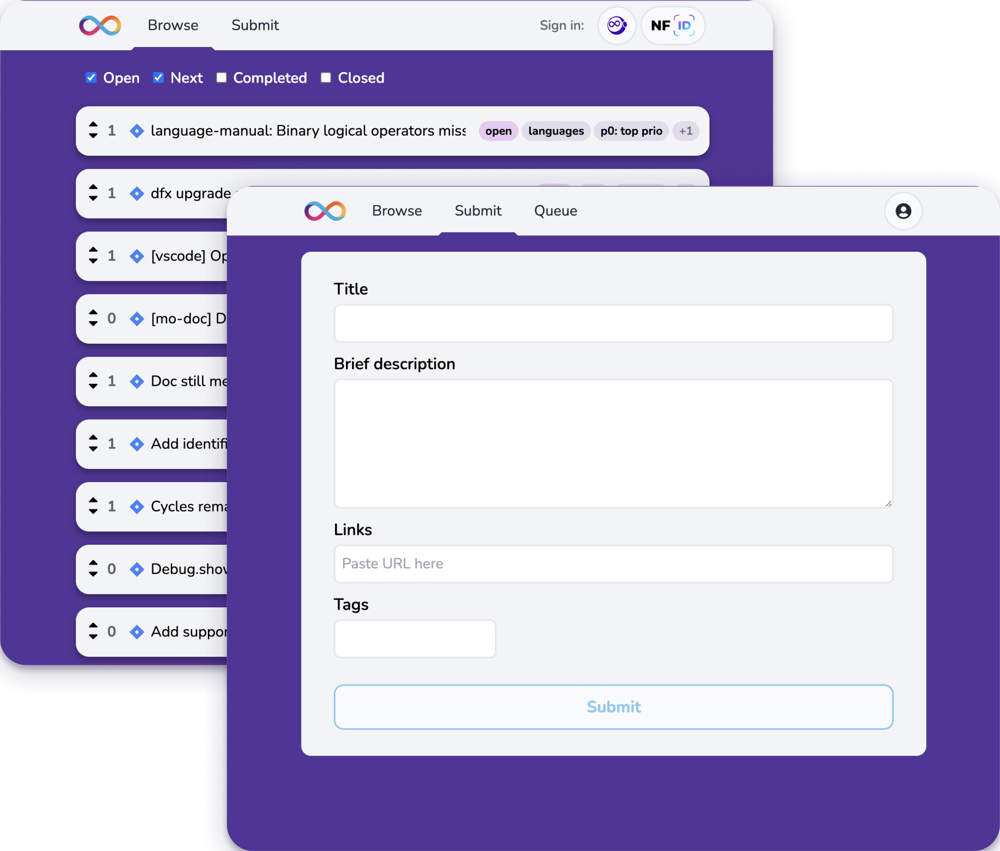
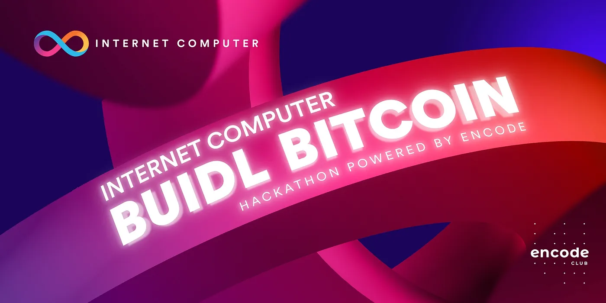

# Developer weekly update: April 25, 2023

Hello devs! 👋

Welcome to this week's edition of developer weekly. We have some exciting announcements to share! Buckle in and let's go.

## Developer feedback tool
We held a series of sessions with an internal focus group whose goal was to determine how we can improve and better prioritize enhancing the developer experience of the [Internet Computer](https://learn.internetcomputer.org/hc/en-us/articles/33152818663444-What-is-ICP) platform. We learned so much throughout these sessions, but here are the key takeaways:

- Our objective is to deliver the best developer experience possible - to continuously improve and remove obstacles from the journey of ideation to launch on ICP.
- We need the ability to ascertain what the majority of developers need right now.

The community has asked to have a single place to provide this level of input, and for us, this input helps prioritize what we work on to maximize the value developers get out of ICP.

Introducing the Feedback Board. This is a place for you as developers to request the features and functionality you want to see land.

The Feedback Board allows you to describe what you want and submit that directly to us. Other members of the developer community can see what you have added and upvote if they want to see it land too.

We have established an internal developer experience focus group whose mission is to triage these requests and address them - to bring them to life in the tools, libraries and frameworks you use everyday.
Now, instead of scattering feedback across a multitude of channels, you’ll have a single place to provide your wishlist and influence the features we focus on more directly.
We’ll be focusing mostly on developer experience related work items that can be accomplished in the short to medium term. This is not replacing NNS motion proposals of course, but it’s still an effective way to influence our roadmap on big ticket items as well.
Oh, and by the way, it’s 100% onchain, written in Motoko, and deployed on ICP. We will also open source the code so you can fork it and use it as an example template. We think it makes a pretty good one.

Up to now, the community didn’t have an effective, organized channel to provide feedback. That has changed.

You can visit https://dx.internetcomputer.org today and start voting on the issues you want us to prioritize. And if what you want isn’t listed, submit your own issue in the form of a bug report or request for new functionality. We will review each and every submission. We want to ensure that your experience using the Internet Computer is the best it can be.

With that, thank you for reading, and looking forward to your feedback!

P.S. Big thank you to Ryan Vandersmith and Matthew Hammer for bringing this to life.

## BUIDL Hackathon

We are excited to announce the Internet Computer BUIDL Bitcoin Hackathon powered by Encode, a four-week online hack designed to empower developers to explore and build on the Internet Computer network. This unique Hackathon offers a fantastic opportunity for hackers worldwide to learn, collaborate, and create groundbreaking projects. With an array of prizes up for grabs, this programme is the perfect chance for both teams and individuals to showcase their talents and make a lasting impact in the web3 space.

You can read more about the hackathon, including how to sign up, [here](https://medium.com/encode-club/announcing-the-internet-computer-buidl-bitcoin-hackathon-powered-by-encode-register-now-776398ff1bc2).

## Until next time
That's all for now. We'll see you next week with some Motoko updates. Keep exploring, and stay tuned for more!
