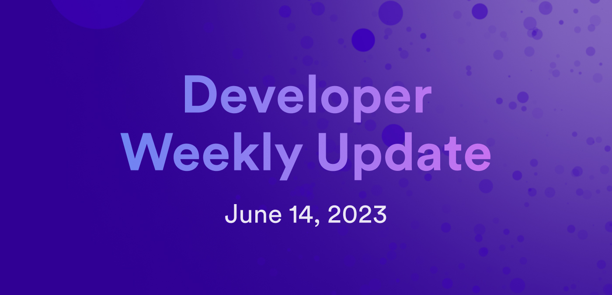

# Developer weekly update: June 14, 2023



Hello devs and welcome to this week’s issue of developer weekly! This week, we’re going to break down our latest release of dfx (0.14.1) by diving into the new features that shipped with this new version, as well as talk about some new features under the hood of Motoko.

Let’s dive in!

## dfx 0.14.1
The latest release of dfx, 0.14.1, primarily addresses issues that were experienced in the previous release, 0.14.0; one of these issues was a bug within the asset canister feature that affected single-page applications. For this reason, we strongly recommend that users upgrade to 0.14.1.

In addition to the important patch for the asset canister functionality, dfx shipped with new features to enhanced developer experiences, such as:

### Feature: gzip option in dfx.json:

dfx can now use gzip on the wasm module as a final step when building canisters. This feature is disabled by default, but can be enabled in the `dfx.json` file by using the following configuration:

```
{
  "canisters" : {
    "app" : {
      "gzip" : true
    }
  }
}
```

If you want to specify the `.wasm.gz` file directly for custom canisters, this functionality is still supported. Metadata, optimization, or shrink options that are set in the `dfx.json` file will be applied after the custom `.wasm.gz` file is decompressed, modified, then compressed back into `wasm.gz` at the end of the canister build process.

### Feature: Detailed logging for ic-asset:
Log output for `dfx deploy -v` (or `-vv`) now includes more detailed information such as:
- The number of chunks that have been uploaded and the total number of bytes.
- The API version for the canister and the ic-asset.
- The count for each `BatchOperationKind` in `CommitBatchArgs`.
- The value of `CommitBatchArgs` (only within the `-vv` output).

### Feature: The `.env` file now includes all created canister IDs.
In previous versions, the `.env` file only contained canister IDs for canisters listed as explicit dependencies during the build process. Now, the `.env` file includes all canisters and their canister IDs for the specified network.

### Feature: Users are now asked for consent when they remove themselves as the controller.
If a user removes themselves, or the wallet that they use, they can lose control over a canister. To prevent this loss, `dfx canister update-settings` will now ask for confirmation when a principal or wallet is removed from the list of controllers for a canister. This check can be skipped by using either the `–yes`/`-y` argument, or passing ‘yes’ to the command with a pipe such as:

```
echo "yes" | dfx canister update-settings <...>.
```

In addition to these new features, an array of various fixes have shipped with this release as well:
- Fix: If `dfx canister delete` is running on a canister that has not been stopped, dfx will confirm the removal of the canister instead of returning an error as it had in the past.
- Fix: The documentation of IC SDK has been cleaned up.
- Fix: To account for a more expensive v2 certification calculation, commit batches are now done incrementally to allow larger changes without exceeding the per-message instruction limit.
- Fix: `dfx deploy`’s behavior previously allowed the same argument to be provided to all canisters; this behavior has been removed and now results in an error.
- Fix: `dfx canister install`’s behavior previously allowed an empty argument to call all canisters regardless of any specifications; this behavior has been removed and now results in an error.
- Fix: When starting dfx with `dfx start`, if the replica does not return a ‘healthy’ status at least once after launching, dfx will terminate the process and restart it.
- Fix: If Bitcoin support is enabled, `dfx start` will now install the Bitcoin canister. dfx start will add a new field `canister_init_arg` to the Bitcoin configuration in the `networks.json` and `dfx.json` files.
- Fix: The `bitcoin_regtest` feature has been disabled.
- Chore: `nns-dapp` and `internet_identity` have been added to the local canister IDs that are set by the `dfx nns import` command.
- Chore: SNS subcommands are now visible in the `dfx help` output.

You can download and check out the full dfx 0.14.1 release notes [here](https://github.com/dfinity/sdk/releases/tag/0.14.1).

## Incremental GC
On the Motoko side of things, under the hood Motoko has recently implemented a new memory management service called the [Incremental Garbage Collector (GC)](https://forum.dfinity.org/t/incremental-garbage-collector-beta-release-motoko-update-part-12/20066). The Incremental GC was released in Motoko v0.9.0 and is currently in beta.

The Incremental GC is a service in Motoko that distributes the garbage collection workload over multiple different steps (referred to as increments) that each pause the user’s running program for a short, limited period of time. Through this service, the garbage collector runs concurrently to the user’s program and allows scalable heap usage, up to 4GB, before it exceeds the message instruction limit. Therefore, it scales much higher than the previously used garbage collection process in previous Motoko versions.

### What does this mean for Motoko developers?
Based on benchmark tests, the Incremental GC allows for allocations of up to 3x more heap space, all while consuming between 3% and 16% **less** cycles on average compared to other garbage collection processes in Motoko.

This not only means that the new Incremental GC is scalable, but it is able to perform with low latency and be extremely powerful for enhancing the Motoko developer experience through increased performance.

## Developer documentation
In the recent weeks, the developer docs have undergone a series of changes and updates as part of a large, long-term project designed to improve the resources available to developers on ICP. Let’s discuss some of the most important and impactful improvements to the dev docs.

### Cohesive format and style guide
The developer documentation has been updated so that each page follows a cohesive, uniform style and format. This includes consistent heading sizes, code block formats, use of language, capitalization, and punctuation. Other general housekeeping tasks like fixing typos, broken links, and updating document links in the side navigation bar were also part of this update.

In the coming weeks, the documentation will continue to be revised and updated to assure that each page is up to date and accurate according to the latest releases of ICP infrastructure, such as updates to dfx, Motoko, and SNS.

Another addition to the documentation is the new [developer documentation style guide](https://github.com/dfinity/portal/blob/master/style-guide.md). This document describes in detail the parameters that should be followed when new documentation is contributed. It includes standards such as heading size, word choice, how to structure tutorials and guides, and how to format bullet points, code snippets, lists, and hyperlinks. When creating new documentation, this style guide should be followed to ensure that each page within the dev docs is cohesive and uniform with one another.

### New sample code documentation
New documentation pages have been created for each piece of sample code that exists in the `dfinity/examples` repository. For most of these examples, README documentation existed previously, but proper developer documentation pages didn’t. These new pages can be found [here](https://internetcomputer.org/ecosystem), but some notable examples are:

- [Decentralized exchange (DEX).](https://internetcomputer.org/docs/samples/dex)
- [Deploying your first Bitcoin dapp.](/references/samples/motoko/basic_bitcoin/)
- [Game of Life.](https://internetcomputer.org/docs/samples/game-of-life)
- [Hosting a web game on ICP.](/references/samples/hosting/unity-webgl-template/)
- [ICP token transfer.](/references/samples/motoko/token_transfer/)

### New SNS documentation pages
Another section of the documentation that’s gotten some updates this week is the SNS documentation. These pages have gone through a thorough revision, reorganization, and restructuring to provide clear and comprehensive documentation around how SNS can be created, launched, and managed. Of these pages, a highly requested [SNS preparation checklist](/building-apps/governing-apps/tokenomics/sns-checklist) page has been created, which details step by step what is needed to create and launch an SNS.

The SNS documentation pages are part of an ongoing project, and are expected to continue to be updated, revised, and added to in the coming months. If you have any feedback on these pages, or any other documentation pages, please be sure to let us know through the [developer forum](https://forum.dfinity.org/) or on [Github](https://github.com/dfinity/portal/pulls).

That’s it for this week, be sure to check in next week for our next round of developer updates!

-DFINITY


