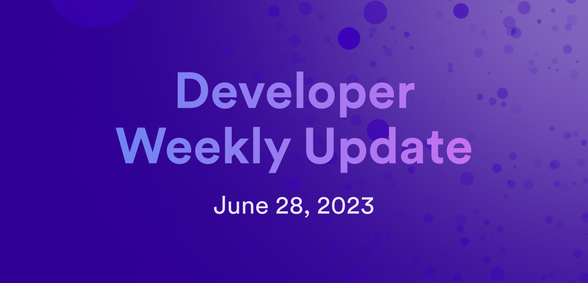

# Developer weekly update June 28th 2023

Good afternoon devs and welcome to this week’s issue of developer weekly!

This week, as Q2 comes to a close, we’re going to recap some of the biggest developer enhancements and features that were released over the past three months, plus discuss the new Motoko Dev Server!

Let’s get into it!

## Q2 recap

During Q2 2023, our SDK and Languages teams shipped a ton of great new features, updates, and tools. Here are some of the biggest highlights:

### Motoko’s new certification library: ic-certification

The new [ic-certification library](https://mops.one/ic-certification) released this quarter implements ICP’s certification tree data structure, which underlies the certified access mechanism on ICP. This is used to validate HTTP responses from canisters in order to protect them against malicious nodes. The ic-certification library also underlies the canister signatures mechanism, which is used to let canisters like the Internet Identity canister sign requests that are sent to ICP. The development of the ic-certification library was funded by an icdevs.org bug bounty, with special work by @nomeata!

### VSCode Candid auto-formatting and syntax highlighting

Additional features were added to the Motoko VSCode extension that include syntax highlighting and auto-formatting for Candid files. While this isn’t a huge update, it helps improve the dev quality of life with the aim to boost productivity.

### Developer Feedback Board

This quarter, a new developer feedback tool was launched: the [Developer Feedback Board](https://dx.internetcomputer.org/)! This board was developed in response to feedback derived from internal focus groups with the goal to improve and prioritize enhancing the developer experience. This group determined that one way to best serve ICP developers was to figure out what developers need *right now* to aid in their development. The ICP community also provided the insight that they’d prefer to have a single place for this input, rather than across multiple channels like the developer forum or Discord.

In response to this feedback, we launched the Developer Feedback Board, an interactive GUI interface where developers can request new features and upvote things that others have suggested that they also would like.

### dfx 0.14.1

This quarter also saw a new release of dfx - 0.14.1. In this release, the primary features and updates included:
- Feature: gzip option in dfx.json.
- Feature: Detailed logging for ic-asset.
- Feature: The .env file now includes all created canister IDs.
- Feature: Users are now asked for consent when they remove themselves as the controller.

In addition to these new features, an array of various fixes have shipped with this release as well:

- Fix: If `dfx canister delete` is running on a canister that has not been stopped, dfx will confirm the removal of the canister instead of returning an error as it had in the past.
- Fix: The documentation of IC SDK has been cleaned up.
- Fix: To account for a more expensive v2 certification calculation, commit batches are now done incrementally to allow larger changes without exceeding the per-message instruction limit.
- Fix: `dfx deploy`’s behavior previously allowed the same argument to be provided to all canisters; this behavior has been removed and now results in an error.
- Fix: `dfx canister install`’s behavior previously allowed an empty argument to call all canisters regardless of any specifications; this behavior has been removed and now results in an error.
- Fix: When starting dfx with `dfx start`, if the replica does not return a ‘healthy’ status at least once after launching, dfx will terminate the process and restart it.
- Fix: If Bitcoin support is enabled, `dfx start` will now install the Bitcoin canister. `dfx start` will add a new field `canister_init_arg` to the Bitcoin configuration in the `networks.json` and `dfx.json` files.
- Fix: The `bitcoin_regtest` feature has been disabled.
- Chore: `nns-dapp` and `internet_identity` have been added to the local canister IDs that are set by the `dfx nns import` command.
- Chore: SNS subcommands are now visible in the `dfx help` output.

You can download and check out the full dfx 0.14.1 release notes [here](https://github.com/dfinity/sdk/releases/tag/0.14.1).

### Developer docs

In Q2, the developer docs have seen a wide range of changes, updates, and visual alterations. These include:
The development and application of a Developer Docs Style Guide, which has been used to standardize the Developer Docs and assure each page looks, feels, and reads cohesively to one another.
Documentation validation and updates, to assure that each current page of the docs is up to date and showcases the most current version of commands, code blocks, and examples.
- New HTTPS outcalls tutorials, such as:

    - [HTTPS outcalls: technology overview:](/docs/references/https-outcalls-how-it-works) this page covers the overview of how the technology behind HTTPS outcalls operates. In summary, when a canister makes an outgoing HTTP request using the management canister API, the request is temporarily stored in the replicated state of the subnet. Then, each replica pushes an instance of the received HTTP response from the external web server through ICP’s consensus layer. Through this, each replica on a subnet can agree on the HTTP response that’s been provided by the canister.
    - [How to use HTTPS outcalls: Intro:](/docs/building-apps/network-features/using-http/https-outcalls/overview) this page provides a high-level overview of the API used to send HTTPS outcalls.
    - [How to use HTTPS outcalls: GET:](/docs/building-apps/network-features/using-http/https-outcalls/get) this page includes a brand new tutorial written by Diego Prats that showcases how to make a GET HTTP request using a sample canister that makes a request to the Coinbase API. This tutorial provides instructions for both Motoko and Rust development workflows.
    - [How to use HTTPS outcalls: POST:](/docs/building-apps/network-features/using-http/https-outcalls/post) this page is another brand new tutorial written by Diego Prats that explains how to make a POST HTTP request using a sample canister that sends a request with JSON information to a free API that is used to verify that the headers and body of the request were sent properly.
- A new [resource limits and constraints documentation](/docs/building-apps/canister-management/resource-limits) page that details ICP’s resource constraints and limits for things such as canister queue limit, instruction limit query calls, Wasm stable memory, and subnet capacity.
- New [SNS documentation](/docs/building-apps/governing-apps/overview), which includes updated instructions for developing, testing, and launching an SNS, including a page dedicated to [SNS asset canisters](/docs/building-apps/governing-apps/managing-sns/sns-asset-canister) and a new [SNS launch checklist](/docs/building-apps/governing-apps/tokenomics/sns-checklist).

### New Quill release - 0.4.2
This quarter, a new version of Quill was released; [0.4.2](https://github.com/dfinity/quill/releases). This release primarily focused on adding new Ledger support, enabling the same key to be shared between the NNS UI and Quill, which previously wasn't possible.

In addition to Ledger support, other new features and additions in this release include:

- Added `--subaccount` to `quill public-ids`.
- Added Ledger support via `--ledger`.
- Added `--confirmation-text` to `quill sns pay`.
- Fixed `quill ckbtc update-balance` allowing the anonymous principal.
- Added `disburse`, `disburse-maturity`, `split-neuron`, and `follow-neuron` to quill sns.
- Added option to print DFN address for Genesis investors.
- Updated to new ICRC-1 account ID format.

Motoko Dev Server

As we wrap up Q2 this week, we have one more huge release for developers: Motoko Dev Server!

Motoko Dev Server, or mo-dev, is a live-reload server designed to enable flexible, quick building and testing of Motoko services on the Internet Computer blockchain. Mo-dev is designed to be a Web3 version of popular Web2 live-reloading servers, like Next.js, Webpack, and Vite. Features and functionality of mo-dev include:
- Executing commands.
- Generating type bindings.
- Deploying canisters.
- Running unit tests.
- Any combination of the above.

You can learn more in [Ryan Vandersmith’s blog post](https://ryanvandersmith.medium.com/20363088afb4), or in the [mo-dev repo](https://github.com/dfinity/motoko-dev-server).

That wraps up this edition of developer weekly, see you all next week!

-DFINITY
