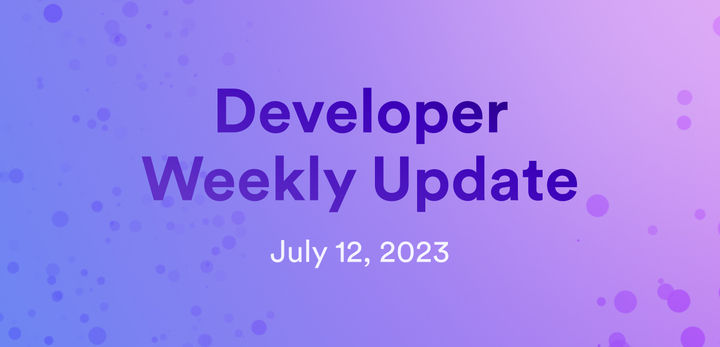

# Developer weekly - July 12 2023



Hello devs and welcome to this week’s issue of developer weekly! This week, we’re going to talk about the new vetKeys feature that was showcased in a community conversation this week, plus a new dfx release and a new feature packaged with dfx: canister optimization!

Let’s dive in!

## vetKeys
This week, a new feature was presented to our community via a community conversation: vetKeys!

Verifiable Encrypted Threshold Keys (shortened to vetKeys) are a new feature that enables a number of cryptographic functions and use cases on the Internet Computer. The purpose of vetKeys is to help mitigate some of the challenges that developers face when using security and privacy tools on ICP. Encrypting information locally on a device and storing it on a blockchain is easy, as long as the encryption’s secret key value is not exposed and remains on the local device. If a user wants to retrieve the encrypted information from another device or share it with another user, there isn’t a straightforward way that is secure.

vetKeys strives to resolve this challenge, as it leverages the [BLS signatures](https://learn.internetcomputer.org/hc/en-us/articles/34209540682644-Subnet-Keys-and-Subnet-Signatures), which are the native signature scheme on ICP and can be used as cryptographic decryption keys. Since BLS signatures are computed in a distributed manner on ICP, there is no central authority that is assigning or managing keys on the behalf of users.

For a more in-depth look at the technology behind vetKeys, check out the [vetKeys primer](https://internetcomputer.org/blog/features/vetkey-primer).

use cases for vetKeys include, but are not limited to:
- End-to-end encryption.
- Sophisticated access policies.
- Blockchain-issues signatures and cross-chain bridges.
- Verifiable randomness.
- “Dead man’s switch”.
- Secret-bid auctions and MEV protection.
- Time-lock encryption.
- Witness encryption.
- One-time programs.

Since this is a new feature still in production, there are a number of bounties available for developers to participate in to help enhance the feature and explore different use cases. For more information on the bounties and a link to the community conversation, check out [this forum post](https://forum.dfinity.org/t/open-bnt-8-vetkeys-enabling-privacy-preserving-applications-on-the-ic/21294).

## dfx 0.14.2
The newest release of dfx 0.14.2 primarily provided fixes and enhancements for existing workflows, such as:
- Diagnose duplicate assets and display upgrade steps: if `dfx deploy` detects duplicate assets in the `dist/` and frontend `assets/` directories, it will now suggest upgrade steps.
- Motoko canisters can import other canisters with service constructor: after a specific canister builder outputs the Wasm and Candid files, dfx will do some post processing on the Candid file.
- `dfx star`t now respects the network replica port configuration in `dfx.json` or `networks.json`
- The redirect from `.raw.ic0.app` now redirects to `.ic0.app` instead of `.icp0.io`.
- The `validate_commit_proposed_batch()` method no longer requires any permission to call.
- The asset canister now enforces limits during upload. These limits do not apply to assets already uploaded.
- A fix to the return of the correct expr_path for index.html fallback routes: previously, the requested path was used to construct the `expr_path` for the `index.html` fallback route. This was incorrect, as the `expr_path` should be the path of the `index.html` file itself in this case.

Additionally, new features included in this release include:
- The deprecation of the `dfx bootstrap` and `dfx replica` commands: please use `dfx start` instead, which is a combination of the two commands.
- An addition of optional custom build command for asset canisters: the custom build command can be set in `dfx.json` the same way it is set for custom type canisters. If the command is not provided, dfx will fallback to the default `npm run build` command.

```
{
  "canisters": {
    "ui": {
      "type": "assets",
      "build": ["<custom build command>"]
    }
  }
}
```

The full release notes for dfx 0.14.2 can be found [here](https://github.com/dfinity/sdk/releases/tag/0.14.2).

## Canister optimization available in dfx 0.14.0 and newer

A new feature now packaged in versions of dfx 0.14.0 and newer includes `wasm-opt`, a general purpose Wasm optimizer. With `wasm-opt`, you can now configure canister optimization options straight from the dfx.json file. For example, to optimize a canister’s cycles consumption, you can use the configuration:

```
{
  "canisters": {
    "my_canister": {
      "optimize": "cycles"
    }
  }
}

```

Or, you can reduce binary size with the configuration:

```
{
  "canisters": {
    "my_canister": {
      "optimize": "size"
    }
  }
}

```

After some benchmark testing, our team estimates that you can expect to see cycle consumptions reduced by around 10% for Motoko canisters and 7% for Rust canisters, and binary size reduction by around 16%.

For more details, check out the full [forum post announcement here](https://forum.dfinity.org/t/canister-optimizer-available-in-dfx-0-14-0/21157).

That’s it for this week! If you missed last week’s [team spotlight blog post](https://internetcomputer.org/blog/news-and-updates/team-spotlight-nns) that featured the NNS team, be sure to check it out. For the next installment of the team spotlight series, we’ll dive into the Runtime team; be sure to check in next week for that!

-DFINITY

