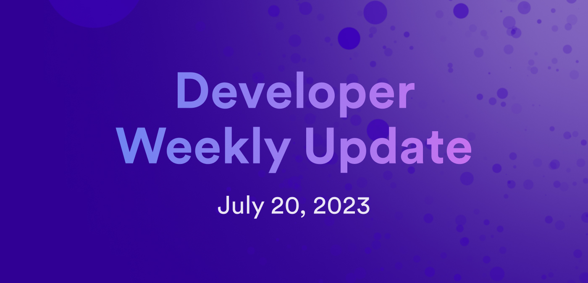

# Developer weekly - July 20 2023



Hello developers and welcome to this week's issue of developer weekly! This week, we're going to take a look at some new Rust documentation that was published this week, plus we'll dive into the details of dfx 0.15.0 which is now out for beta testing!

Let's get into it!

## New documentation for building canisters with Rust

This week, ICP developer documentation got a major update for Rust developers: a new and improved section on building backend canisters with Rust!

Previously, this section contained seven pages of documentation that were rather limited in the information and concepts that they contained. We received several bits of feedback from Rust developers that these pages simply weren't providing enough resources for them. As a result of this feedback, along with some internal insight, we've published an improved section of documentation that now contains fifteen pages of content, including concepts such as upgrading canisters, stable structures, and inter-canister calls.

To summarize, the new Rust documentation covers the following topics:

- Rust backend canister infrastructure.
- Project organization.
- Developer environment.
- Rust quick start.
- Writing and deploying canisters.
- Inter-canister calls.
- Upgrading a canister.
- Optimizing rust canisters.
- Incrementing a counter.
- Using periodic timers.
- Stable structures.
- Adding and searching simple records.
- Access control.
- Using the Candid UI with a Rust canister.
- Rust sample code and applications.

You can check out the new documentation [here](/building-apps/developer-tools/cdks/rust/intro-to-rust).

## dfx 0.15.0 beta release

dfx 0.15.0 is now available for beta testing. This new release introduces several new features and workflows, such as:

- The `dfx nns` and `dfx sns` commands have been removed. Both commands have been reworked to be **dfx extensions**, and can be used with the commands `dfx extension install nns` and `dfx extension install sns` respectively. dfx extensions are still under development and will be elaborated on fully in a future blog post upon their official release.

- The `dfx replica` and `dfx bootstrap` commands have been removed. The `dfx start` command should now be used instead.

- Warnings regarding using an unencrypted identity on the mainnet can now be suppressed:

```
WARN: The <identity> identity is not stored securely. Do not use it to control a lot of cycles/ICP. Create a new identity with `dfx identity new` and use it in mainnet-facing commands with the `--identity` flag

To do so, export the environment variable DFX_WARNING with the value -mainnet_plaintext_identity.

export DFX_WARNING="-mainnet_plaintext_identity"
Note that this can be combined to also disable the dfx version check warning:

export DFX_WARNING="-version_check,-mainnet_plaintext_identity"
```

- New identities are now restricted to using 'safe characters', meaning characters such as `/` or whitespace are no longer supported. The supported characters are now:

```
ABCDEFGHIJKLMNOPQRSTUVWXYZabcdefghijklmnopqrstuvwxyz.-_@0123456789.
```

Existing identities are not affected by this change.

For the full release notes on dfx 0.15.0, please see the [changelog here](https://github.com/dfinity/sdk/releases/tag/0.15.0-beta.0).

## Integration of Rust Candid with dfx

To further improve the experience for Rust developers, the Rust Candid library has been integrated with dfx. Through this integration, Rust code and interfaces can be generated from a Candid interface.

In the future, the Rust Candid library will also be integrated with the CDK to achieve similar functionality.

That'll wrap things up for this week's developer update. Be sure to tune in later this week for our next installment of our team spotlight blog series; this week's focus is on the runtime team!

-DFINITY
