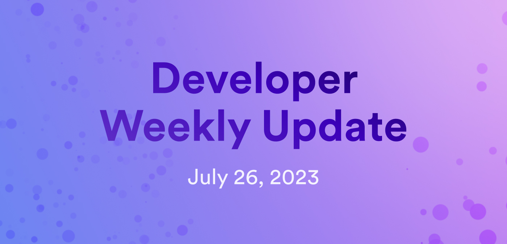

# Developer weekly - July 26 2023

Hello devs and welcome to this week’s issue of developer weekly! In this issue, we're going to take a brief look at the new `dfx deps` subcommand, plus explore a new QR code example project that showcases deterministic time slicing.

Ready to dive in?

## `dfx deps`

`dfx deps` is a new subcommand that allows developers to pull third-party canisters from the mainnet, then deploy them on a local replica to test integration functionality without worrying about paying cycles or using production environments.

To use `dfx deps`, there are two roles to the workflow. A service provider can configure a canister to be 'pullable', meaning it can be pulled by others using `dfx deps`, and a service consumer can pull a canister from the mainnet if that canister has been configured to be 'pullable'.

A separate blog post has been published on this subcommand and workflow that goes into much deeper detail. You can check out that blog post [here](https://internetcomputer.org/blog/features/dfx-deps), and the corresponding developer documentation for it [here](/docs/building-apps/advanced/using-third-party-canisters).

## New sample code: QR code generator

Thanks to Ulan Degenbaev from the Runtime team, a new Rust example has been added to the `DFINITY/examples` repository. This example demonstrates how dapps on ICP can perform long-running computation tasks, such as image processing, in a single message execution. This functionality is possible to Deterministic Time Slicing (DTS), which is a unique feature on ICP that divides long computational tasks into smaller slices that are then executed across multiple blocks. Using this new feature, developers can write long-running computational code as they normally would, and don't need to perform any special tasks to take advantage of the DTS benefits.

This new sample code demonstrates the DTS functionality using a QR code generation application. A live version of this sample can be found [here](https://khpe2-4qaaa-aaaao-a2fnq-cai.icp0.io/) for you to try out.

If you want to play with the sample locally, you can find the code in our examples repo [here](https://github.com/dfinity/examples/tree/master/rust/qrcode).

### How the QR code generator works

In this sample, the initial dapp code has been generated by dfx's standard template with the `dfx new` command.

The frontend canister contains an HTML webpage that includes a form for users to enter text fields to configure the QR code. Then, a 'Generate!' button uses a JavaScript handler to initiate a call to the backend canister, which automatically generates a JavaScript object from the Candid interface. The JavaScript object uses async functions for each of the backend canister's endpoints. There are two backend endpoints: one for updates and one for queries. This is intentionally done for educational purposes. The JavaScript button uses async functions to make the call from the frontend to the backend.

This sample is written in Rust and utilizes the `image` and `qrcode-generator` crates. There is some minor image processing that happens as well, in order to add the [Internet Computer](https://learn.internetcomputer.org/hc/en-us/articles/33152818663444-What-is-ICP) logo and color scheme to the final generated QR code image result.

## `dfx deploy --playground`

For our last topic today, we're going to briefly introduce a new upcoming feature: `dfx deploy --playground`!

`dfx deploy --playground` is an upcoming feature that will soon be available in dfx. With this new `--playground` flag, canisters can be immediately deployed to the playground. When this flag is used, the canisters in the dfx project will be deployed to mainnet and a canister URL will be returned to the developer. This deployment method allows devs to quickly deploy canisters to the mainnet without having to first setup a cycles wallet or acquire cycles. This allows for developers to quickly get started using dfx to help aid in the developer onboarding process.

It is important to note that canisters deployed with the `--playground` flag will be subject to the same restrictions as other canisters deployed to the playground. These restrictions are:

- Cycle transfer instructions are silently ignored by the playground.
- Canisters can use at most 1GB of stable memory.
- Canisters can call the management canister to manage itself without being the controller.
- Deployed canisters expire after 20 minutes.

This feature is upcoming and will be elaborated on further in a future blog post with additional documentation. Be sure to stay tuned for that update!

That's it for this week! Be sure to tune back in next week for our weekly update, plus another installment of our team spotlight series!

-DFINITY
