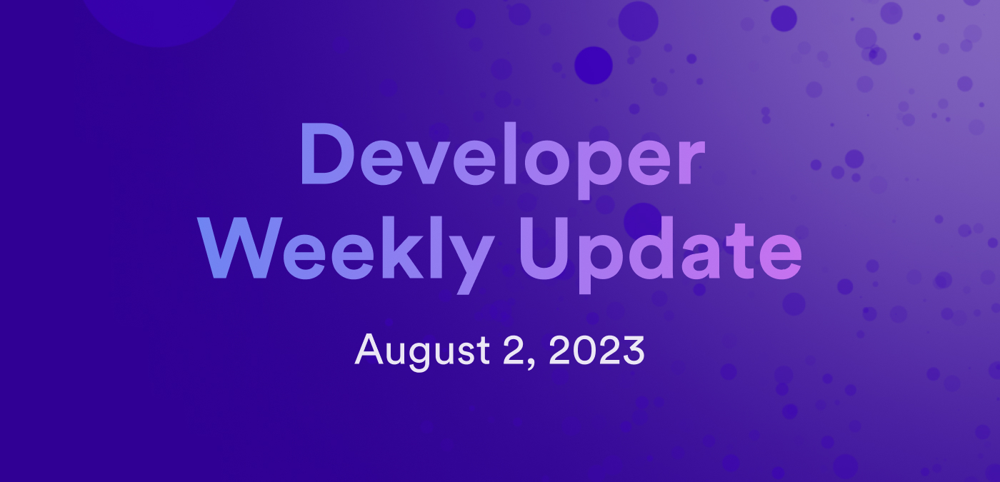

# Developer weekly - August 2 2023

Hello developers and welcome to this week's issue of developer weekly! In this issue, we're going to talk about some of our upcoming developer events for the month of August. You can participate in these events to ask questions, gain insight into different features, and provide feedback directly to our team on things you'd like to see in the future.

Let's talk about it!

## Motoko working group

**Date and time:** August 10, 2023 @ 3PM UTC

**Duration:** 1 hour.

**Frequency:** The second Thursday of every month.

**Description:** The Motoko working group is a way for developers to discuss issues, concerns, or ideas relevant to Motoko with the DFINITY Languages team. Developers can occasionally give demos of their current projects and express any roadblocks or pain points that they're experiencing in their development process.

Want to learn more? Check out the [forum post](https://forum.dfinity.org/t/motoko-developer-working-group/20488) that contains more information.

Interested in attending? [Here is the Zoom link](https://dfinity.zoom.us/j/97118754835?pwd%3DWFZiUVcyQ0tqOHlrajFUa0dpRTc3Zz09).

## Technical working group: BTC on ICP

**Date and time:** August 3, 2023 @ 3PM UTC

**Duration:** 1 hour.

**Frequency:** The first Thursday of every month.

**Description:** In the BTC on ICP working group, the goal is to work together as an ecosystem to improve the Bitcoin experience on the Internet Computer. To accomplish this, the group will work closely with the Ordinals and Bitcoin ecosystems, work on building decentralized Bitcoin solutions within the application layer of the ICP, and work with the protocol layer to support different Bitcoin use cases.

Want to learn more? Check out the [forum post](https://forum.dfinity.org/t/technical-working-group-btc-on-icp/21225) that contains more information.

Interested in attending? [Here is the Zoom link](https://dfinity.zoom.us/j/96908162000?pwd=UXc5bFowMXZqTXgwOW9zZFk4TkNNUT09).

## Developer tooling working group

**Date and time:** August 3, 2023 @ 5PM UTC

**Duration:** 1 hour.

**Frequency:** The first Thursday of every month.

**Description:** The developer tooling working group is a place for developers to discuss different developer tools on ICP, such as the SDK and pre-installed system canisters. It also provides an opportunity for the community to share demos of their dapps and discuss current bounty projects.

Want to learn more? Check out the [forum post](https://forum.dfinity.org/t/technical-working-group-developer-tooling/11941) and [developer docs](https://docs.internetcomputer.org/) that contain more information.

Interested in attending? [Here is the Zoom link](https://dfinity.zoom.us/j/98865672859?pwd=UXorcDNQQzl3Tk5rVTVmRW5lYXdEQT09).

## Identity and wallet standards working group

**Date and time:** August 8, 2023 @ 3PM UTC

**Duration:** 1 hour.

**Frequency:** Bi-weekly on Tuesdays.

**Description:**  The identity and wallet standards working group focuses on discussion pertaining to the adoption and development of the ICRC token standard and how it relates to identity and wallets on the Internet Computer. Some current topics for discussion and development include verifiable credentials, transaction approval with canister calls, and DID registries.

Want to learn more? Check out the [Github issues and PRs](https://github.com/dfinity/wg-identity-authentication) that contain more information.

Interested in attending? [Here is the Zoom link](https://dfinity.zoom.us/j/99119049293?pwd=ZUZ0eGZJN3FHK1RzWkpTZUJoNUd0dz09).

## Ledger and tokenization working group

**Date and time:** August 22, 2023 @ 4PM UTC

**Duration:** 1 hour.

**Frequency:** Bi-weekly on Tuesdays.

**Description:** The focus of the ledger and tokenization working group is to discuss and contribute to the core token standard supported by the Internet Computer, ICRC. This group currently focuses on discussing proposals for new versions of the standard, such as ICRC-3, and future developments or additions to the standard to support new or emerging use cases.

Want to learn more? Check out the [forum post](https://forum.dfinity.org/t/announcing-token-standard-as-topic-of-the-first-meeting-of-the-ledger-tokenization-working-group/11925) that contains more information.

Interested in attending? [Here is the Zoom link](https://dfinity.zoom.us/j/99093158767?pwd=NEhFdk9yemtmT2NoYW1Ta2VWM2VzZz09).

## Weekly community call

**Date and time:** August 4, 2023 @ 5PM UTC

**Duration:** 1 hour.

**Frequency:** Weekly on Friday.

**Description:** The Discord weekly community call is a general catch-all conversation where members of the community can discuss any topic that they'd like pertaining to the Internet Computer. There is a short weekly update provided by a member of the DFINITY team at the start of the call, but the remainder of the meeting has no set agenda or topic.

Want to learn more? Check out this event in our [community Discord server.](https://discord.gg/9Ptz48GZ?event=1135913036465573908)

## Wrapping up

You can find the full Internet Computer community events calendar [here](https://calendar.google.com/calendar/u/0/embed?src=c_cgoeq917rpeap7vse3is1hl310@group.calendar.google.com&ctz=Europe/Zurich) for more details and links.

That's it for this week, be sure to tune in next week for the next issue of developer weekly!

-DFINITY
