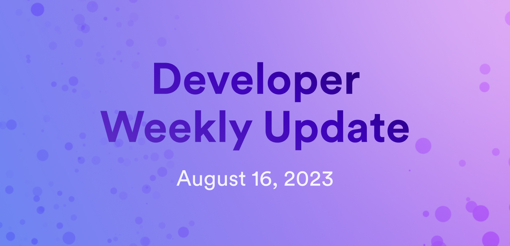

# Developer weekly update August 16, 2023



Hey developers! Welcome to this week's developer weekly update. In this issue, we're excited to introduce the first portion of a new documentation series: Developer Journey, plus talk about the upcoming `dfx` release and new documentation on the Motoko feature `mo-doc`. 

## Introducing the Developer Journey

Today we're excited to introduce the new Developer Journey tutorial series! This series is designed to bring new developers on a detailed, diverse journey through development on the Internet Computer. The journey starts with 'pre-flight operations', which is an introductory level that provides context for the remainder of the journey, such as an overview of what the IC is, how it works, and how to set up your developer environment. Then, the journey will bring you through a series of modules to develop your skills and learn about additional IC components in order to become an IC astronaut! 

Overall, the journey will contain the following modules and components:

### Level 0: Pre-flight operations

- 0.1: Overview of the Internet Computer.

- 0.2: Internet Computer terminology.

- 0.3: Developer environment setup.

- 0.4: Introduction to canisters.

- 0.5: Introduction to languages.

- 0.6: Introduction to dfx.

### Level 1: Space cadet

- 1.1: Exploring a live demo.

- 1.2: Developing your first dapp.

- 1.3: Acquiring and using cycles.

- 1.4: Deploying canisters.

- 1.5: Managing canisters.

- 1.6: Motoko: level 1.

### Level 2: Space explorer

- 2.1: Upgrading canisters.

- 2.2: Using third-party canisters.

- 2.3: Canister query and update methods.

- 2.4: Inter-canister calls.

- 2.5: Introduction to agents.

- 2.6: Motoko: level 2.

### Level 3: Space engineer

- 3.1: Identities and authentication.

- 3.2: Using the ICP ledger.

- 3.3: ICRC-1 tokens.

- 3.4: Using the XRC canister.

- 3.5: Using Quill.

- 3.6: Motoko: level 3.

### Level 4: Space pilot

- 4.1: Using HTTPS outcalls.

- 4.2: NFTs on the Internet Computer.

- 4.3: Deterministic time slicing.

- 4.4: Creating a Bitcoin dapp.

- 4.5: Using libraries with MOPS.

- 4.6: Motoko: level 4.

### Level 5: Internet Computer astronaut

- 5.1: Encrypted notes dapp with vetKD.

- 5.2: Creating your own ICRC-1 token with Rosetta.

- 5.3: Creating an SNS.

- 5.4: Creating a web game with upgradable NFT assets.

- 5.5: Creating a media streaming platform with II authentication for user accounts.

- 5.6: Next steps.

The first portion of this series, Level 0: Pre-flight operations, is out now and ready for you to follow along with! You can get started with your developer journey [here](https://internetcomputer.org/docs/current/tutorials/developer-journey//level-0/).

## Upcoming `dfx 0.15` release

`dfx` version `0.15.0` will be released in the upcoming weeks. This new version of `dfx` ships some important new features and fixes that developers should be excited for! Some of these features include:

- The new `dfx deploy --playground` feature, which can be used to deploy canisters directly to the Motoko playground. A blog post diving into this feature specifically will be released soon.

- Fixes for the asset canister's response verification v2. We dove into this fix a bit further in last week's developer weekly update [here](2023-08-09-update.mdx).

- Removal of the `dfx nns` and `dfx sns` commands, which will be part of the new upcoming subcommand, `dfx extensions`. 

A detailed breakdown of the full release notes will be available in an upcoming blog post. Stay tuned! 

## `mo-doc`

`mo-doc` is a command-line tool that can be used to generate documentation for Motoko code. It can generate various formats of documentation based on Motoko source code. 

To use `mo-doc`, you can download it directly from the Motoko Github releases page, or use the binary that is included in `dfx`.

Then, you can use the following command to generate documentation:

```
(dfx cache show)/mo-doc [options]
```

The options for the tool are:

- `--source <path>`: This option specifies the directory to search for Motoko source files; the default is `src`.

- `--output <path>`: This option specifies the directory where the documentation will be generated; the default is `docs`.

- `--format <format>`: This option specifies the generated format, which can be HTML, ADOC, or Markdown; the default is HTML. 

- `--help`: This option shows usage information.

You can find the full documentation with examples [here](https://internetcomputer.org/docs/current/developer-docs/backend/motoko/mo-doc). 

That'll wrap things up for this week's update. Be sure to also check out this week's issue of team spotlight, where we interview the node team!

-DFINITY
