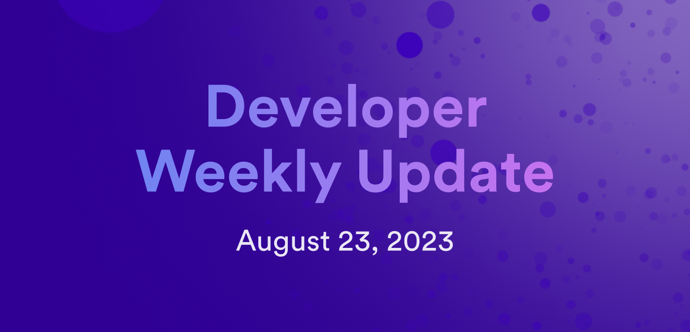

# Developer weekly update August 23, 2023

Hello developers and welcome to this week's developer weekly update! In this issue, we're excited to announce a new developer video series, along with providing some information about the upcoming proposal that would enable the 1-proposal SNS feature, plus how to enter the Internet Computer Devpost hackathon. Let's dive in!

## Internet Computer developer workshop series

Today we're excited to introduce a new, on-going video series: 'Building on the Future // Workshop Series'. In the latest video of this series, David Dal Busco who is a software engineer at DFINITY, showcases how to build an Internet Computer dapp using Juno. This workshop video teaches developers how to implement authentication into their dapp, save images and other data onchain, and then launch their first smart contract onto ICP without needing to write a single line of backend code!

Want to get started? You can find the video tutorial [here](https://www.youtube.com/watch?v=mr_9XArcG9Y).

## 1-proposal SNS initialization feature proposal

On Friday August 25, the NNS team will submit an upgrade proposal that, if adopted, will introduce the 1-proposal SNS initialization feature. This new feature for SNSes has been developed based on feedback collected during the launch of previous SNSes, such as OpenChat, where it was requested that the launch process for an SNS be simplified. Particularly, the feedback received suggested that some steps of the launch process should be combined into a single process, that would then be triggered by the SNS proposal submission.

This new 1-proposal initialization feature combines all of the SNS preparation steps into one process, making it easier to launch and verify an SNS. You can read the full details of the 1-proposal SNS initialization in this [forum post](https://forum.dfinity.org/t/enhancement-of-the-sns-launch-process-one-proposal/19548), and find additional information regarding the NNS proposal for this feature [here](https://forum.dfinity.org/t/nns-sns-update-august-25-2023/22303).

## Devpost hackathon

Calling all devs! The Devpost 'Fully Onchain with ICP' hackathon is happening now! Until September 25, you can enter to develop a project on ICP and win a number of prizes.

There are three possible tracks to follow for this hackathon:

### Track 1: The awesome ICP track

In this track, you can build any dapp that showcases and leverages the unique features of the ICP. Some examples of awesome dapps might include SocialFi dapps, where social media interactions are reflected onchain so users own all of their data, decentralized AI dapps, DAO tooling, or multichain infrastructures dapps.

### Track 2: The buidl Bitcoin track

In this track, showcase how you can take Bitcoin to the next level using ICP's native Bitcoin integration. Develop a project that unlocks the full potential of Bitcoin using ckBTC, a native ICP token that is 1:1 Bitcoin backed. Example dapps could include functionality such as secure login, direct API calls, community-governed canisters, or leverage enormous computational power.

### Track 3: GameFi

In the third and final track, you can develop a dapp that provides next-gen web3 gaming to help demonstrate what the future of decentralized gaming looks like. Dapps that include wallet integrations with popular game engines, popular game formats like tower defense or battle royale, or in-game economy functionality are all things we'll be looking for in the submissions!

You can learn more or enter your project by heading over to the Devpost website [here](https://awesomeicp.devpost.com/?utm_source=devpost&utm_medium=twitter&utm_campaign=onchainwicp).

## ICP JavaScript agent v0.19.0 release

This week, we released a new version of the [ICP JavaScript agent](https://www.npmjs.com/package/@dfinity/agent), `v0.19.0`.

In this release, features and enhancements include:

- HttpAgent now uses `https://icp-api.io` as the default host.
- `@noble/hash` has replaced `js-sha256`. This change has resulted in reduced package sizes.
- New crypto nonce randomness.
- Nonce generation no longer uses date.

For the full release notes, check out the changelog [here](https://github.com/dfinity/agent-js/releases/tag/v0.19.0).

That'll wrap things up for this week! We'll see you all next week!

-DFINITY
