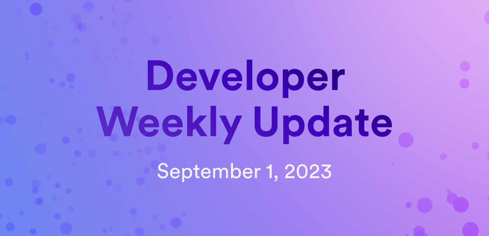
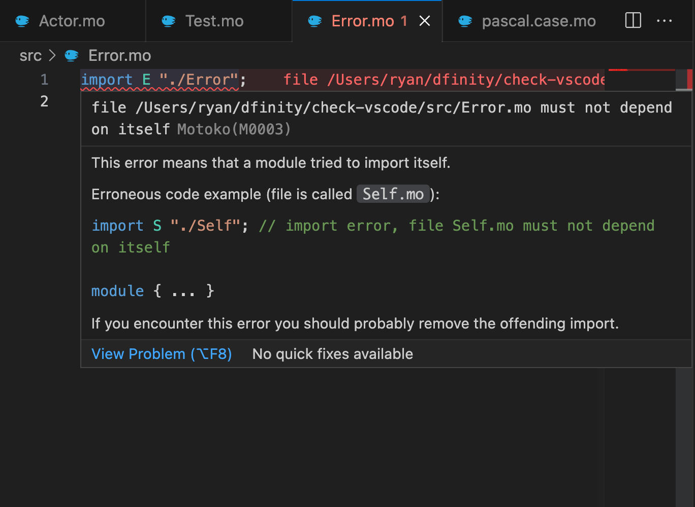
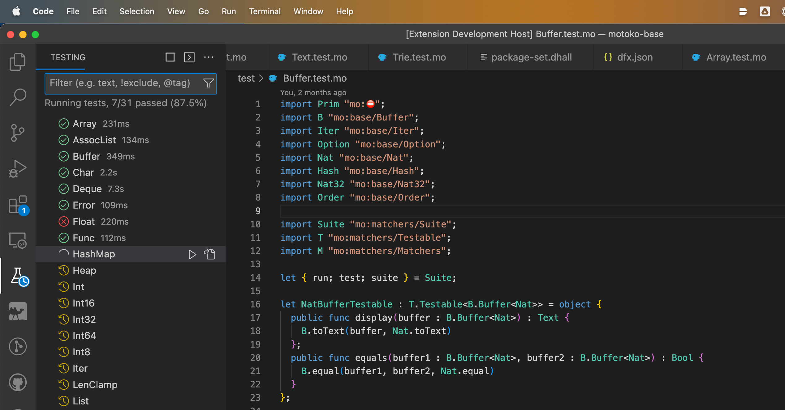

# Developer weekly update September 1, 2023



Hello devs and welcome back to another installment of developer weekly! This week, we're going to recap some of the recent enhancements to the Motoko VS Code extension that have been implemented over the past few months, plus we'll take a look at some major road map items that are in development for dfx. 

Let's talk about it! 

## Motoko VS Code extension enhancements 

Over the past few months, several improvements and enhancements have been made to the Motoko VS Code extension. Some of these changes are:

- Error code explanations from `moc --explain` are now shown as tooltips within the extension. An example can be seen here:



- A Motoko unit test runner has been integrated directly into the VS Code extension, providing functionality for testing libraries such as Motoko Matchers or testing files via the moc interpreter. This unit test runner works out of the box with Wasmer and moc.js, and does not require you to install wasmtime or dfx to locally run base library unit tests. 



- Error messages for common issues with dfx.json, Mops, Vessel, and other workflows have been added for more efficient debugging. 

- The go-to-definition for object pattern field aliases has been improved. Previously, go-to-definition on `B` with `import { A = B } "path/to/A"` would have resolved to the location of `B` within the import. With this improvement, the language server automatically follows the import and then places the cursor on the definition of `A`. Additionally, this change provides the ability for tooltip doc comments to be shown in more situations. 

You can learn more about the Motoko VS Code extension [here](https://internetcomputer.org/docs/current/developer-docs/setup/vs-code).

## Upcoming `dfx` road map items

### `dfx new`

The `dfx new` command has some exciting updates and improvements that will be coming out in `dfx release 0.15.1`. One of the biggest changes is that there will be an interactive prompt that will allow you to choose what language template you'd like to create a new project using. Previously, this decision was made using the flag `--type=motoko` or `--type=rust`. Additionally, there will be additional options through this new interactive prompt, such as Azle and Kybra. 

In this interactive prompt, there are also options to enable add-ons, such as adding a frontend canister using different frontend templates like React or Vue, enabling unit tests, or adding integrations like Internet Identity and Bitcoin. 

### `dfx extensions`

`dfx extensions` is a highly anticipated feature that will replace the way certain management canisters are installed, such as the NNS and SNS canisters. Instead of having to manually install and deploy these canisters locally to use them, `dfx extensions` can be used to install them, such as:

```
dfx extension install nns
dfx extension install sns 
```

Then, you can use them as you did before, using commands like `dfx nns` and `dfx sns`. `dfx extensions` will be available in `dfx release 0.15.0`. 

For more information on `dfx nns` and `dfx sns`, please see the reference documentation [here](https://internetcomputer.org/docs/current/references/cli-reference/dfx-nns)

### `dfx deploy --playground` 

As we've mentioned a couple of times already in previous developer weekly updates, the `dfx deploy --playground` feature is also coming in `dfx release 0.15.0`. This feature allows you to quickly deploy canisters directly to the playground without needing to setup a developer environment or cycles wallet to deploy them. 

You can read more in our previous update from [July 26](2023-07-26-update.mdx).

That'll wrap things up for this week's update! Be sure to check in next week for another issue of developer weekly!

-DFINITY
