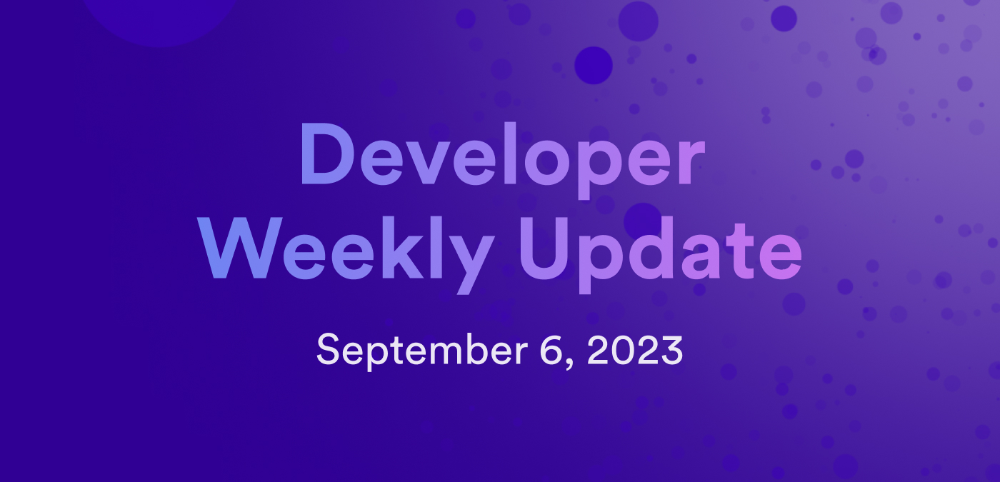

# Developer weekly update September 6, 2023

Hello devs and welcome to this week's issue of developer weekly! This week, we're excited to talk about the next installment of the new documentation series developer journey, plus talk about upcoming features and integrations such as the Ethereum integration and the cycles ledger.

Let's get into it! 

## Developer journey level 1

The second level of the developer journey tutorial series is now live on the developer docs! In this level, level 1, we begin to dive into the building blocks of developing on the IC, such as learning about Motoko fundamentals, developing a simple poll dapp, and learning about canister deployment and management. Modules in this level include:

- [1.1: Exploring a live demo](/docs/current/tutorials/developer-journey/level-1/1.1-live-demo):

In this module, you can learn about:

    - An overview of the Motoko Playground.
    - An overview of the `dfx deploy --playground` command.
    - Deploying a canister to Motoko Playground using `dfx`.
    - Interacting with the canister via the CLI.
    - Interacting with the canister via the Candid interface.

- [1.2: Motoko level 1](/docs/current/tutorials/developer-journey/level-1/1.2-motoko-lvl1):

In this module, you can learn about:

    - Basic concepts and terms.
    - Motoko syntax.
    - Using the base library.
    - Declarations and expressions.
    - Defining an actor.
    - Values and evaluation:
        - Primitive values.
        - Non-primitive values.
    - Printing values.
    - Passing text arguments.

- [1.3: Developing your first dapp](/docs/current/tutorials/developer-journey/level-1/1.3-first-dapp): 

In this module, you can learn about:

    - Creating a new project.
    - Reviewing the project's file structure.
    - Writing the backend canister code.
        - Creating an actor.
        - Defining the `getQuestion` method.
        - Query calls vs. update calls.
        - Creating a data structure to store the data.
        - Importing additional dependencies.
        - Declaring the `votes` variable.
        - Declaring the `getVotes` method.
        - Declaring the `votes` method.
        - Declaring the `resetVotes`  method.
        - Final code.
    - Deploying the dapp locally.
    - Adding pre-developed frontend code.
    - Re-deploying the dapp.

- [1.4: Acquiring and using cycles](/docs/current/tutorials/developer-journey/level-1/1.4-using-cycles):

In this module, you can learn about:

    - An overview of cycles.
    - Creating a developer identity.
    - Acquiring cycles using a cycles coupon.
    - Converting ICP tokens to cycles.

- [1.5: Deploying canisters](/docs/current/tutorials/developer-journey/level-1/1.5-deploying-canisters): 

In this module, you can learn about deploying to the mainnet.

- [1.6: Managing canisters](/docs/current/tutorials/developer-journey/level-1/1.6-managing-canisters): 

In this module, you can learn about:

    - Obtaining a canister's ID.
    - Obtaining canister information.
    - Adding an identity as a controller of a canister.
    - Managing the running state of a canister.
    - Checking the cycles balance of a canister.
    - Topping up a canister.
    - Getting cycles back from a canister.
    - Setting the canister's freezing threshold.
    - Deleting a canister.

You can learn more about the developer journey and get started with level 0 in the [tutorials section of our developer documentation](/docs/current/tutorials/developer-journey/index).

## Ethereum starter project

One of the most exciting roadmap items for the IC currently is our upcoming IC + ETH integration, enabling devs to build on the IC and interact with Ethereum! As a sample project, our team has developed an IC + ETH starter project, which showcases the simple use case of using an IC canister to verify NFT ownership for NFTs minted on the Ethereum network. This sample dapp has support for the Ethereum mainnet, plus the Sepolia and Goerli testnets. You can connect your Internet Identity or NFID to the dapp!

You can play with a running version of the dapp [here](https://xm3ir-rqaaa-aaaap-abhqq-cai.icp0.io/).

If you want to use this sample project as a boilerplate to build your own, or learn more about the technology stack used in the project, check out the open source repo [here](https://github.com/dfinity/ic-eth-starter).

## Upcoming feature: cycles ledger

Another exciting upcoming feature is the new cycles ledger feature. The cycles ledger, which is expected to launch in October 2023, will simplify cycle management by providing the ability for principal IDs to hold cycles. 

Currently, cycles wallets are a complex solution that is used to associate cycles with principals, since cycles wallets must be deployed locally, consume cycles themselves, and are easily lost if the cycles wallet canister ID is lost. 

The cycles ledger is an alternative to the cycles wallet, and will be deployed as a single global ledger canister, rather than a local deployment. The cycles ledger will comply with the ICRC-2 standard and will also interact with the NNS canisters and user canisters to provide ledger-specific functions, such as creating new canisters using cycles, sending cycles to canisters, and accepting incoming cycles. 

Be sure to check back in October for a more detailed blog post when the feature is live! 

That'll wrap things up for now, see you next time!

-DFINITY
