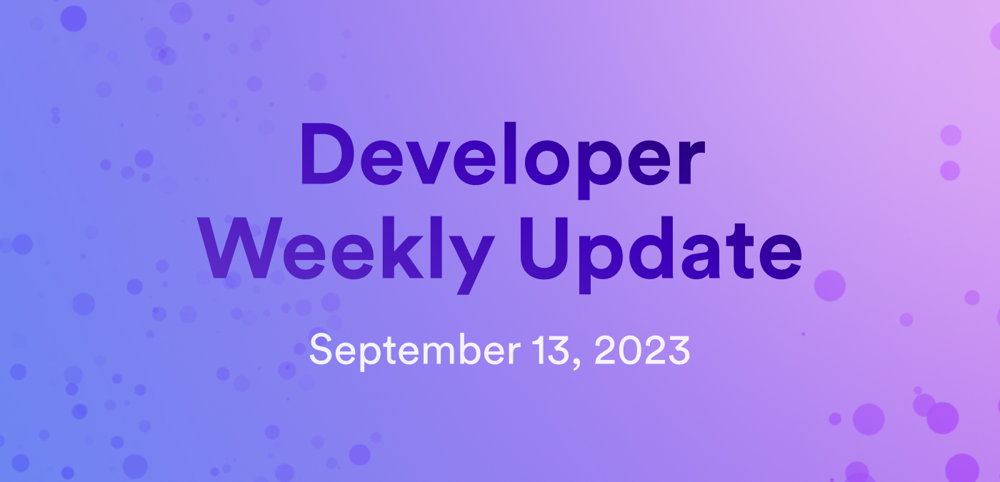

# Developer weekly update September 13, 2023

This week, we have a new `moc` release, version `0.10.0`, which introduces the new stable regions feature, plus we'll talk about some new resources for developers on our dev docs. Let's talk about it!

## `moc 0.10.0` - Motoko stable regions

This past week, a new version of the Motoko compiler has been released - `0.10.0`. This release includes a new, highly anticipated feature: Motoko stable regions! This feature has been a long-running project that encompasses effort from several team members to continue developing Motoko to be a powerful, yet safe language, targeted toward ambitious developers and their projects.

Stable regions are a type of dynamically allocated, isolated, and independently growable regions of stable memory. Let's take a closer look at what this new stable regions feature is and how developers can use it.

### What is a "region"?

A `Region` is a new Motoko abstract data type that uses an API which exposes low-level canister stable memory. `Region`s are unique since they use distinct portions of stable memory that never interfere with one another. New `Region`s can be created dynamically, and any old regions that are marked for garbage collection will be removed and reused for new `Region`s afterwards.

### How to use Motoko stable regions

`moc 0.10.0` will be added to the next release of `dfx`, but for developers who want to test the feature now, you can try it now [here](https://github.com/dfinity/motoko/releases).

:::caution
It is important to note that this new stable regions feature may re-organize the stable memory layout of existing canisters. For this reason, developers will not be able to downgrade `moc` to older releases. Thorough testing is advised.
:::

Be sure to check out the documentation for the feature [here](https://github.com/dfinity/motoko/blob/master/doc/md/stable-regions.md). If you have any questions, the forum post for this feature can be found [here](https://forum.dfinity.org/t/motoko-stable-regions/19182).

## Motoko interactive course

[Agorapp](https://agorapp.dev/) has designed a web-based IDE and corresponding Motoko introduction tutorial. We've embedded this tutorial into our developer docs, meaning you can write and run Motoko code in-browser without even having to leave our documentation! This is a great way to get started using Motoko with an interactive, hands-on tutorial.

Want to get started? The interactive tutorial can be found in our Motoko documentation [here](https://internetcomputer.org/docs/motoko/tutorial).

## New documentation

Over the past few weeks, we've had some great new pages added to our developer documentation. Let's take a look at some of the new additions!

- [Developer Liftoff level 0](/docs/tutorials/developer-liftoff/level-0/): Start the Developer Liftoff at the very beginning by following the level 0 module. In level 0, we cover the fundamentals of what the Internet Computer is, what terms you should be familiar with, and what tools we'll be using throughout our journey.

- [Developer Liftoff level 1](/docs/tutorials/developer-liftoff/level-1/): In the next stage of the Developer Liftoff, become a space cadet by getting comfortable creating your first dapp, managing your canisters, and acquiring and using cycles.

- [Pulling canister dependencies](/docs/building-apps/advanced/using-third-party-canisters): Learn how to use the new `dfx deps` feature to pull third-party canister dependencies.

- [Service Nervous System (SNS) documentation](/docs/building-apps/governing-apps/overview): Over the past few months, our documentation on SNSes has been greatly expanded. New docs include a pre-flight checklist, guidelines on integrating with the ledger and index canisters, and guides for testing your SNS before deploying it.

That'll wrap things up for this week, see you all next week!

-DFINITY
