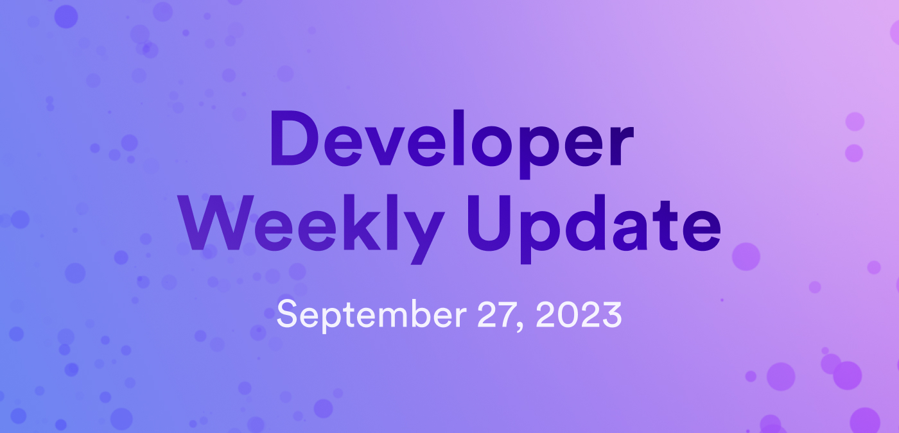

# Developer weekly update September 27, 2023

Hello ICP developers and welcome to this edition of developer weekly! This week, we're going to talk all things new documentation, including level 2 of the Developer Liftoff series, plus the new workflow for requesting a cycles coupon. Let's get into it!

## Developer Liftoff level 2

This week, level 2 of the Developer Liftoff series was published. To recap, the Developer Liftoff is a new tutorial series that acts as the map for a developer to start or grow their journey as an ICP developer. In level 2, developers learn about canister upgrades, storage, data persistence, advanced canister calls, Candid, unit testing, and using third-party canisters. The full breakdown can be found below:

- [2.1: Canister upgrades, storage, and persistence.](/tutorials/developer-liftoff/level-2/2.1-storage-persistence): When a canister's code needs to have changes made, the canister must be upgraded. This module covers:
    - Memory types and terms.
    - Upgrading canisters.
	    - Motoko stable memory workflow.
	    - Rust stable memory workflow.
    - Stable storage and stable variables.
    - Interactive example.
	    - Prerequisites.
	    - Creating a new project.
	    - Defining a stable variable.
	    - Deploying your counter app.
	    - Stable variables in action.

- [2.2: Advanced canister calls.](/tutorials/developer-liftoff/level-2/2.2-advanced-canister-calls): Now that we've covered the core functionalities of canisters and using them, let's take a look at advanced canister calls. This module covers:
    - The ICP execution model.
    - Canister query calls.
	    - Example query call.
    - Canister update calls.
	    - Example update call.
    - Certified variables.
    - Composite queries.
    - Inter-canister calls.
    - Using inter-canister calls.
	    - Prerequisites.
	    - Creating a new project.
	    - Writing a `publisher` canister.
	    - Writing a `subscriber` canister.

- [2.3: Using third-party canisters.](/tutorials/developer-liftoff/level-2/2.3-third-party-canisters): For certain workflows, using third-party canisters and integrating them with a dapp is important to provide functionalities such as authentication. This module covers:
    - Pulling third-party canister dependencies.
	    - Prerequisites.
	    - Creating a new project.
	    - Using `dfx deps`.

- [2.4: Introduction to Candid.](/tutorials/developer-liftoff/level-2/2.4-intro-candid): Candid is an interface description language that has unique support for ICP features. This module covers:
    - Candid types and values.
	    - Candid textual values.
    - Candid service descriptions.
	    - The `.did` file.
	    - Example candid service descriptions.
	    - Generating service descriptions.
    - Service upgrades.
    - Using Candid.
	    - Prerequisites.
	    - Creating a new project.
	    - Interacting with a service using the command-line terminal.
	    - Interacting with a service using a web browser.

- [2.5: Unit, integration, and end-to-end testing](/tutorials/developer-liftoff/level-2/2.5-unit-testing): Testing code prior to setting it live in production is an important step in the development process. This module covers:
    - Motoko unit testing.
	    - Canister unit testing.
    - Rust unit testing.
	    - Tests using Light Replica.
    - End-to-end (e2e) testing.
	    - Prerequisites.
	    - Creating a new project.
	    - Setting up the project.
	    - Creating an agent.
	    - Creating a test file.
	    - Running a basic test.
	    - Running a complex test.
    - Integration testing.

- [2.6: Motoko: level 2.](/tutorials/developer-liftoff/level-2/2.6-motoko-lvl2): This module covers:
    - Actor types.
        - Actor type definition.
    - Shared functions.
    - Actors and async data.
    - Actor classes.
        - Defining an actor class.
        - Defining an actor within the class.
    - Using multiple actors.
        - Prerequisites.
        - Creating a new project.
        - Configuring canisters in `dfx.json`.
        - Creating canister directories and Motoko files.
        - Creating the `characterCount` actor.
        - Creating the `Daemon` actor.
        - Deploying the actors locally.
        - Interacting with multiple actors.

Want to start at the beginning? You can get started with the Developer Liftoff [here](/tutorials/developer-liftoff/).

## New cycles coupon workflow

The workflow for requesting a cycles coupon has been changed. Previously, when developers requested a cycles coupon in the Discord server, they had to wait for a member of the DFINITY team to send them a survey, confirm it had been filled out, then send the developer a cycles coupon code.

Now, developers can use a Discord bot to request a cycles coupon. The bot will automatically send them the link to the survey, cutting out the previous delay that developers faced when awaiting a team member. Once the survey has been filled out, the DFINITY team will review it, then mark it as complete. Once marked complete, the bot will send the developer the coupon.

Want to check out the updated instructions? Read the documentation [here](/building-apps/getting-started/tokens-and-cycles).

## New developer documentation

Over the past few weeks, we've had some great new additions to the documentation. Several of these new docs pages are the result of direct feedback from developers on the forum or ICP Discord server. These new pages include:

- [Independently verifying Internet Computer signatures](/building-apps/authentication/independently-verifying-ic-signatures).

- [ICRC-1 ledger setup](/defi/token-ledgers/setup/icrc1_ledger_setup).

- [ICRC-1 index local setup](/defi/token-indexes/).

- [Generating Candid files for Rust canisters](/building-apps/developer-tools/cdks/rust/generating-candid).

Have a request for some documentation? Let us know on the developer [forum](https://forum.dfinity.org/) or on [Discord](https://discord.internetcomputer.org).

That'll wrap things up for this week! We'll see everyone back here next week for another developer weekly update!

-DFINITY
