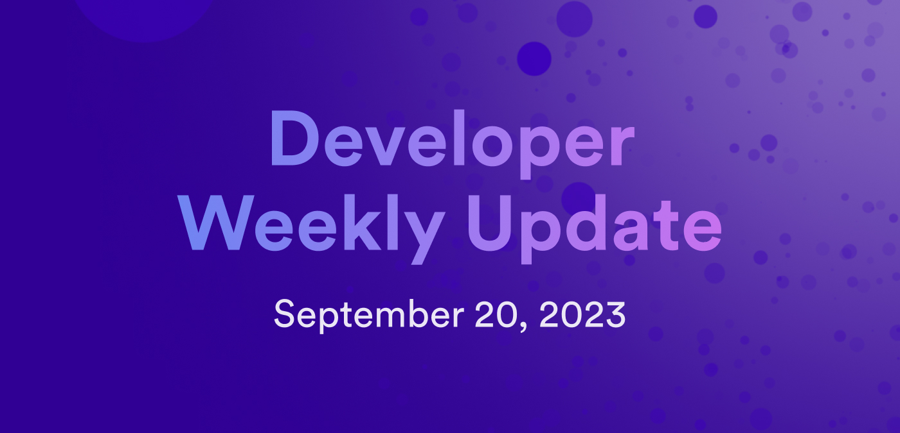

# Developer weekly update October 4, 2023

Hello developers and welcome to this week's developer weekly update! This week, we have a wide variety of updates for you, including a proposal to deprecate the Service Worker, a new `dfx` release, and a new sample project that showcases ckBTC in a point of sale environment.

Let's get started!

## SNS office hours

This week, we introduce a new office hour dedicated to SNSes! During this office hour, SNS teams and community members can join a call together to discuss technical questions regarding SNSes with the DFINITY team.

These office hour sessions will be every other Wednesday at 5PM GMT+2 / 8AM PST. Each session will be 30 minutes, and will begin on October 18th. The sessions will last through the end of November, for a total of 4 sessions.

You can find more information on the [forum post here](https://forum.dfinity.org/t/announcing-sns-office-hours/23506).

## Proposal to deprecate the Service Worker

Last week, a [new post here](/blog/features/deprecating-the-service-worker) on the Dev Blog announced a proposal to deprecate the Service Worker in favor of replacing it with the ICX Proxy hosted on the boundary nodes. The benefits of this proposal include:

- Enhanced user experience.
- Faster initial page loading.
- Consistent branding.
- Availability.
- Reduced cognitive load.
- Providing features for progressive web apps.
- Content encoding.
- Lighthouse support.

To migrate away from the Service Worker, the roadmap for this proposal includes milestones in creating alternative HTTP gateways, federated HTTP gateways, and decentralized HTTP gateways.

You can read the full proposal [here](/blog/features/deprecating-the-service-worker)

## `dfx v0.15.1`

This week, `dfx v0.15.1` has been released, which includes a very anticipated feature: deploy to playground!

We've been hyping up this feature for several weeks now, since it creates an easy on-ramp to deploying canisters without needing cycles or setting up local identities, simply by using the `--network playground` flag.

In addition to the deploy to playground feature, other features in this release include:

- Support for `reserved_cycles` and `reserved_cycles_limit`: the output of `dfx canister status` now displays the reserved cycles balance and limit for a canister. Limits for a canister can be set using `dfx canister create --reserved-cycles-limit <LIMIT>` and `dfx canister update-settings --reserved-cycles-limit <LIMIT>`.

-  Emit management canister IDL when imported by Motoko canister, which will automatically produce the IDL in the `.dfx` folder.

- Support for the `--version` tag for `dfx extension install`, allowing for a specific version of an extension to be installed.

- Updated handling of missing values in state tree certificates.
The Unknown lookup of a path in a certificate results in an AgentError (ICP returns Absent for non-existing paths).

- The flag `--ic` can now be used as shorthand for `--network ic`.

The full release notes can be found [here](https://github.com/dfinity/sdk/blob/50a0e25c58962e0b4a840798c0912c60dc107c57/CHANGELOG.md).

## IC-POS

This week, a new sample application has been added to the DFINITY `examples` repo! This example showcases a real-world use case for ckBTC that creates a point of sale application, allowing users to accept payments in ckBTC.

This app includes features such as:

- Creating a store that users can configure with products to sell. Users can log into their store with their Internet Identity.

- Functionality to charge customers by entering an amount, then generating a QR code that the customer can scan to pay. The QR code follows the ICRC-22 standard.

- Functionality to send tokens, where users can send ckBTC to other users.

- Notifications that can be sent whenever a payment is received. These notifications use HTTPS outcalls to send emails or SNS notifications.

- Functionality to display transaction history of all transactions made within the store.

This example has a [full documentation tutorial](https://github.com/dfinity/examples/tree/master/motoko/ic-pos) showcasing how to setup and deploy the project.. Additionally, the project's code can be found within the DFINITY examples repo [here](https://github.com/dfinity/examples/tree/master/motoko/ic-pos).

That'll wrap things up for this week! We'll see everyone again for the next issue of developer weekly!

-DFINITY
