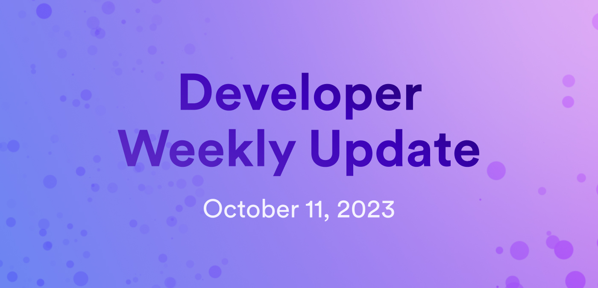

# Developer weekly update October 11, 2023

Hello everyone and welcome to DFINITY developer weekly! This week, we'll talk about updates to ckBTC, the `ic-js` library, and increased subnet storage and resource reservation. Let's dive in!

## ckBTC now supports ICRC-2 standards

The ledger, index, and archive canisters for ckBTC have been upgraded to now support the ICRC-2 standard! As part of this upgrade, the ckBTC minter has also been upgraded to support a simpler flow for transferring ckBTC into BTC. In this new minter workflow, the minter can be authorized to take ckBTC and use it to obtain BTC using the new `retrieve_btc_with_approval` endpoint instead of sending ckBTC to a minter-controlled subaccount.

You can read the full details on the DFINITY [forum](https://forum.dfinity.org/t/ckbtc-a-canister-issued-bitcoin-twin-token-on-the-ic-1-1-backed-by-btc/17606/166).

## ICP/ICRC ledger breaking changes

Recently, the `ic-js` library has undergone breaking changes. Part of these changes include relocating ICP ledger features previously included in the package `@dfinity/nns` to `@dfinity/ledger-icp` and moving the ICRC ledger features to `@dfinity/ledger-icrc`. The `@dfinity-ledger` package will be deprecated and retired in the future.

Essentially, as a result of these changes, the `@dfinity/ledger-icp` package encompasses the ICP ledger functions, and the `@dfinity/ledger-icrc` package encompasses functions for ICRC tokens, ckBTC, and SNSes.

The full details can be found on the forum [here](https://forum.dfinity.org/t/breaking-changes-in-ledger-icrc-icp-javascript-libraries/23465?utm_source=weekininternetcomputer.beehiiv.com&utm_medium=referral&utm_campaign=week-in-internet-computer-icp-news-oct-7-2023).

## Increased subnet storage capacity and resource reservation

The subnet storage capacity has been increased from 450GiB to 700GiB as of replica version `76fd768b`. This increase is the first significant milestone in the movement to push the subnet storage capacity toward terabytes rather than gigabytes.

In addition to this storage increase, a new resource reservation mechanism is designed to enable consistent, long-term use of storage for nodes running on application subnets by making it more expensive for inconsistent, high spikes of usage, and keeping costs the same for consistent, long-term users. This for application subnets only because system subnets and verified application subnets do not need protection from sudden, unexpected, large spikes in storage usage.

This new mechanism has been added to `dfx` through the new fields `reserved_cycles` and `reserved_cycles_limits`. Check out this [forum post](https://forum.dfinity.org/t/increasing-subnet-storage-capacity-and-introducing-resource-reservation-mechanism/23447) for the full information and how these changes work.

That'll wrap it up for this week, until next time!

-DFINITY
