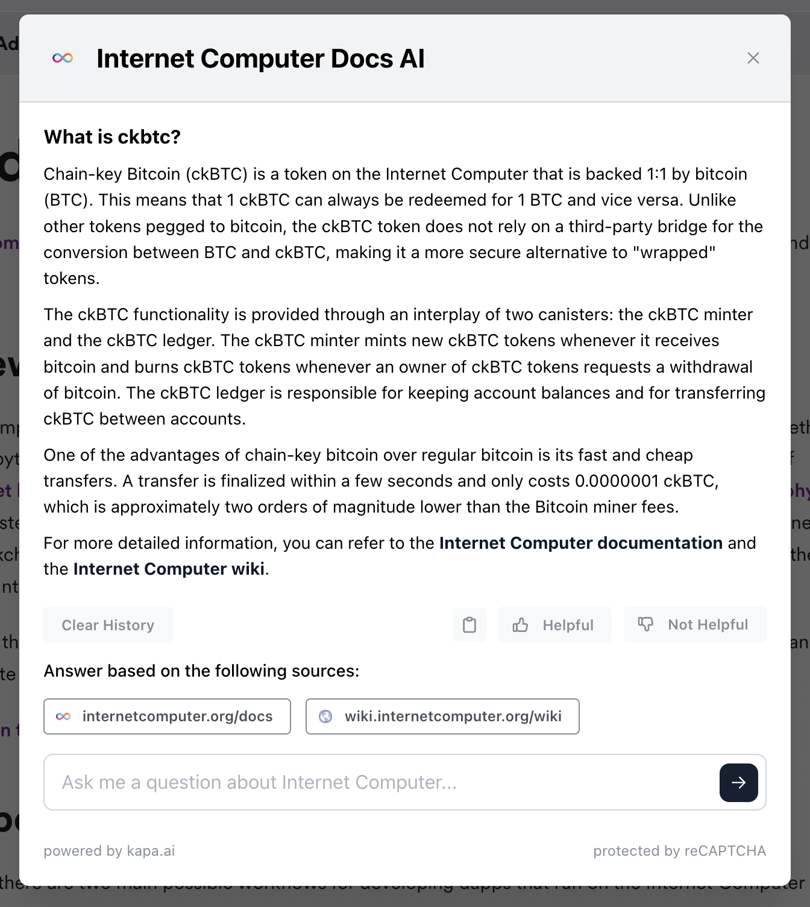

# Developer weekly update October 18, 2023

This week, we'll take a look at a new AI tool on the developer documentation, the latest level of the Developer Liftoff series, and ask for your feedback on naming a new tool!

## Developer docs 'Ask AI' chat bot

This past week, ICP developer docs got a new exciting widget addition: an AI chat widget! This AI chat widget uses an LLM trained on the ICP wiki, developer docs, and developer forum, to provide answers to questions and help developers find resources. Additionally, developers have given the DFINITY team valuable feedback on other resources that the LLM should be trained on. That feedback can be found and submitted in the forum post [here](https://forum.dfinity.org/t/use-an-llm-to-help-build-on-icp-feedback-appreciated/23804)

This chat widget is powered by [Kapa.ai](https://www.kapa.ai/), which hosts the LLM data off-chain. The ICP website, however, is fully onchain.

An example question might be, "What is ckBTC?", in which, the AI replies with a generated area such as:

Try it yourself on the [developer docs](https://internetcomputer.org/docs/home) by clicking the 'Ask AI' button!

## Developer Liftoff level 3

Level 3 of the [Developer Liftoff tutorial series](/docs/tutorials/developer-liftoff/) is now live on the developer docs! In level 3, we cover Motoko package managers, HTTPS outcalls, certified data, agents, and Internet Identity. A full breakdown can be found below:

- [3.1 Motoko package managers.](/docs/tutorials/developer-liftoff/level-3/3.1-package-managers): To use packages developed outside of the Motoko base library, a Motoko package manager can be used. This module covers:
    - What is a package manager?
    - Installing Mops.
    - Installing Vessel.
    - Using Mops.
	    - Creating a new project.
	    - Configuring your project to use Mops.
	    - Initializing Mops.
	    - Adding packages to `mops.toml`.
    - Publishing a package.
    - Using Vessel.
    - Importing packages into your Motoko code.

- [3.2 Using HTTPS outcalls.](/docs/tutorials/developer-liftoff/level-3/3.2-https-outcalls): HTTPS outcalls are a feature of canisters on ICP that allow smart contracts to directly make calls to HTTP servers that are external to ICP. This module covers:
    - Supported HTTP methods.
    - Cycles.
    - HTTPS outcalls API.
    - HTTP `GET`.
        - Prerequisites.
        - Creating a new project.
        - Creating an HTTP `GET` request.
        - Calling the HTTP `GET` request.
    - HTTP `POST`.
        - Prerequisites.
        - Creating a new project.
        - Creating an HTTP `POST` request.
        - Calling the HTTP `POST` request.

- [3.3 Certified data.](/docs/tutorials/developer-liftoff/level-3/3.3-certified-data): Certified data utilizes **chain-key cryptography** at the canister level to generate a digital signature that can be validated using a permanent, public key that belongs to the Internet Computer, whose private key counterpart is constantly distributed across many different nodes on the network. This module covers:
    - How data is certified.
        - Data certificates.
        - How canisters certify data.
        - Certified data API methods.
    - How Developers can certify data.
        - Certified data Motoko module.
        - Certified data Rusk CDK module.
    - Generating an HTTP response.
        - Example.
    - Using certified variables.
        - Prerequisites.
        - Creating a new project.
        - Creating an HTTP request.
        - Interacting with certified variables.
    - Resources.

- [3.4 Introduction to agents.](/docs/tutorials/developer-liftoff/level-3/3.4-intro-to-agents): On the Internet Computer, an **agent** is a library used to make calls to ICP's public interface. This module covers:
    - What does an agent do?
        - Structuring data.
        - Decoding data.
        - Managing authentication.
            - Accepted identities.
    - Available agents.
    - Using the JavaScript agent.
        - Prerequisites.
        - Creating a new project.
        - Generating Candid declarations.
        - Creating the JavaScript agent.
        - Using the agent.

- [3.5 Identities and authentication.](/docs/tutorials/developer-liftoff/level-3/3.5-identities-and-auth): When developing on the Internet Identity, there are several types of identities and methods of authentication that you'll encounter. This module covers:
    - Types of identity.
    - Internet Identity.
       - Internet Identity architecture.
        - What is a passkey?
    - Creating an Internet Identity.
    - Integrating an Internet Identity into your app.
        - Prerequisites.
        - Creating a new project.
        - Creating an actor.
        - Importing the `auth-client` package.
        - Pulling the Internet Identity canister.
        - Interacting with the integration.

- [3.6 Motoko level 3.](/docs/tutorials/developer-liftoff/level-3/3.6-motoko-lvl3): In this Motoko level, we'll look into caller identification, adding access control with identities, plus other non-identity related functionalities such as pattern matching and periodic tasks. This module covers:
    - Principals and caller identification.
    - Adding access control with identities.
        - Prerequisites.
        - Creating a new project.
        - Creating an owner identity.
        - Writing backend code with access control.
        - Interacting with the dapp.
    - Pattern matching.
    - Periodic timers.

## `dfx` version manager

We need your feedback!

An upcoming tool, currently known as the `dfx` version manager, needs a name! There is an ongoing naming thread on the forum that can be found [here](https://forum.dfinity.org/t/dfx-version-manager-naming-thread/23665).

The `dfx` version manager will be a tool designed to simplify and improve installing and using different versions of `dfx` locally. Currently, switching between different versions is clunky and can cause discrepancies within your local environment. The `dfx` version manager will provide a solution to this common developer pain point.

That'll wrap things up for this week, be sure to check back in next time!

-DFINITY
