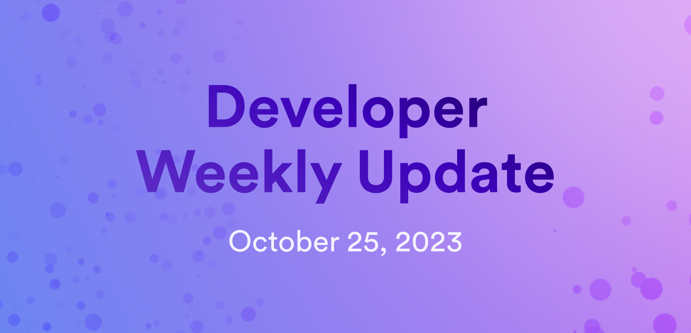

# Developer weekly update October 25, 2023

Hello developers and welcome back to developer weekly! This week, we're excited to share the first video tutorial in the Developer Liftoff series, announce the name for the `dfx` version manager, and take a look at the details of a proposed new workflow for SNS launches.

## Developer Liftoff video series

In previous dev updates, we've introduced the Developer Liftoff documentation series and provided updates when new 'levels' of the tutorial series have been published. In today's update, we're excited to share that the first video corresponding to the documentation has been released!

The first video, **ICP Developer Liftoff 0.1 | Overview of the Internet Computer** corresponds to the very first page in the Developer Liftoff series, which can be found [here](/tutorials/developer-liftoff/level-0/ic-overview).

New videos will be released every week, and will follow each page of the Developer Liftoff documentation - that means there will be a total of 36 videos!

The first video can be found on the DFINITY Youtube channel:

## `dfx` version manager name decision

Last week, we asked for your feedback on naming an upcoming tool known as the `dfx` version manager. The results are in, and a name has been decided!

The `dfx` version manager will be called **dfxvm**.

Stay tuned for more updates on this new tool!

## Proposed new SNS workflow

Recently, a new SNS hand-off workflow has been proposed on the developer forum. This new workflow has been proposed because there has been a high amount of friction during the canister hand-off process, especially when handing off the SNS's asset canister.

For an SNS to be launched, the dapp's canisters must be handed over from the developers to the SNS itself. Prior to August 2023, this process included the following steps:

- An SNS is first approved to be launched through an NNS proposal.

- The dapp's canisters are then created and initialized, with the SNS governance canister's ID being publicly known.

- Then, developers hand over the dapp's canisters to the SNS.

- The SNS root canister is set as the controller of the canisters, and the SNS's proposal methods are configured so that they can only be called by the governance canister.

- Lastly, an NNS proposal is used to start the SNS decentralization swap and launch the SNS.

This process was amended in August 2023 to simplify and condense several steps, ultimately providing an SNS to be created through a single NNS proposal. In this revised workflow, the dapp's canisters are handed over from the developers to the NNS, then an NNS proposal creates the SNS canisters, initializes them, hands them over to the SNS, then starts the decentralization swap and launches the SNS.

This is how the SNS process currently operates.

The newly proposed workflow takes this current workflow and adds an additional step where once the SNS is launched, the SNS community upgrades the dapp's canisters through an SNS proposal. Within this upgrade, they can set the privileges within the dapp appropriately.

You can read more about this proposed workflow and provide your thoughts on the [developer forum](https://forum.dfinity.org/t/handing-over-dapp-canisters-to-an-sns-dao/23877).

That'll wrap up this week. Tune back in next week for more developer updates!

-DFINITY
