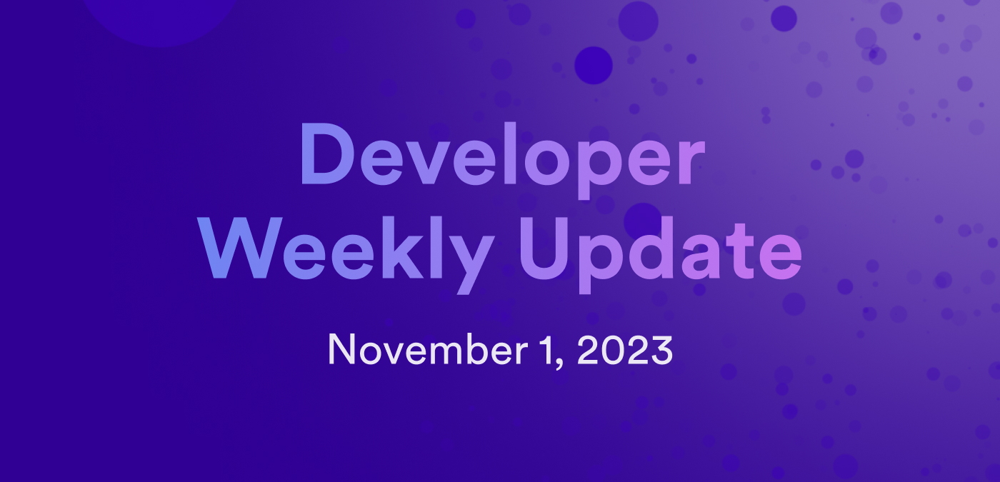

# Developer weekly update November 1, 2023

Hello developers and welcome to this week's developer weekly update! In this update, we announce the publication of the Developer Liftoff level 4 documentation, a handful of other documentation updates, and a new ledger method for retrieving your account identifier. Let's dive in!

## Developer Liftoff level 4

This week, the Space Pilot level of the Developer Liftoff series was published! In this level, developers learn about tokens such as ICP and ICRC-1, how to deploy and use their respective ledgers, and how to use the ICP Bitcoin integration. This level also covers ICP's form of governance through the NNS and the CLI tool quill that can be used to interact with the ICP ledger, ckBTC, and the NNS.
Here's the full breakdown of level 4:

- [4.1 Using the ICP ledger](/tutorials/developer-liftoff/level-4/4.1-icp-ledger): In this tutorial, we'll dive into how to deploy a local instance of the ICP ledger canister and how to interact with it:
    - Accounts.
    - Transaction types.
    - Deploying the ICP ledger locally.
        - Prerequisites.
        - Creating a new project.
        - Locating the Wasm and Candid files.
        - Creating a `minting` account.
        - Deploying the canister.
    - Interacting with the ICP ledger canister.
        - Using `dfx ledger`.
        - Using `dfx canister`.
        - Using the Candid UI.
    - Resources.

- [4.2 ICRC-1 tokens](/tutorials/developer-liftoff/level-4/4.2-icrc-tokens): For developers to create their own fungible tokens on the Internet Computer, the ICRC-1 token standard can be used. For this tutorial, we'll focus on the ICRC-1 standard, ICRC-1 ledger, and briefly look into the ICRC-2 standard:
    - What’s the difference between the ICP and ICRC-1 ledgers?
        - `Account`s versus `AccountIdentifier`s.
        - Endpoints.
    - Index canisters.
    - Extensions of the standard.
    - Metadata.
    - Deploying the ICRC-1 ledger locally.
        - Prerequisites.
        - Creating a new project.
        - Locating the Wasm and Candid files.
        - Deploying the ICRC-1 ledger on the mainnet.
    - Interacting with the ICRC-1 ledger.
        - Using the `dfx canister` command with ICRC-1 endpoints.
        - Using ICRC-2 endpoints.
        - Using the Candid UI.
    - Resources.

- [4.3 ckBTC and Bitcoin integration](/tutorials/developer-liftoff/level-4/4.3-ckbtc-and-bitcoin): One of the key features of the Internet Computer is known as **chain-key cryptography**. This feature enables integrations with other networks, such as the Bitcoin network. In this tutorial, we take a look at ckBTC and the Internet Computer's Bitcoin integration:
    - Bitcoin integration architecture.
    - What is ckBTC?
    - Bitcoin use cases on ICP.
    - Deploying a Bitcoin dapp.
        - Prerequisites.
        - Setting up a local Bitcoin network.
        - Cloning the `basic_bitcoin` example.
        - Deploying the example canister.
        - Generating a Bitcoin address.
        - Receiving BTC.
        - Checking your BTC balance.
        - Sending BTC.
    - Resources.

- [4.4 NNS governance and staking](/tutorials/developer-liftoff/level-4/4.4-nns-governance): The Network Nervous System (NNS) is the governing body of the Internet Computer. It is a decentralized autonomous organization that is hosted fully onchain and is responsible for making protocol-level upgrades to ICP:
    - What is the NNS?
        - Neurons.
        - Proposals.
    - Why is the NNS important to developers?
    - Using the NNS dapp.
        - Transferring ICP tokens into your Internet Identity `Main` account.
        - Staking ICP in a neuron.
        - Interacting with NNS proposals.

- [4.5 Using quill](/tutorials/developer-liftoff/level-4/4.5-using-quill): Quill is a ledger and governance toolkit that provides support for self-custody of ICP tokens and functionality to interact with the NNS, SNSs, and ICP ledger from a **cold wallet**:
    - What is quill?
    - Downloading and installing quill.
    - Using quill’s basic commands.
    - Using quill with ckBTC.
    - Using quill with the NNS.
    - Resources.

- [4.6 Motoko level 4](/tutorials/developer-liftoff/level-4/4.6-motoko-lvl4): In this final Motoko module of the Developer Liftoff series, we'll cover the following Motoko concepts and components:
    - Mutable state.
        - Immutable variables versus mutable variables.
        - Reading data from mutable memory.
        - Immutable arrays.
        - Mutable arrays.
    - Local objects and classes.
        - Object classes versus actor classes.
        - Object types.
        - Object subtyping.
        - Object classes.
        - Data arguments.
    - Message inspection.
    - Errors and options.
        - Error handling best practices.
        - Error reporting with `Option` values.
        - Error reporting with `Result` variants .
        - Asynchronous errors.
    - Resources.

## New `account_identifier` method for the ledger

A new method for the ICP ledger is available. This method, `account_identifier` is used to return your account identifier. Before, developers had to get the SHA224 hash for their `principal` and `subaccount_identifier`, then prepend this value with the CRC32 value to get their account identifier. This method does this work behind the scenes for you, so there is no longer a risk of getting a wrong identifier due to incorrect byte manipulation.

You can view the reference documentation for the ledger [here](/references/ledger#_accounts).

## Documentation updates

This week, the developer docs saw several updates, which include:

- Publication of the six documents that make up [Level 4 of the Developer Liftoff](/tutorials/developer-liftoff/level-4/).
- The [ledger reference documentation](/references/ledger#_accounts) has been updated to include the new `account_identifier` method.
- A new document on the canister history feature has been created.
- A new community-contributed JavaScript signature verification library has been added to the documentation for independently verifying signatures.
- The playground documentation has been updated to include instructions for how to create a custom local playground instance.

That'll wrap things up for this week! See everyone in the next issue of developer weekly!

-DFINITY
