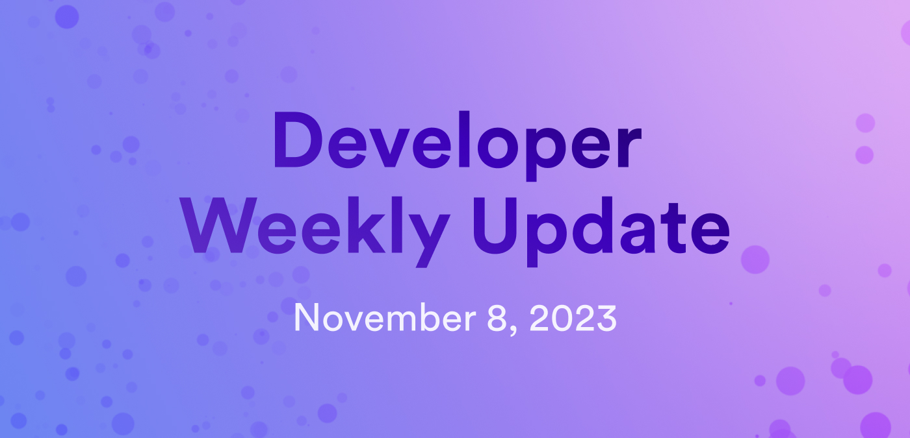

# Developer weekly update November 8, 2023



Hello devs! Welcome to this week's developer weekly update. In this issue, we're excited to talk about the planned ICP events for DevConnect 2023 next week, the PocketIC testing library, and introduce the 'Zero to Dapp' educational series! 

## ICP at DevConnect 2023

Next week, ICP will be at DevConnect 2023 in Istanbul! There are several ICP events planned, so if you'll be at the event be sure to stop by! 

Here's the full schedule of events:

### Wednesday, November 15, 2023:

**Cross-Chain Hacker's Den**: Come join ICP in this hacker-house style event, filled with discussions about ICP's cross-chain capabilities. There will be chances to submit bounties and win prizes! 

You can sign up [here](https://lu.ma/HackersDen).

**Threshold Crypto Day**: A one-day conference for learning, exploration, and networking that covers threshold cryptography research, engineering, product, and more. 

You can sign up [here](https://lu.ma/ThresholdCryptoday).

### Thursday, November 16, 2023:

**ETH Pragma**: Pragma is a one-day event for high-quality talks and discussions for leaders, builders, and developers within the Ethereum ecosystem. This event will feature DFINITY Founder Dominic Williams as a roundtable speaker, and also include an ICP booth location. 

You can purchase a ticket [here](https://ethglobal.com/events/pragma-istanbul).

## PocketIC 

Introducing PocketIC! PocketIC is a testing library that enables a canister testing suite for Rust and Python canisters. It supports deterministic and programmatic canister testing through a lightweight infrastructure that can be seamlessly integrated with existing testing infrastructures such as `cargo test`. 

PocketIC runs as a standalone binary on macOS and Linux systems without needing to run additional containers or virtual machines.

Here's an example canister test written using PocketIC:

```rust
use candid::{encode_one, Principal};
use pocket_ic::PocketIc;

 #[test]
 fn test_counter_canister() {
    let pic = PocketIc::new();
    // Create an empty canister as the anonymous principal.
    let canister_id = pic.create_canister(None);
    pic.add_cycles(canister_id, 1_000_000_000_000_000);
    let wasm_bytes = load_counter_wasm(...);
    pic.install_canister(canister_id, wasm_bytes, vec![], None);
    // 'inc' is a counter canister method.
    call_counter_canister(&pic, canister_id, "inc");
    // Check if it had the desired effect.
    let reply = call_counter_canister(&pic, canister_id, "read");
    assert_eq!(reply, WasmResult::Reply(vec![0, 0, 0, 1]));
 }

fn call_counter_canister(pic: &PocketIc, canister_id: Principal, method: &str) -> WasmResult {
    pic.update_call(canister_id, Principal::anonymous(), method, encode_one(()).unwrap())
        .expect("Failed to call counter canister")
}
```

PocketIC allows for versatile, custom control over execution environments to run specific tests, such as providing functionality to manipulate the stable memory of a canister and test canister upgrade. It provides the ability to create reproducible test executions, as non-deterministic components of the replica such as networking and [consensus](https://learn.internetcomputer.org/hc/en-us/articles/34207558615956-Consensus), are replaced with deterministic counterparts for testing. It also allows for fast test execution since networking related timeouts are removed.

You can learn more about PocketIC and ask questions in the forum post discussion [here](https://forum.dfinity.org/t/pocketic-fast-and-versatile-canister-testing-in-rust-and-python/23793/).


## Zero to Dapp education series

Introducing the new Zero to Dapp education series! This series is the latest education initiative through a collaboration with Encode Club to help onboard new developers onto the ICP. 

This series will contain 8 live, online sessions to teach developers about the fundamentals of the Internet Computer. Topics for this series include:

1. The Internet Computer Protocol
2. Canisters — Smart Contracts on steroids
3. Internet Identity — A secure and privacy preserving identity for all services
4. Connecting canisters to the Web with HTTPS Outcalls — No Oracles required
5. The Bitcoin Direct Integration & ckBTC — Bringing smart contracts to Bitcoin
6. Unlocking More Awesomeness — Dive Deeper with These Resources
7. IC Developer Grantee Showcase
8. Hackathon Success Stories and Ideation

The programme launches on November 14, 2023 and will run through December 2023. Attendees that attend the majority of the sessions will receive an NFT certificate of completion that makes a great LinkedIn or CV asset! 

You can register for the series [here](https://encodeclub.typeform.com/icpedu23q4reg). 

Want to read the full announcement? Head over to [Medium](https://www.blog.encode.club/announcing-the-zero-to-dapp-educate-series-learn-and-build-on-the-internet-computer-b264abefd451) for the full blog post. 

That'll wrap up this week's developer weekly update! See you next week!

-DFINITY

