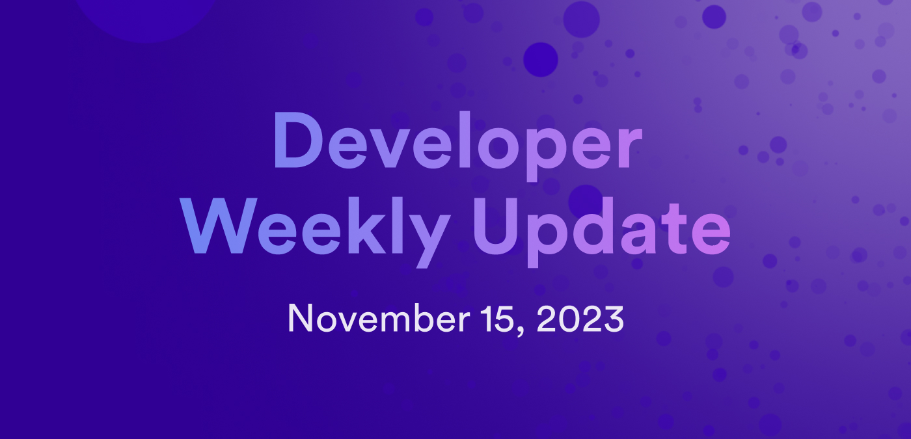

# Developer weekly update November 15, 2023

Good afternoon developers and welcome to this week's edition of developer weekly! In this week's issue, we're excited to talk about episode 3 of the ICP Developer Liftoff video series, the recent 'Let's Talk ICP-ETH integration' talk, and the latest Motoko release, v0.10.2. Let's get started!

## Episode 3 of the Developer Liftoff video series

Episode 3 of the video series corresponding to the Developer Liftoff tutorial series is now live on the DFINITY YouTube channel! In this episode, we walk through how to set up your developer environment by installing IC SDK, Node.js, and getting familiar using a command line interface through gaining a basic introduction to using CLI commands.

New episodes of the Developer Liftoff are released every week, and will correspond to each tutorial included in the Developer Liftoff series on the [developer documentation](/docs/tutorials/developer-liftoff/).

You can find the video tutorial on YouTube [here](https://t.co/X9nF5k9zFF).

## Let’s talk ICP-ETH integration: ckETH, EVM world computer and more

In addition to the Developer Liftoff video, another great educational asset has been published on the DFINITY YouTube channel this past week: 'Let’s talk ICP-ETH integration: ckETH, EVM world computer and more'! This video features an insightful, in-depth discussion about the upcoming ICP-ETH integration, featuring Kyle Langham,  Director of Data and Analytics at DFINITY, Jan Camenisch, CTO of DFINITY

Lomesh Dutta, VP of Growth at DFINITY, Manu Drijvers, Director of Engineering at DFINITY, Marcin Kaźmierczak, COO at Redstone Oracles, and Max Chamberlin, CEO of BITFINITY. You'll definitely want to give this one a listen!

You can find the full talk on YouTube [here](https://www.youtube.com/watch?v=JuwHREhrsTc).

## Motoko v0.10.2

This week, Motoko version 0.10.2 was released! Some important takeaways from the release notes include:

- A breaking change where values of type `Principal` are now constrained to contain at most 29 bytes. This matches ICP's notion of a principal. In this change specifically:

    - An actor import will be rejected if the binary representation of the aliased textually encoded principal contains more than 29 bytes.

    - `Principal.fromBlob(b)` will trap if `b` contains more than 29 bytes.

    - The actor literal (actor `<exp>`) will trap if the binary representation of the textually encoded principal `<exp>` contains more than 29 bytes.

- A bug fix to separate `tag` from `underscore` in coverage warnings.

- Code compiled for targets WASI (-wasi-system-api) and pure Wasm (-no-system-api) can now use up to 4GB of stable memory.

- A bug fix to fully implement Region.loadXXX/storeXXX for `Int8`, `Int16`, and `Float`.

- A bug fix in `motoko-base` that fixes `Array.tabulateVar` to avoid repeated side effects.

You can read the full release notes [here](https://github.com/dfinity/motoko/releases/tag/0.10.2).

That'll wrap up this week's developer weekly update, be sure to tune in next week!

-DFINITY