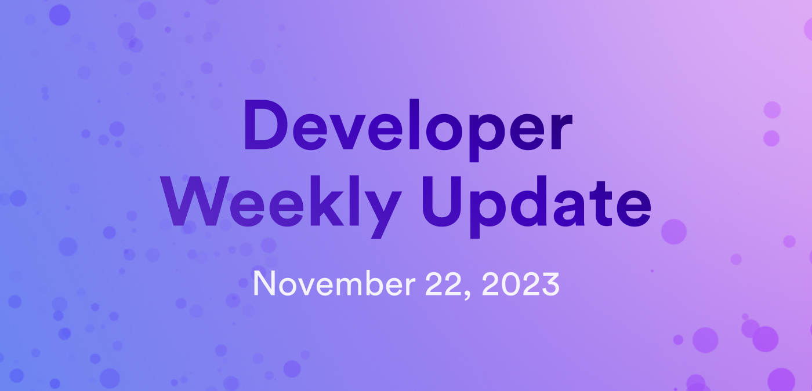

# Developer weekly update November 22, 2023

Hello developers and welcome to this week's edition of developer weekly! This week, we dive into the new replica-signed queries feature, the new [ICP JavaScript agent](https://www.npmjs.com/package/@dfinity/agent)` release, and episode 4 of the Developer Liftoff video series!

## Replica-signed queries

This past week, we've rolled out our newest feature: replica-signed queries! This feature strives to enhance the trustworthiness of queries by providing signatures in query responses that provide a level of validation to better guarantee against malicious query attacks.

This feature includes two primary changes. First, the subnet state tree now exposes the public keys of the replicas. Then, query responses will now contain a signature that signs specific parts of the response using the replica's private key. The query response can be validated by fetching the replica's public key from the state tree, reading the public key of the signing replica, then verifying the signature.

You can read the full blog post that dives deeper into the feature [here](/blog/features/replica-signed-queries).

## ICP JavaScript agent `v.0.20.0`

To support replica-signed queries, a new version of the [ICP JavaScript agent](https://www.npmjs.com/package/@dfinity/agent) has been released, which introduces support for replica-signed queries amongst other new features and bug fixes. Some highlights from the release notes include:

### New features:

- Node keys can now be fetched from subnet certificates.

- Logic catches that throw errors are now retried.

- `canisterStatus` now shows subnet metrics.

- Round ingress expiry is now enabled.

- Nonce values have been removed from queries.

- `ExpirableMap` has been introduced and is used for subnet keys.

### Bug fixes:

- Fixed a bug where `canisterStatus` returned a full list of controllers.

- Fixed a bug regarding `bigint` `toJson` trailing space.

- Fixed a bug where service ordering must be alphabetical.

You can read the full release notes [here](https://github.com/dfinity/agent-js/releases/tag/v0.20.0).

## Developer Liftoff episode 0.4: Introduction to canisters

The fourth video installment of the Developer Liftoff video series has been released! In this episode, developers are introduced to canisters, their architecture, and the different types of canisters that they'll come across in the Developer Liftoff.

You can watch the full video on YouTube here:

