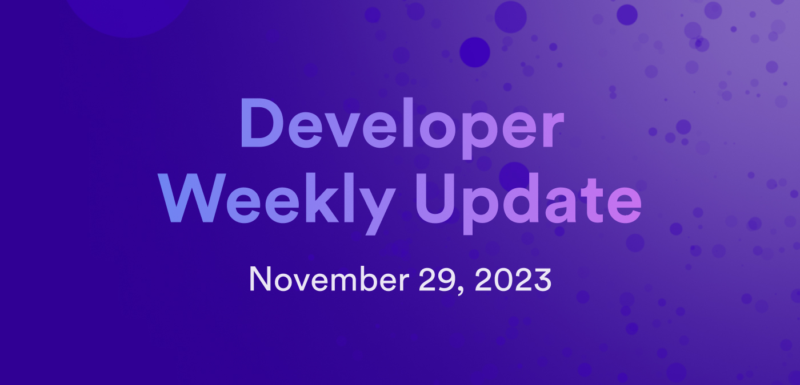

# Developer weekly update November 29, 2023



Hello developers and welcome back to developer weekly! This week, we're excited to talk about a new version of PocketIC, an exciting development in the IC ETH integration, and the upcoming ICRC-3 standard. Let's get started!

## PocketIC v2.0.0

PocketIC is a canister testing platform for Rust and Python canisters. A detailed blog post about PocketIC is coming soon, but for today's update we're excited to share that a new version of PocketIC has been released. In v2.0.0 of PocketIC, multi-subnet testing is now supported! With multi-subnet testing, canister deployments can be tested on different locally simulated subnets using the PocketIC Rust library. 

For example, to create an IC instance with local two application subnets and an NNS subnet, you can use the following code snippet: 

```rust
let pic = PocketIcBuilder::new()
    .with_nns_subnet()
    .with_application_subnet()
    .with_application_subnet()
    .build();
```

Then, to target the NNS subnet to create a canister, use the following piece of code:

```rust
let nns_sub = pic.topology().get_nns_subnet().unwrap();
let nns_can_id = pic.create_canister_on_subnet(..., nns_sub);
```

To target one of the application subnets, use the code:

```rust
let app_sub_2 = pic.topology().get_app_subnets()[1];
let app_can_id = pic.create_canister_on_subnet(..., app_sub_2);
```

Then, create a canister with a specific `canister_id` on a named subnet. A named subnet are subnets such as the NNS, SNS, II, or Bitcoin subnets:

```rust
let ledger_canister_id = Principal::from_text("ryjl3-tyaaa-aaaaa-aaaba-cai").unwrap();
pic.create_canister_with_id(..., ledger_canister_id);
pic.install_canister(ledger_canister_id, ...);
```

You can read more about this release of PocketIC on the forum [here](https://forum.dfinity.org/t/pocketic-multi-subnet-canister-testing/24901).

## ckETH

An exciting development in the ICP ETH integration has been announced! DFINITY plans to submit NNS proposals to install the ckETH token this Friday, December 1st! 

The ckETH code has been tested thoroughly on the ckSepoliaETH environment and working well for the past two months. Several internal security reviews have been executed to validate the code's integrity, and there have been no major security flaws or findings as a result of these reviews. 

If the proposal is adopted, real mainnet ckETH would be available for anyone to use on the IC. This will alow for new workflows such as creating UIs for converting between ETH and ckETH, and in the future enable functionalities for ckERC20 and the upcoming EVM RPC canister. 

You can vote on the proposal once it has been submitted via the [NNS dapp](https://nns.ic0.app/).

Additionally, you can learn more about ckETH on the forum post [here](https://forum.dfinity.org/t/cketh-a-canister-issued-ether-twin-token-on-the-ic/22819/69).


## ICRC-3 standard

A second draft of the ICRC-3 standard has been finalized. The next step for this standard is for the working group to proceed with voting on the standard and if approved, create the NNS motion proposal to implement the standard. 

The ICRC-3 standard will be used for accessing the block log of a ledger on the IC. The proposed standard specifics the following:

- A generic format for sharing the block log without losing information, including the fields that a block must contain.

- A mechanism to verify the block log from the client side.

- A way for future standards to define new transaction types compatible with ICRC-3.

- Two new endpoints; one for getting blocks and one for getting the last block certification.

You can read more about the proposed ICRC-3 standard in the specification document [here](https://github.com/dfinity/ICRC-1/blob/c1cfd5fb2893134d90b48622166203b04c650233/standards/ICRC-3/README.md) and leave feedback on the forum [here](https://forum.dfinity.org/t/icrc-3-draft-v2-and-next-steps/25132).

That'll wrap up this week. Tune back in next week for more developer updates!

-DFINITY
