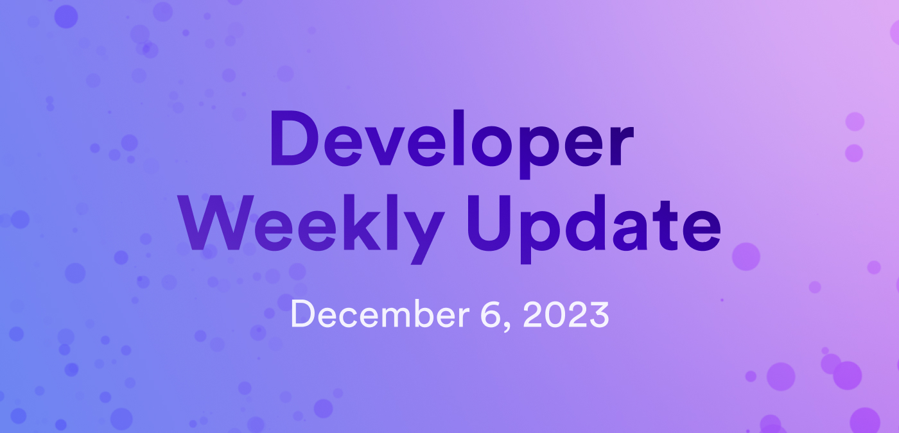

# Developer weekly update December 6, 2023

Hello developers and welcome back to developer weekly! This week, we have some very exciting announcements about ckETH, an EU subnet proposal, and the final level of the Developer Liftoff series! Let's get started.

## ckETH: now live!

On Friday, December 1st, the NNS proposals to enable ckETH on ICP went live. We're excited to announce that all proposals were passed by the NNS, and ckETH is now live on the mainnet!

ckETH has been added to the ICP dashboard, which you can view [here](https://dashboard.internetcomputer.org/ethereum). You can learn how to interact with ckETH by reviewing the ckETH minter documentation [here](https://github.com/dfinity/ic/blob/master/rs/ethereum/cketh/minter/README.adoc).

ckETH support is also live in the ICRC-1 wallet, which includes ckETH has a pre-defined token. The index canister has been integrated, allowing you to mint directly to your principal. The ICRC-1 wallet canister can be found [here](https://e4hv6-7yaaa-aaaao-a2ida-cai.icp0.io/)

With the current ckETH integration, you will not be able to withdraw to ETH directly from the ICRC-1 wallet. This is because the ICRC-1 wallet does not support the withdrawal process (withdraws are supported in the ICRC-2 standard). To withdraw ckETH for ETH, you can send your ckETH to your dfx principal, then withdraw from there following [these steps](https://github.com/timohanke/ic/blob/d34903fc2c41e2cff5df86248628f5d0b4fd7168/rs/ethereum/cketh/minter/README.adoc#withdrawal-cketh-to-eth).

To encourage you to try it out, the first person who logs into the ICRC-1 wallet using the “Seed method” with seed “ckETH”, then adds the subaccount whose index is “ckETH” in hex will find some ETH in it!

You can join the forum discussion [here](https://forum.dfinity.org/t/cketh-a-canister-issued-ether-twin-token-on-the-ic/22819/95) to let us know your thoughts on ckETH and report any bugs you might encounter.

## EU subnet NNS proposal

Another new and exciting proposal is now live for voting on the NNS. This proposal is the first of three proposals that proposes launching an EU subnet! Adding this subnet would be a huge milestone in enabling GDPR-compliant services on ICP.

This proposal will create a new subnet type of 'European'. If this initial proposal passes, two additional proposals will be submitted. The first will propose the creation of a subnet with only node machines located in the European geographic region, and a second proposal will assign the subnet type 'European' to the newly created subnet.

This new subnet type will enable developers and enterprises alike to benefit from:

- Building and deploying applications that require a GDPR-aligned infrastructure.

- Building and deploying applications that leverage blockchain decentralization with regional data sovereignty needs.

It is important to note that while the creation of an EU subnet would enable applications to be GDPR-compliant, developers and enterprises will need to take further measures to ensure that their applications meet all GDPR requirements.

You can join the discussion on the forum [here](https://forum.dfinity.org/t/european-subnet-on-the-internet-computer-a-step-toward-gdpr-ready-infrastructure/25110), and you can vote on the first proposal [here](https://nns.ic0.app/proposal/?u=qoctq-giaaa-aaaaa-aaaea-cai&proposal=126328)

## Developer Liftoff level 5

The final level of the Developer Liftoff tutorial series has been published! In this final level, you can learn about the most advanced features of ICP, how to build dapps that utilize these features, and where to go to further your Developer Liftoff on your own. This level's tutorials cover:

- [5.1 Developing an encrypted notes dapp with vetKeys](/docs/tutorials/developer-liftoff/level-5/5.1-vetKeys-tutorial): The Internet Computer vetKeys feature provides developers with more enhanced privacy, encryption, threshold decryption, and security capabilities for their projects and dapps:
    - What is vetKeys?
        - Crypto primitives.
        - Public key encryption (PKE).
        - Identity based encryption (IBE).
        - vetKD.
        - [BLS signatures](https://learn.internetcomputer.org/hc/en-us/articles/34209540682644-Subnet-Keys-and-Subnet-Signatures).
    - vetKeys example dapp.
        - Prerequisites.
        - Closing the `encrypted-notes-dapp-vetkd` example.
        - Setting up the project.
        - Reviewing the project's files.
        - Starting a local replica.
        - Deploying the Internet Identity canister.
        - Deploying the vetKD system API canister.
        - Deploying the encrypted notes backend canister.
        - Updating the generated canister interface bindings.
        - Deploying the frontend canister.
        - Starting the local development server.
        - Using the dapp.

- [5.2 Developing a dapp using the IC Ethereum integration](/docs/tutorials/developer-liftoff/level-5/5.2-ICP-ETH-tutorial): In this tutorial, you'll use the DFINITY IC ETH starter project to deploy a boilerplate dapp that showcases how the IC can query information from the Ethereum network using HTTPS outcalls:
    - Deploying the ETH starter project.
        - Project technology stack.
        - Prerequisites.
        - Downloading the starter project’s files.
        - Exploring the project's files.
        - Creating a testnet wallet.
        - Obtaining Sepolia testnet tokens.
        - Deploying the project.
        - Using the dapp.
    - Going further.
    - Resources.

- [5.3 Creating a decentralized token swap](/docs/tutorials/developer-liftoff/level-5/5.3-token-swap-tutorial): In this tutorial, you'll deploy a simple token swap canister that demonstrates how to deposit, swap, and withdraw tokens:
    - Decentralized token swap canister.
        - Prerequisites.
        - Cloning the `icrc2-swap` example.
        - Reviewing the project's files.
        - Starting a local replica.
        - Creating identities for `user_a` and `user_b`.
        - Deploying `token_a`.
        - Deploying `token_b`.
        - Exporting the token canister IDs as environmental variables.
        - Deploying the swap canister.
        - Depositing tokens into the swap canister.
        - Performing a token swap.
        - Withdrawing tokens.
        - Checking token balances.

- [5.4 Creating NFTs on the IC](/docs/tutorials/developer-liftoff/level-5/5.4-NFT-tutorial): A **non-fungible token**, commonly referred to as an NFT, is a type of tokenized asset that is assigned a unique identifier that is used to distinguish one NFT from another:
    - How do NFTs work?
    - NFT standards.
        - DIP721.
        - ICRC-7.
    - Creating and deploying an NFT.
        - Prerequisites.
        - Cloning the `dip-721-nft-container` example.
        - Confirm your local identity.
        - Reviewing the project's files.
        - Starting a local replica.
        - Deploying the project’s canister.
        - Minting an NFT.
        - Transferring an NFT.
        - Querying the balance of NFTs for your user principal.
        - Querying the maximum amount of NFTs that can be minted.
        - Querying the NFT's metadata.
        - Querying token IDs owned by your user.
        - Querying the NFT’s information.
        - Querying the owner of a specific token ID.
    - Resources.

- [5.5 Creating an auction dapp](/docs/tutorials/developer-liftoff/level-5/5.5-auction-tutorial):
- How does an auction work?
- Creating an auction dapp.
    - Prerequisites.
    - Cloning the `auction` example.
    - Reviewing the project's files.
    - Creating the backend canister.
    - Starting a local replica.
    - Deploying the project's canisters.
    - Using the dapp.

- [5.6 Next steps](/docs/tutorials/developer-liftoff/level-5/5.6-next-steps): In this final tutorial, you'll learn about some of the different resources to help guide you further in your personal Developer Liftoff:
    - Developer grants.
    - Developer bounties.
    - Hackathons.
    - ICP.Hubs.
    - Contributing to the IC.
    - Developer resources.

That'll wrap up this week's developer weekly update! See you next week!

-DFINITY

