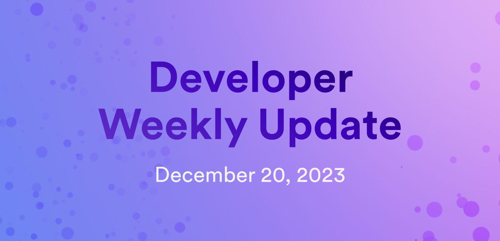

# Developer weekly update December 20, 2023

Hello developers and welcome back to developer weekly! This week, we're excited to talk about the upcoming 'Zero to Dapp' hackathon, introduce a new node metrics API, and the latest episode of the Developer Liftoff video series! Let's get started.

## 'Zero to Dapp' hackathon

In a collaboration with Encode Club, ICP is launching a four-week hackathon starting January 16, 2024. This hackathon will contain exclusive technical workshops that will help developers of all skill levels grow and enhance their skills for building on ICP. You can sign up on the Encode Club website [here](https://www.encode.club/zero-to-dapp-hackathon).

## Trustworthy node metrics

Node Provider compensation is receiving an upgrade! ICP is introducing a new approach that will enable a new node provider compensation model that rewards nodes for providing 'useful work' rather than the current, fixed-rate location based model. This change has the potential to improve the network's performance and reliability.

Providing a new node metrics API endpoint is the first step toward implementing a new reward distribution model in the future. The metrics are determined through [consensus](https://learn.internetcomputer.org/hc/en-us/articles/34207558615956-Consensus), which ensure that the metrics provided are authentic and not manipulated by a node provider. Developing these new trustworthy node metrics has been a collaboration between the Consensus, Message Routing, Execution, and Decentralized Reliability Engineering teams.

For developers and users, this initiative signifies a performance-driven and transparent system that strives to encourage node providers to maintain optimal performance and health of their nodes. These new metrics enable reliable monitoring and provide deeper insights into the operation of nodes, and ensures alignment with the network's goals.

You can learn more in the forum post [here](https://forum.dfinity.org/t/trustworthy-node-metrics-for-useful-work/22989).

## Developer Liftoff episode 1.1: Exploring a live demo

In this episode of the ICP Developer Liftoff, developers will learn how to explore a live, deployed canister that utilizes the playground  through the `dfx deploy --playground` command to get a feel for deploying canisters on the IC before developing and deploying their own.

The documentation for this episode can be found [here](/docs/tutorials/developer-liftoff/level-1/1.1-live-demo), and you can watch the full video on the DFINITY YouTube channel [here](https://www.youtube.com/watch?v=-se6Se9z-aM).

That'll wrap up this week. Tune back in next week for more developer updates!

-DFINITY
