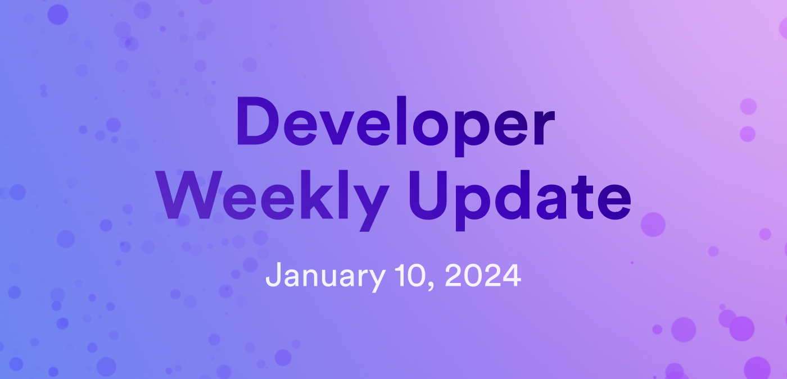

# Developer weekly update January 10, 2024

Hello developers, and welcome to this week's developer weekly update! This week, we have an exciting new release of Motoko, some news regarding increasing canister smart contract memory, and a call for community input! Let's get started.

## Motoko v0.10.4

This week, Motoko `v0.10.4` has been released! The release notes for this version are short, but for good reason: this Motoko update officializes the new incremental garbage collector after a successful beta testing phase! That's right, the incremental GC has officially been flagged for release outside of beta, meaning it is now regarded as safe for use in production. Some important notes about using the new incremental GC:

- Thoroughly test the upgrade: Be sure to take adequate measures to verify that the amount of stable data is supported when upgrading your canister. Utilize different data volumes and heap sizes to conservatively determine the amount of stable data supported by your program. 

- Monitor the heap size: Be sure to monitor memory size and heap size of your code in production.

- Avoid large allocations per message: Avoid allocations of 100 MB or more per message, as they extend the duration of the GC's increment. Instead, distribute large allocations across multiple messages.

- Limit the heap size: Set a custom limit within your program to keep the heap size and data volume below the [scalability](https://learn.internetcomputer.org/hc/en-us/articles/34576974172692-Evolution-Scaling) limit that you determined during testing.

To review the full list of recommendations along with the full release details, see the Motoko release notes [here](https://github.com/dfinity/motoko/releases/tag/0.10.4).

## Increased canister smart contract memory

The DFINITY engineering team has announced that testing of canister stable memory has been successful for 400 GB of memory! There are plans to propose in an upcoming replica version to increase the stable memory limit from 96 GB to 400 GB. 

You can read more or contribute your thoughts in the forum post [here](https://forum.dfinity.org/t/increased-canister-smart-contract-memory/6148/173).

## Request for community input: short videos!

Have a developer question that you'd like a short video explanation of? Kai from the SDK team is taking suggestions on questions to answer in a short-form video format. Ideally, the question can be answered in a short 60-second explanation, helping developers get quick, visual answers to some of their questions. Some examples are:

- "Should I use Motoko or Rust?"

- "How do I create an Internet Identity?"

- "What are threshold signatures?"

You can find an example [here](https://www.youtube.com/shorts/_AKZwwG6Z_k), that answers the question, "How do you make sure a Principal is not anonymous? How would you execute this using II?"

You can leave your questions in the forum post [here](https://forum.dfinity.org/t/video-short-suggestions/26368).

That'll wrap up this week. Tune back in next week for more developer updates!

-DFINITY
