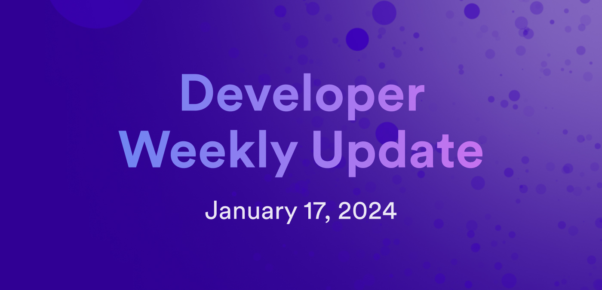

# Developer weekly update January 17, 2024

Hello developers, and welcome to this week's developer weekly update! This week, we're going to talk about the upcoming SNS developer office hours, the scalability and performance working group, and the new Cycle.Express tool for topping up canisters with fiat currency! Let's get started.

## SNS office hours

Last fall, the SNS office hours began as a regular, reoccurring meeting group for developers to ask questions about how to create and manage an SNS, while also providing feedback to the DFINITY team about the SNS process. This year, the SNS office hours are resuming in a new format. 

In this new format, developers are asked to submit their questions before the session starts so that the team can best prepare answers to the community's questions. The following process will be used:

- SNS office hours will be every other Wednesday at 5PM CET / 8AM PST, beginning January 24, 2024.

- Questions can be submitted using [this form](https://airtable.com/appnzpIOLS42Nqv6G/pagethaq2ZGIO5j9Y/form). Questions will be evaluated on Tuesday prior to the office hour session. 

You can learn more about the SNS office hours on the [forum](https://forum.dfinity.org/t/sns-office-hours-format-2024/26407), and you can subscribe to the weekly [calendar invitation](https://airtable.com/appnzpIOLS42Nqv6G/shrAtmnN4gOxcIuq3) if you'd like to attend. 

## Scalability & performance working group

The next meeting of the scalability and performance working group will be on Thursday, January 25, 2024 at 5:30 PM CET. The agenda for this meeting will be to provide an update on backup and restore features and functionality. 

You can prepare for the group by reviewing the [meeting notes for past sessions](https://drive.google.com/drive/folders/1DADNPf7HJjgu2lzny7ZuzxT1VcVebqtI?usp=sharing) or contributing to the [forum post](https://forum.dfinity.org/t/technical-working-group-scalability-performance/14265).

## Cycle.Express

Obtaining and managing cycles has been a common pain point for developers onboarding into the ICP ecosystem. This process has now been made easier with a new tool: [Cycle.Express!](https://cycle.express/).

Cycle.Express provides developers with a way to top up their canisters with fiat money directly, rather than converting ICP into cycles and topping up the canister using those cycles. 

Cycle.Express is a new tool, and feedback or suggestions are appreciated! You can provide them on the [forum post](https://forum.dfinity.org/t/introduce-cycle-express-pay-credit-cards-to-get-cycles-at-steep-discount/25919) announcing this tool. 

That'll wrap up this week. Tune back in next week for more developer updates!

-DFINITY

