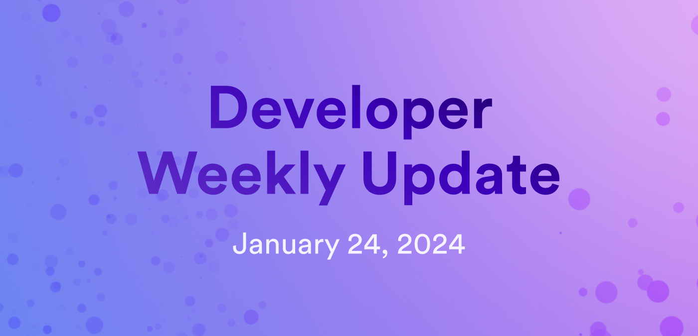

# Developer weekly update January 24, 2024

Hello developers, and welcome to this week's developer weekly update! This week, we'll talk about a new version of the [ICP JavaScript agent](https://www.npmjs.com/package/@dfinity/agent), a new developer documentation series, and an important update to the replica. Let's get started!

## ICP JavaScript agent v0.21.2

This week, a new version of the [ICP JavaScript agent](https://www.npmjs.com/package/@dfinity/agent) has been released! In this release, there are several new features, such as:

- Introducing `PartialIdentity` export, allowing you to use @dfinity/identity in @dfinity/auth-client and delegate any public key without the full key pair in the agent.

- Replacing the `secp256k1` npm package with `@noble/curves`.

- `github.dev` and `gitpod.io` have been added as known hosts.

This release also includes several bug fixes, such as:

- Fix for running audit.

- Honoring the `disableIdle` flag.

- Limiting the delegation depth of `read_state` certificates to 1.

For more information, read the [full release notes](https://github.com/dfinity/agent-js/releases/tag/v0.21.2).

## Hackathon prep course series

A new tutorial series has been published in the dev docs! This series is designed to act as preparatory materials for hackathon participants, giving them a crash-course style for developing on ICP and kickstarting their hackathon projects!

This series contains the modules:

- [1: What is the Internet Computer?](/docs/tutorials/hackathon-prep-course/what-is-icp).

- [2: Deploying your first fullstack dapp](/docs/tutorials/hackathon-prep-course/deploying-first-fullstack-dapp).

- [3: Exploring the backend](/docs/tutorials/hackathon-prep-course/exploring-the-backend).

- [4: Exploring the frontend](/docs/tutorials/hackathon-prep-course/exploring-the-frontend).

- [5: Integrating with tokens](/docs/tutorials/hackathon-prep-course/integrating-with-tokens).

- [6: Authentication](/docs/tutorials/hackathon-prep-course/authentication).

- [7: Obtaining cycles](/docs/tutorials/hackathon-prep-course/obtaining-cycles).

- [8: Managing canisters](/docs/tutorials/hackathon-prep-course/managing-canisters).

- [9: Sample starter projects](/docs/tutorials/hackathon-prep-course/sample-starter-projects).

- [10: Resources to learn more](/docs/tutorials/hackathon-prep-course/resources).

## Latest replica version

The latest version of the IC replica contains an important update that enables P2P implementation for t-ECDSA and HTTPS outcalls! The following technological improvements are included in this update:

- Replicas are guaranteed not to crash due to unbounded memory growth.

- Congestion control is fair, meaning that messages from one peer should not be favored over messages from another.

- No head-of-line blocking delays.

- Replication latency has been reduced by pushing small artifacts less than 1KB.

This update lays the groundwork for future improvements to the finalization rate of the [consensus](https://learn.internetcomputer.org/hc/en-us/articles/34207558615956-Consensus) protocol, meaning faster interaction with dapps.

That'll wrap up this week. Tune back in next week for more developer updates!

-DFINITY
