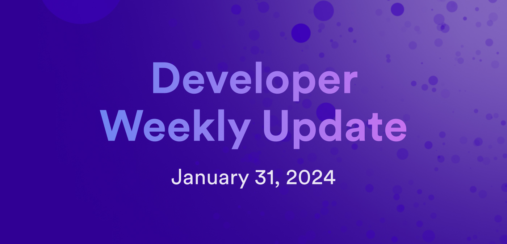

# Developer weekly update January 31, 2024

Hello developers, and welcome to this week's developer weekly update! This week, we're excited to announce new 'Hello, world' examples, some huge developer documentation updates, and a new community demo showcasing ETH and ICP. Let's get started!

## New 'Hello, world!' examples

Ready to get started developing on ICP? The 'ICP Hello, world!' example templates for Motoko and Rust have been updated! Updates to these templates include:

- The ability to run either template in [Gitpod](https://gitpod.io/#https://github.com/dfinity/icp-hello-world-motoko) or [Github workspaces](https://codespaces.new/dfinity/icp-hello-world-motoko?quickstart=1), meaning there is no need to download dfx or setup a local environment.

- [PocketIC](/building-apps/test/pocket-ic) for unit testing, allowing you to simulate deployment on the mainnet for an enhanced developer workflow.

You can check out the [Motoko repo](https://github.com/dfinity/icp-hello-world-motoko/) or [Rust repo](https://github.com/dfinity/icp-hello-world-rust) to get started!

## Documentation updates

The developer documentation has received some huge updates this past week! These updates are intended to enhance, optimize, and improve the developer onboarding experience. The primary focus has been on improving the documentation that developers would interact with when approaching ICP for the first time.

The most notable of these updates is the newly reformatted top and side navigation bars. Additionally, the UI has been updated to include divider bars in the side navigation menu to help separate different categories and be more visually appealing. Here is a before and after:

UI changes aren't the only new updates, though. There are a handful of brand new documentation pages, such as:

- [Hello, world! Getting started guide](/building-apps/developing-canisters/write).

- [Creating a developer account](/building-apps/getting-started/identities).

- [Introduction to Solidity smart contracts](https://docs.bitfinity.network/).

These changes mark a half-way point in the overarching 'Developer Documentation Accelerator project'. The second half of this project will focus on adding more new documentation pages, so expect some additional updates coming soon!

## New ETH + ICP demo

A new community-contributed demo showcasing how ETH and ICP can work together in a single dapp. This new demo showcases how users can sign into an ICP canister with Ethereum and create a 1:1 link between their ETH address and ICP principal.

Want to try it out? [Check out the demo canister](https://shtr2-2iaaa-aaaal-qckva-cai.icp0.io/) and read more about it on the [forum](https://forum.dfinity.org/t/ic-siwe-sign-in-with-ethereum-support-libraries-for-ic/25306).

That'll wrap up this week. Tune back in next week for more developer updates!

-DFINITY

