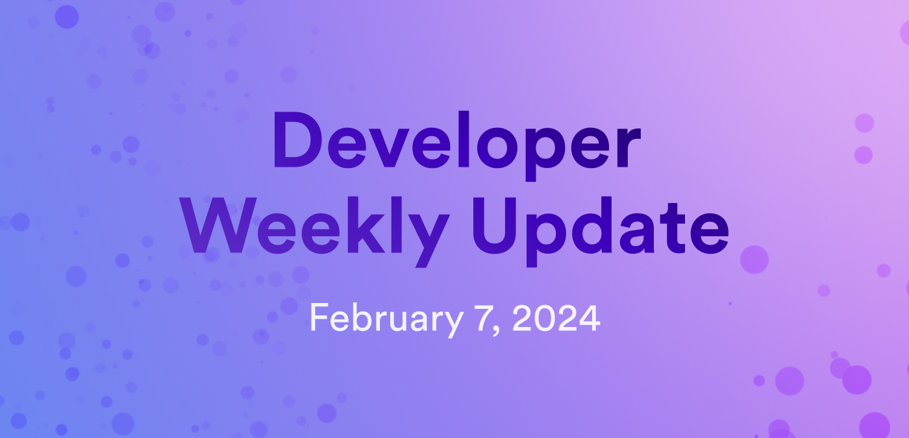

# Developer weekly update February 7, 2024



Hello developers, and welcome to this week's developer weekly update! This week, we're excited to talk about the official 'soft' launch of `dfxvm`, the launch of the EVM RPC canister, and a new community-driven course called DAO Adventure. Let's get started!


## `dfxvm` official soft launch!

The official dfx version manager tool known as `dfxvm` has beet an officially launched! `dfxvm` is designed to act like `rustup` but for `dfx`. It allows you to download, switch between, and manage different versions of `dfx` between projects. `dfxvm` is considered as a 'soft launch', meaning that it's available for download and use, but the `dfx` installation script still downloads and installs `dfx` as it has in the past. Soon, it will be updated to use `dfxvm` instead.

You can install `dfxvm` with the command:

```
sh -ci "$(curl -fsSL https://raw.githubusercontent.com/dfinity/sdk/dfxvm-install-script/install.sh)"
```

We'd love to hear your feedback about `dfxvm` on the [forum post announcing the launch](https://forum.dfinity.org/t/introducing-the-dfx-version-manager/27408), and you can contribute to the open source [`dfxvm` repo](https://github.com/dfinity/dfxvm).

## EVM RPC canister

This week, the EVM RPC canister has been launched! This canister provides the ability for ICP canisters to integrate with Ethereum smart contracts by making calls to the Ethereum JSON-RPC API! This integration allows for ICP canisters to use Ethereum data, such as block, transaction, account, or gas price information.

The key feature of this canister is that the API keys are managed within the canister on your behalf, meaning there is no need for you to go to an RPC provider such as Alchemy or CloudFlare and obtain an API key and manage it.

You can learn more about the [EVM RPC canister in the documentation](/docs/building-apps/chain-fusion/ethereum/evm-rpc/evm-rpc-canister), including how to use it in your project!

## DAO Adventure: Build a DAO in 7 days!

A new Motoko bootcamp has been announced. This new bootcamp will focus on starting out at zero and within 7 days, developers will build an entire DAO! This bootcamp will include:

- 5 guided Motoko projects.

- A video series to accompany the projects.

- Access to the Motoko Bootcamp community to ask questions and chat with other devs.

- Access to weekly workshops and monthly bootcamps for additional support and advanced topics.

Want to learn more? Check out the [forum post announcing this bootcamp](https://forum.dfinity.org/t/announcing-the-dao-adventure-build-a-dao-in-7-days/27218).

That'll wrap up this week. Tune back in next week for more developer updates!

-DFINITY