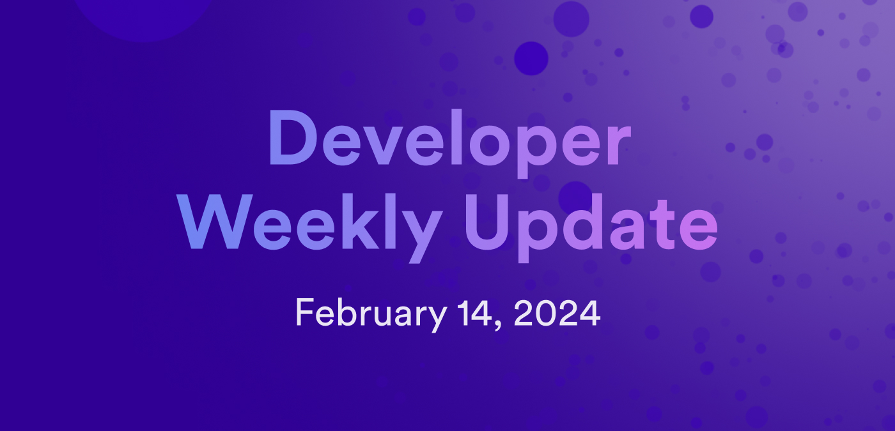
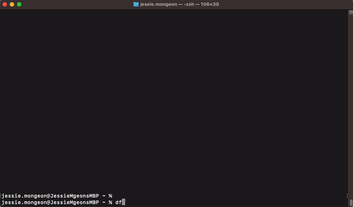
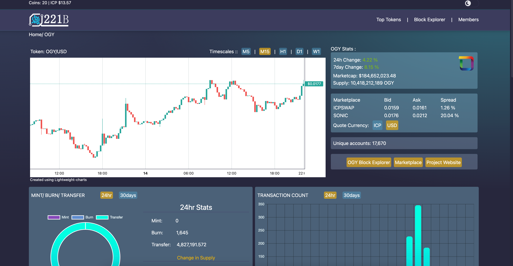

# Developer weekly update February 14, 2024

Hello developers, and welcome to this week's developer weekly update! This week, we have a new `dfx` release, v0.17.0, which introduces a brand new `dfx new` workflow, a new PocketIC release that enables threshold ECDSA testing, and a new community-developed dapp that provides onchain exploring for tokens! Let's get started.

## dfx v0.17.0

A new version of `dfx` has been released! This release is exciting because it introduces a new workflow for `dfx new`!

Now, when `dfx new` is used without any flags, an interactive prompt will be displayed that lets you customize what language backend canister you'd like to use, what frontend framework you'd like to use for your frontend canister (or choose 'No frontend canister'), and you can choose additional features to be generated within the project, such as Bitcoin integration functionality or Internet Identity!

Additional notable new features in this release include:

- The flag `--specified-id` can be used in the `dfx deploy` and `dfx canister create` commands to create a canister with a specific ID. `specified_id` is also supported in `dfx.json`.

- Creating canisters on the same subnet as another canister is now supported with the flag `--next-to <canister principal>`. The [registry canister](https://dashboard.internetcomputer.org/canister/rwlgt-iiaaa-aaaaa-aaaaa-cai#get_subnet_for_canister) is used as the source of truth for finding a canister's subnet ID.

- `init_arg` can now be set for canisters in `dfx.json`.

- The `dfx upgrade` command will direct users to install `dfxvm`.

You can read the [full release notes on GitHub](https://github.com/dfinity/sdk/releases/tag/0.17.0-beta.1).

## PocketIC v3.0.1

This week, a new version of PocketIC has been released! This release includes support for testing threshold ECDSA calls by supporting trapping for t-ECDSA calls. Additional bug fixes are included in this version, such as the `inspect_message` no longer panics if a call is rejected, and the server will now reject JSON files that contain an invalid variant of the SubnetSpec.

You can read the [full release notes on Github](https://github.com/dfinity/pocketic/releases/tag/3.0.1)

## 221Bravo.App - Onchain explorer for ICP and ICRC tokens

[221Bravo.App](https://221bravo.app/) is a new community project that provides a blockchain explorer for ICP and ICRC tokens! The exciting attribute of this app is that it is hosted 100% onchain and fully powered by ICP!

221Bravo.App can be used to search for things such as principals, accounts, and even Principal.Sub-account records. Data for tokens such as CHAT, SONIC, and OGY are displayed on the app's homepage and can be clicked on to provide detailed information about the token's statistics, mint/burn/transfer rates, transactions, and how many unique accounts hold the token.

You can read more about [221Bravo.App on the forum](https://forum.dfinity.org/t/221bravo-a-fully-on-chain-explorer-for-icp-tokens/27586).

That'll wrap up this week. Tune back in next week for more developer updates!

-DFINITY
