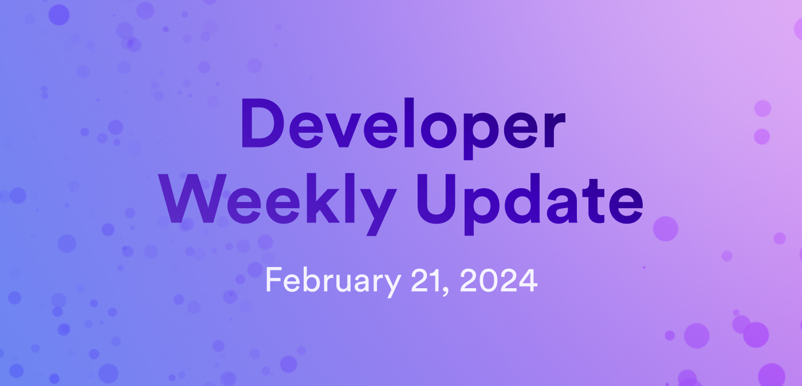

# Developer weekly update February 21, 2024

Hello developers, and welcome to this week's developer weekly update! In this week's update, we have a very important message about a critical security bug in the ICP JavaScript agent, updates from the NFT working group, and info about ICP at ETHDenver next week! Let's get started.

## Critical security vulnerability in the ICP JavaScript agent v1.0.0

A critical security vulnerability in the [ICP JavaScript agent](https://www.npmjs.com/package/@dfinity/agent) versions 1.0.0 and older has been identified and patched. This vulnerability had to do with the [ICP JavaScript agent](https://www.npmjs.com/package/@dfinity/agent) library's `Ed25519KeyIdentity.generate` function, which generates an ed25519 key pair with the optional parameter to provide a 32 byte seed value. Due to a recent change in the [ICP JavaScript agent](https://www.npmjs.com/package/@dfinity/agent), this function was altered so that when no seed value was provided, the library generated an insecure seed for key pair generation. The resulting principal was a constant identity that was based on an all-zero private key. With this vulnerability, attackers could steal funds associated with this principal on a ledger or compromise access to canisters controlled by this principal.

The patch for the vulnerability is available in [ICP JavaScript agent](https://www.npmjs.com/package/@dfinity/agent) [v1.0.1](https://github.com/dfinity/agent-js/releases/tag/v1.0.1). It is encouraged that all developers upgrade and deploy their canisters immediately.

- [Forum post](https://forum.dfinity.org/t/agent-js-insecure-key-generation-in-ed25519keyidentity-generate/27732).

- [GitHub advisory](https://github.com/advisories/GHSA-c9vv-fhgv-cjc3).

- [CVE-2024-1631](https://nvd.nist.gov/vuln/detail/CVE-2024-1631).

## NFT working group updates

The NFT working group has recently concluded work on the ICRC-7 standard and is looking ahead to the next steps for NFTs on ICP. The group has put together 4 possible new ICRC standards that can be pursued by the working group moving forward:

- ICRC-8: Ledger markets: This standard would define marketplace standards for fungible or non-fungible ledgers, including the data structures and workflows necessary to support other token standards and achieve atomic trades.

- ICRC-56: Infinitely scalable multi-canister file system: This standard would define parameters for a standard file system that can be used for storing onchain NFT media.

- ICRC-59: Static NFT metadata interface standard: This standard would define a static standard for NFT metadata.

- ICRC-60: Dynamic NFT metadata interface standard: This standard would define a dynamic standard for NFT metadata.

The NFT working group meets every other Tuesday at 5PM CEST.

[Read more and participate in the discussion on the forum](https://forum.dfinity.org/t/nft-working-group-next-steps-icrc-8-icrc-56-icrc-59-icrc-60/27698).

## Upcoming event: ETHDenver

If you're going to ETHDenver, be sure to stop by the ICP booth! Our team will be hosting and participating in some exciting events:

- Our DevRel engineer Jennifer Tran will be joining the [Encode Club panel](https://www.encode.club/denver2024) to cover L2s.

- [ICP Hubs Meetup Buidl community and technology](https://lu.ma/icp-denver).

- [CryptoMondays - ETH X ICP](https://www.meetup.com/cryptomondays-denver/events/298354132/?utm_medium=referral&utm_campaign=share-btn_savedevents_share_modal&utm_source=link).

- [Stop by the booth to participate in one of the ETHDenver bounties!](https://www.ethdenver.com/buidlathon).

Want to learn more or sign up for email updates on these events? [Join the mailing list](https://mailchi.mp/internetcomputer/ethdenver2024) to stay updated!

That'll wrap up this week. Tune back in next week for more developer updates!

-DFINITY

