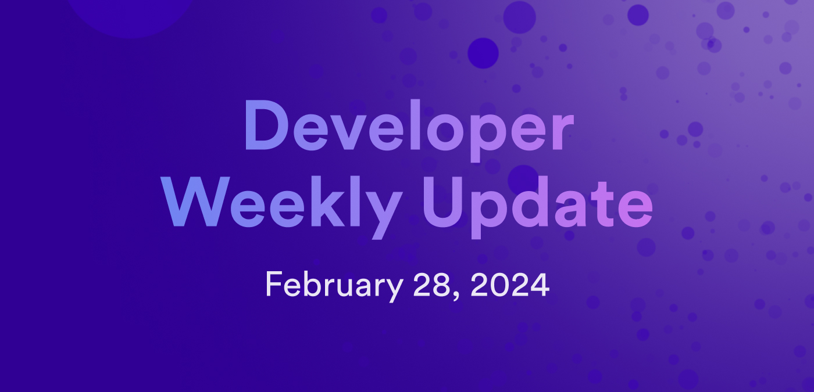

# Developer weekly update February 28, 2024



Hello developers, and welcome to this week's developer weekly update! This week, we have a new episode of the Developer Liftoff, a new benchmarking framework for canisters, and SNS ledger support for ICRC-2 tokens. Let's dive in!

## Developer Liftoff episode 2.1: Canister upgrades, storage, and persistence

Catch up on the latest episode of the ICP Developer Liftoff tutorial series! In this episode, "2.1: Canister upgrades, storage, and persistence", you'll learn about:

- Memory types and terms.
- Upgrading canisters.
- Motoko stable memory workflow.
- Rust stable memory workflow.
- Stable storage and stable variables.
- Defining a stable variable.
- Stable variables in action.

Watch the video on the DFINITY YouTube channel:

<div class="text--center">
<p> </p>
</div>
<div class="text--center">
<iframe width="660" height="415" src="https://www.youtube.com/watch?v=-aXjKSz_oXc&list=PLuhDt1vhGcrdR2h6nPNylXKS4u8L-efvD&index=13" title="YouTube video player" frameborder="0" allow="accelerometer; autoplay; clipboard-write; encrypted-media; gyroscope; picture-in-picture; web-share" allowfullscreen></iframe> </div>

## Canbench

A new benchmarking framework for canisters has been released! This new framework, called **canbench**, is an open-source tool that can be used to understand canister performance through monitoring and analytics.

Canbench currently supports Rust canisters, but additional languages may be added in the future. An example can be found below:

```rust
use canbench::bench;
use candid::{CandidType, Encode};
use ic_cdk_macros::pre_upgrade;
use std::cell::RefCell;

#[derive(CandidType)]
struct User {
    name: String,
}

#[derive(Default, CandidType)]
struct State {
    users: std::collections::BTreeMap<u64, User>,
}

thread_local! {
    static STATE: RefCell<State> = RefCell::new(State::default());
}

#[pre_upgrade]
fn pre_upgrade() {
    // Serialize state.
    let bytes = STATE.with(|s| Encode!(s).unwrap());

    // Write to stable memory.
    ic_cdk::api::stable::StableWriter::default()
        .write(&bytes)
        .unwrap();
}

#[bench]
fn insert_users() {
    STATE.with(|s| {
        let mut s = s.borrow_mut();
        for i in 0..1_000_000 {
            s.users.insert(
                i,
                User {
                    name: "foo".to_string(),
                },
            );
        }
    });
}

fn main() {}
```

The output of this would be:

```
No significant performance changes detected

examples/btreemap_vs_hashmap/canbench_results.yml is up to date


---------------------------------------------------

Benchmark: insert_users
  total:
    instructions: 2.57 B (no change)
    heap_increase: 871 pages (no change)
    stable_memory_increase: 0 pages (no change)

---------------------------------------------------
```

You can learn more about canbench on the [canbench docs](https://docs.rs/canbench-rs/latest/canbench_rs/) and the [forum post announcing canbench](https://forum.dfinity.org/t/introducing-canbench-a-benchmarking-framework-for-canisters/27517).

## ICRC-2 now supported by SNS ledgers

This week, the ICP community voted on proposals to adopt a new version of the SNS index canister suite, which includes new versions of the ledger, archive, and index canisters. This new version means that all newly launched SNS projects will have support for the ICRC-1 token standard. A key feature of the ICRC-2 token standard is the ability for token transfers to be delegated to a third party. Existing SNS projects can upgrade their index canister suite to enable this new functionality.

You can learn more or participate in the discussion on [the ICP developer forum](https://forum.dfinity.org/t/sns-ledgers-now-support-icrc-2/27932).

That'll wrap up this week. Tune back in next week for more developer updates!

-DFINITY

