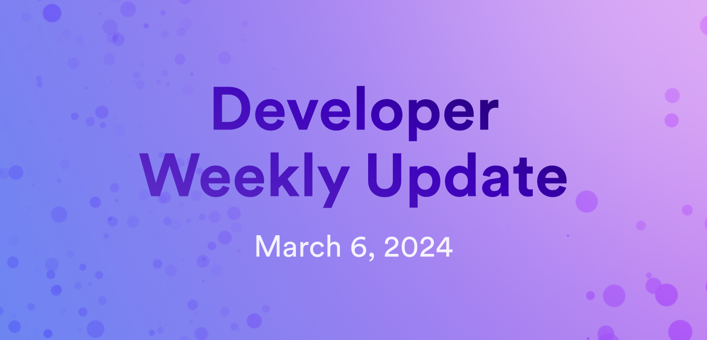

# Developer weekly update March 6, 2024



Hello developers, and welcome to this week's developer weekly update! This week, we'll talk about the exciting new NNS neuron sandbox, some breaking changes to the latest Motoko version (v0.11.0), and a cool community demo featuring Juno and OpenAI. Let's get started!


## NNS neuron sandbox

Have you ever wanted to experiment with neurons without having to stake actual ICP? Introducing the NNS neuron sandbox! This new sandbox platform is an onchain interactive tool that can be used to simulate the behavior of neurons. It is a great resource to learn more about the NNS and understand how to participate in the governance of ICP.

You can use the sandbox to play with different neuron configurations and operations in a safe environment. It also provides insights into the simulated voting power of a neuron and its estimated annualized rewards in the upcoming years. Get started practicing today by heading over to the [NNS neuron sandbox](https://klgza-cqaaa-aaaak-qcz5a-cai.icp0.io/).

Want to ask questions or give the team feedback on this new tool? [Head over to the ICP developer forum!](https://forum.dfinity.org/t/try-out-the-new-nns-neuron-sandbox/27931)


## Motoko v0.11.0: New breaking changes

A new version of Motoko (v0.11.0) introduces a new safety feature that could cause breaking changes to existing code.

This update makes changes to how Motoko handles making calls to sensitive functions. In the past, third-party libraries could make calls to functions such as `ExperimentalCycles.add(...)` and `Timer.setTimer(...)` without providing any indication to the caller that sensitive system functionality was being utilized.

In the newest version of Motoko, the type system has been revised to detect and prevent this scenario. However, it still allows developers to allow sensitive functions to be called.

For example, in previous Motoko versions, the following code snippet could be used:

```motoko no-repl
  func splitCycles() {
    let amount = ExperimentalCycles.balance() / 2;
    ExperimentalCycles.add(amount); // new error
  };
```

In Motoko v0.11.0 and newer, this code will throw a compiler error:

```
`system` capability required, but not available
(need an enclosing async expression or function body or explicit `system` type parameter)(M0197)
```

To support the new changes, the previous code should be rewritten to include the `system` type parameter:

```motoko no-repl
 func splitCycles<system>() {
    let amount = ExperimentalCycles.balance() / 2;
    ExperimentalCycles.add(amount); // warning
  };
```

You can learn more in the [Motoko v0.11.0 migration guide](/docs/motoko/main/migration-guides/0.11.0-migration-guide).

## Juno + OpenAI demo

This week, a new Juno demo has been shared on the forum! This demo showcases how to use Juno's serverless functions to query the OpenAI API by leveraging HTTPS outcalls.

In this demo, you can give OpenAI a prompt, and it will generate an image in response!

You can play with the [demo canister](https://pycrs-xiaaa-aaaal-ab6la-cai.icp0.io/), or check out the [open source code to learn how you can implement something similar in your dapp!](https://github.com/peterpeterparker/juno-openai)

Feedback or questions for the Juno team? [Head over to the forum post for this demo](https://forum.dfinity.org/t/juno-openai-demo/28176).

That'll wrap up this week. Tune back in next week for more developer updates!

-DFINITY
