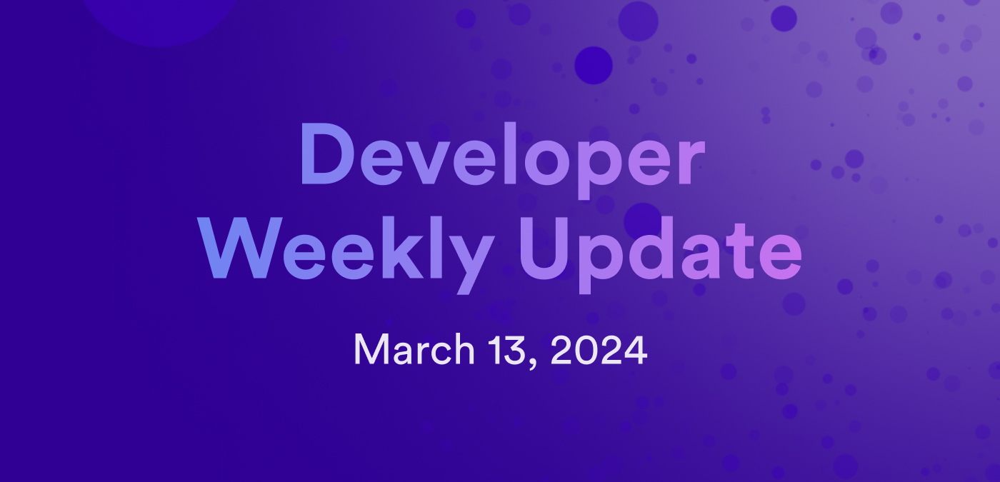

# Developer weekly update March 13, 2024

Hello developers, and welcome to this week's developer weekly update! This week, there is a new release of `dfx` to discuss, new NNS proposals to vote on, and a new community project to explore. Let's get started!

## `dfx` v0.18.0

Last week, `dfx` v0.18.0 was released. Some highlights from this release include:

- `dfx canister logs <canister_id>`: A new subcommand that retrieves a canister's logs. This feature is still under development, but it is an exciting preview of this upcoming functionality!

- Local asset canisters are displayed in a subdomain format of either `<canister_id>.localhost:<port>` or `localhost:<port>?canisterId=<canister_id>`.

- Candid assist: `dfx` now asks for init arguments within the terminal window when a canister requires init arguments.

- `dfxvm` is now installed within the `install.sh` script.

- fix: `.env` fallbacks have been removed.

- fix: The `dfx upgrade` command has been removed.

You can check out the [full release notes on GitHub](https://github.com/dfinity/sdk/releases/tag/0.18.0).

This new version includes breaking changes, and a migration guide has been created to help migrate old workflows to use the latest update. [Read the migration guide on GitHub](https://github.com/dfinity/sdk/blob/master/docs/migration/dfx-0.18.0-migration-guide.md).

v0.180 also includes Motoko v0.11.0, which also includes breaking changes. [Read the Motoko v0.11.0 migration guide](https://internetcomputer.org/docs/motoko/main/migration-guides/0.11.0-migration-guide).

## NNS updates

This week, the following NNS upgrade proposals have been submitted and are open for voting:

NNS Governance:

- Neurons' Fund update: Change the Neuron's Fund participation from 333,000 ICP to 750,000 XDR. Limits are converted to ICP using the 30-day conversation rate from the CMC.

- Proposal summary limit increased for both the NNS and SNS from 15KiB to 30KiB.

- NNS governance metrics will now include the proposal action type.

SNS-W:

- Refactoring and cleanup; no external changes.

Registry:

- Bug fix for Candid service definition.

- Multiple signing subnets for the same key are now allowed.

CMC:

- Make an edit where `canister_settings` now has `log_visibility`.

You can [learn more on the DFINITY forum](https://forum.dfinity.org/t/nns-updates-2024-03-12/28372) about these updates.

## NFID Vaults

A new community project has been shared on the forum! [NFID Vaults](https://nfidvaults.com/) is an omni-chain multi-sig wallet protocol designed to protect personal and shared digital assets.

Each NFID Vault is a smart contract deployed on ICP. The canister is self-controlling and can be verified by searching the [canister ID on the dashboard](https://dashboard.internetcomputer.org/).

NFID Vaults currently includes a 'Pro' version, designed for teams and grant recipients to control how their ICP is spent.

In the future, a 'Light' version will be released that is aimed toward individuals and teams who don't require granular policy controls.

Additional roadmap items for the project include:

- Additional wallet support.

- Additional ICP asset support (ICRC-1, ICRC-7, etc).

- Other network support such as BTC.

- Dev SDK for creating and managing vaults.

[Learn more on the DFINITY forum](https://forum.dfinity.org/t/introducing-nfid-vaults-worlds-first-omni-chain-multi-sig/28370).

That'll wrap up this week. Tune back in next week for more developer updates!

-DFINITY
