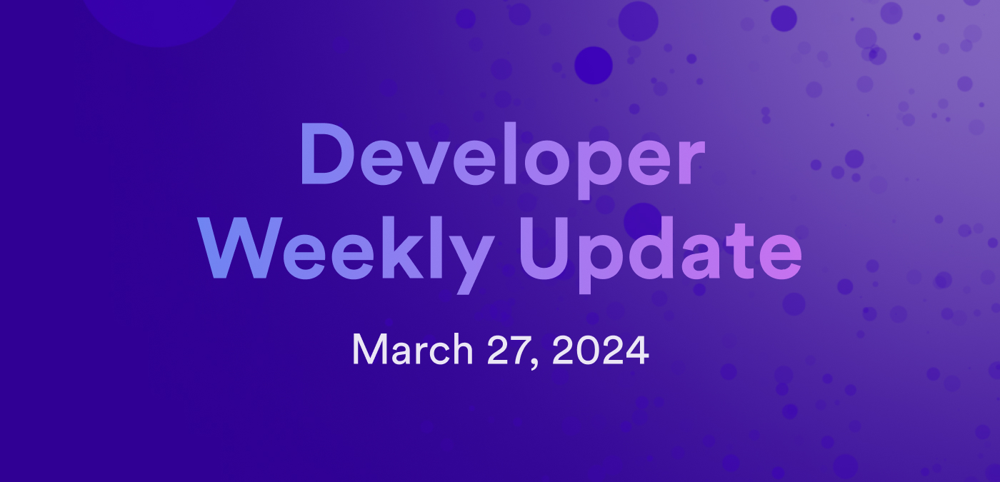

# Developer weekly update March 27, 2024

Hello developers, and welcome to this week's developer weekly update! This week, we have an update on Threshold Schnorr signatures, the ICRC-4 standard, and a new dfx beta release. Let's get started!

## Threshold Schnorr protocol

Threshold Schnorr signatures are coming to ICP! Schnorr signatures are popular on blockchains due to their simple and efficient design. They allow for easy aggregation of multi-signatures and threshold signatures.

For ICP specifically, threshold-Schnorr signatures will enable canisters to obtain their own Schnorr public keys and addresses, request ICP to compute Schnorr signatures for arbitrary messages, and support both BIP-340 and Ed25519.

Opening the door for canisters to engage in these workflows also allows for further developments on ICP, including BRC-20 trading, certificate signing, and potential integrations with other chains that use Ed25519 variants like Solana, Polkadot, or Cardano. Additional multichain possibilities include additional chain-key tokens, like ckBRC20 and ckSOL, and enabling canisters to hold additional multichain assets like SOL, XRP, or ADA.

To implement threshold-Schnorr signatures on ICP, there are several prerequisites that will need to be completed, such as latency and throughput improvements to t-ECDSA.

You can learn more and participate in the conversation on the [ICP developer forum](https://forum.dfinity.org/t/t-schnorr-facilitating-brc-20-trading-solana-integration-certificate-signing-and-more/28993).

## ICRC-4

The ICRC-4 token standard is nearing finalization! ICRC-4 will specify a standard for processing  batch transfers for tokens compliant with ICRC-1. The motivation behind this standard is to facilitate optimized batch transfers within DeFi applications that commonly use multi-party settlements or token distributions.

ICRC-4 will extend the ICRC-1 standard to enable multiple subaccounts owned by a principal to transfer tokens to multiple recipient accounts within a single ledger call. This method will provide reduced latency and cost when compared to traditional multi-account token transfers.

Check out the [ICRC-4 standard](https://github.com/skilesare/ICRC/blob/main/ICRCs/ICRC-4/ICRC-4.md) and participate in the discussion about ICRC-4 on the [developer forum](https://forum.dfinity.org/t/icrc4-batch-transfers-nearing-finalization-please-review/27395/2)

## `dfx` v0.19.0 beta

`dfx` v0.19.0 has been released for initial beta testing! This new release of `dfx` comes with several exciting new features and improvements:

- Support for the highly anticipated cycles ledger. Stay tuned for a dedicated blog post where we interview the team behind to cycles ledger to learn all the details about this feature.

- Hyphenated project names are now supported.

- The `dfx canister call` command now supports the flag `--output json`.

- `dfx canister call/install/sign` and `dfx deploy` commands now support the flag `--always-assist` where `dfx` will enable the Candid assist feature for optional arguments rather than providing a `null` value by default.

This release includes several bug fixes as well, including:

- The output of `dfx ping` is now a valid JSON format.

- Fetching canister logs are now grep and tail compatible.

- Canister logs can now be called using a query call to the method `fetch_canister_logs`.

You can [read the full release notes](https://github.com/dfinity/sdk/releases/tag/0.19.0-beta.0) for more information.

That'll wrap up this week. Tune back in next week for more developer updates!

-DFINITY