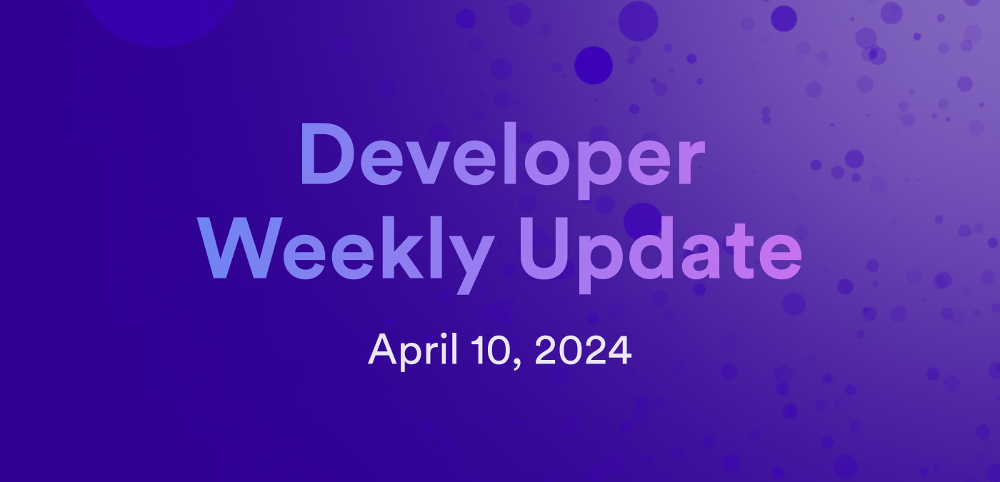

# Developer weekly update April 10, 2024

Hello developers, and welcome to this week's developer weekly update! In this week's update, we have important info regarding an SNS bug, plus two new and exciting community projects. Let's get started!

## SNS bug regarding Treasury Transfer proposals

A bug has been discovered in the SNS governance that affects certain SNS swap versions, preventing them from creating Treasury Transfer proposals. If the three following criteria apply to you, you have been affected:

- You created an SNS before or during summer 2023.

- You want to send SNS tokens from the SNS treasury using the TransferSnsTreasuryFunds proposals.

- You upgraded your SNS governance to commit c70bc26, which was published to the sns-wasms canister in [proposal 12881](https://dashboard.internetcomputer.org/proposal/128811) on 2024-03-26.

A fix is currently in progress, and will be released as soon as possible. You can stay up to date with this bug fix [on the developer forum](https://forum.dfinity.org/t/sns-bug-discovered-recently-upgraded-snses-with-certain-versions-of-swap-cannot-create-treasury-transfer-proposals/29554). 

## ICPsig

ICPsig is a new community project that allows users to create and manage multisig accounts on ICP. The project uses a backend canister that implements multisig logic and a frontend canister for users to interact with multisig accounts.

Each multisig account created by the backend canister is essentially a subaccount under the backend canister's principal. Users can create subaccounts by providing a list of principals that are allowed to sign transactions from the subaccount, or a subaccount can be created with a single principal with the ability to add more principals later.

Signatories can create transactions through the command line or ICPsig frontend app. ICPsig supports the ICP token ledger and the ICRC-1 standard.

Learn more about ICPsig on the [developer forum](https://forum.dfinity.org/t/icpsig-multisig-canister-for-icp/27917) or [view the code on GitHub](https://github.com/ICPsig/icpsig).

## SurveyEase

Another new community project to showcase this week is SurveyEase, an IC-based survey tool for creating, distributing, and analyzing questionnaires. SurveyEase provides a user-friendly survey interface that features flexible question types, survey customization settings, multilingual support, pre-built templates, offline functionality, and more.

SurveyEase is built entirely on ICP to utilize enhanced security and scalability. The backend of SurveyEase is written in Motoko, while the frontend application uses the Flutter framework.

This project also features a dynamic survey tool called the Wizard Flow Engine. This engine orchestrates the user experience based on a JSON payload which defines the sequence of screens, data collected on each screen, and the storage location of that data. This design helps to provide an efficient management and transfer of user data. 

Learn more about SurveyEase on the [developer forum](https://forum.dfinity.org/t/surveyease-a-secure-and-customizable-survey-tool-built-on-the-internet-computer/29419).

That'll wrap up this week. Tune back in next week for more developer updates!

-DFINITY