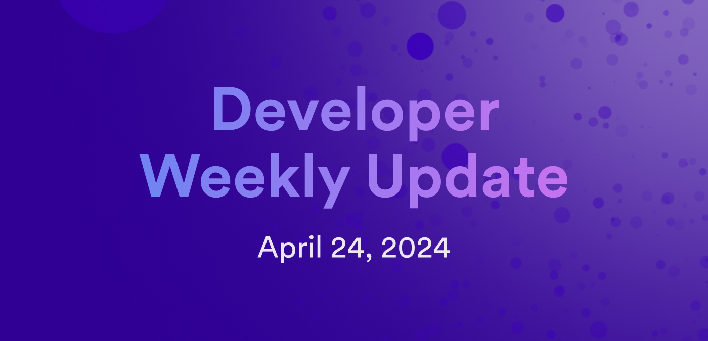

# Developer weekly update April 24, 2024

Hello developers, and welcome to this week's developer weekly update! In this week's update, we're excited to announce that ckUSDC is live on the Sepolia testnet, showcase a community project called Personal DAO, and discuss a post mortem network issue that occurred March 27, 2024. Let's get started!

## ckUSDC live on Sepolia testnet!

ckUSDC is a digital twin of the USDC stable coin. Similar to ckBTC and ckETH, ckUSDC uses chain-key cryptography to create a a token deployed on ICP that is backed 1:1 with USDC.

We're excited to announce that you can now mint and test ckUSDC on the Sepolia testnet! Simply follow these steps:

1. First, obtain Sepolia ETH from a [faucet](https://sepoliafaucet.com/), then obtain Sepolia USDC from another [faucet](https://faucet.circle.com/).

Remember, these are test tokens that are not redeemable for real currencies.

2. Then, use the ckSepoliaETH minter canister (`jzenf-aiaaa-aaaar-qaa7q-cai`) to mint ckSepoliaETH. You need ckSepoliaETH before you can deposit Sepolia USDC and mint ckUSDC.

3. Lastly, use the ckSepoliaETH minter canister again to convert ckSepoliaETH into ckUSDC. You can use the `get_minter_info` method on the [minter canister dashboard](https://dashboard.internetcomputer.org/canister/jzenf-aiaaa-aaaar-qaa7q-cai) to retrieve all supported ckERC20 tokens.

You can find the full instructions [in the ckETH GitHub](https://github.com/dfinity/ic/blob/master/rs/ethereum/cketh/README.adoc).

Find a bug or have any questions? [Participate in the discussion on the forum](https://forum.dfinity.org/t/cketh-a-canister-issued-ether-twin-token-on-the-ic/22819/155).

## Post mortem: subnets cv73p and 4ecnw failed upgrade process on March 27, 2024

On March 27, 2024, a critical incident ocurred regarding the upgrade of two subnets, cv73p and 4ecnw. These subnets failed to upgrade, resulting in an interruption of services for several user applications. The post mortem report details the cause for this outage, a timeline of events, the actions taken to resolve it, and the technical details of how the incident was resolved.

In summary, the upgrade failed due to changes in error code mappings in the recently deployed replica versions. Certain error codes were used in the previous replica version that were replaced with new error codes. The system tried to resume operations after the upgrade, but it did not recognize the error codes that had been replaced. This resulted in a failure to restart the affected subnets.

The team rolled back the affected subnets to their previous stable versions and recovered the subnets successfully. Subnets were recovered within about an hour and a half.

This post mortem report can be found [on the forum](https://forum.dfinity.org/t/post-mortem-subnets-cv73p-and-4ecnw-failed-upgrade-process-on-march-27-2024/29841).

## Community project: Personal DAO

Personal DAO is a new community project that enables users to create their own DAO deployed on ICP that comes with a user interface, URL, API, database, and treasury. These DAOs are tokenized and can be purchased and sold via an NFT marketplace. These personal DAOs can create DAO-controlled neurons, and members of the personal DAO can submit proposals to stake new neurons or stake ICP into the DAO's existing neurons.

You can learn more about Personal DAO, including information about the project's architecture and go to market strategy on [the developer forum](https://forum.dfinity.org/t/personal-dao-a-commoditized-dao-that-functions-as-a-icp-neuron-pool-for-now-more-features-on-the-way/29958).

That'll wrap up this week. Tune back in next week for more developer updates!

-DFINITY