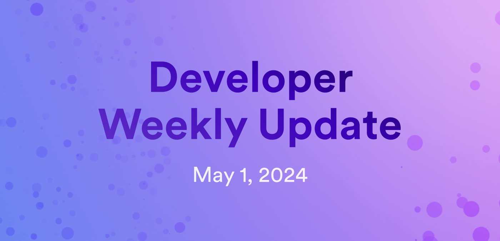

# Developer weekly update May 1, 2024

Hello developers, and welcome to this week's developer weekly update! In this week's update, we have several new developer docs pages to share, a new blog post on extending HTTPS outcalls, and an update on the `dfx` dashboard GUI project. Let's get started!

## New documentation pages

Over the past few weeks, the Dev Docs have gotten several new pages, with a heavy focus on new and improved documentation for the EVM RPC canister. Here's a breakdown of what's new:

- [Candid tools](/docs/building-apps/interact-with-canisters/candid/candid-tools): Learn about how to use `didc`, Candid UI, and `ip-repl`.

- [CanBench](/docs/building-apps/advanced/benchmarking): Learn how to benchmark your canister's memory and instruction usage using the `canbench` crate.

- Want to take a deep dive into the ETH integration? Check out these new pages on the EVM RPC Canister:

    - [Overview](/docs/building-apps/chain-fusion/ethereum/evm-rpc/overview): Learn what the EVM RPC canister is and what purpose it serves for ETH development on ICP.

    - [How it works](/docs/building-apps/chain-fusion/ethereum/evm-rpc/how-it-works): Learn how the EVM RPC canister works.

    - [Costs](/docs/building-apps/chain-fusion/ethereum/evm-rpc/costs): View cost information associated with using the EVM RPC canister.

    - [Sample projects](/docs/building-apps/chain-fusion/ethereum/evm-rpc/evm-rpc-canister): Get inspired by viewing some projects using the EVM RPC canister.

- [Learn how to use GitHub codespaces to deploy canisters](/docs/building-apps/developer-tools/icp-ninja).

- [Learn how to use developer containers](/docs/building-apps/developer-tools/icp-ninja).

## Blog post: Extending HTTPS outcalls

A new blog post written by Roman Kashitsyn has been published that details how HTTPS outcalls can be extended to match current industry standard solutions such as oracles. To summarize, in the blog post Roman proposes that a canister should be able to inspect and aggregate responses from all nodes.

The blog post features a great explanation of how HTTPS outcalls currently work (with nice diagrams!) and how their functionality could be extended to enable further workflows and use cases.

[Check out the full blog post](https://mmapped.blog/posts/27-extending-https-outcalls).

## `dfx` dashboard GUI v2

A community team is currently working on a bounty project to create a dashboard GUI for `dfx` through a native desktop application. This dashboard offers several key features including:

- Identity management: Manage identities through creating, importing, and deleting developer identities in the GUI.

- Canister interaction: Interact with canisters through creating, deleting, calling, and managing them.

- Project management: Create new projects or import existing ones into the GUI application.

- Network management: Manage the `networks.json` file to fit specific needs of your project.

The team is looking for feedback and suggestions! Let them know what other features you're looking for by participating in the [forum post discussion](https://forum.dfinity.org/t/dfx-dashboard-gui-v2-new-features/29975).

That'll wrap up this week. Tune back in next week for more developer updates!

-DFINITY
