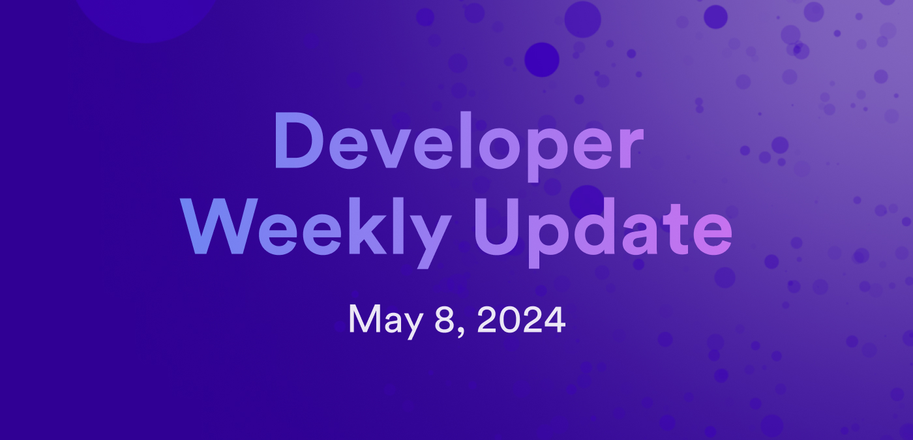

# Developer weekly update May 8, 2024



Hello developers, and welcome to this week's developer weekly update! In this week's update, we have a new release of `dfx`, a new release of PocketIC, and a call for feedback from the development team behind Azle. Let's get started!

## `dfx v0.20.0` has been released!

This week, a new version of `dfx`, v`0.20.0` has been released! You can download and install this latest version with the commands:

```
dfxvm install 0.20.0
dfxvm default 0.20.0
```

This release comes with several new features and bug fixes, including:

- A fix for `CANISTER_CANDID_PATH_<canister name>` to be set properly for remote canister declarations.

- A new way to display the JSON schema for `dfx` metadata through the command `dfx schema --for dfx-metadata`.

- `dfx` metadata has been extended with the object `tech_stack`.

- The `dfx completion` command has been added, which generates shell completion scripts for bash, elvish, fish, zsh, or PowerShell.

- `dfx` will no longer create a `.dfx` directory if `dfx.json` is present.

You can read the full [release notes](https://github.com/dfinity/sdk/releases/tag/0.20.0).

Run into a bug? Let us know on the [developer forum](https://forum.dfinity.org/t/dfx-0-20-0-is-promoted/30471).

## PocketIC version 4 has been released!

PocketIC v4 has been release, introducing new capability with agent-based tools through HTTP compatibility. This release also enables you to browse frontend canisters while they are running on PocketIC and make concurrent update calls!

To use the HTTP compatibility, you need to explicitly make an instance live by calling `make_live(...)` on it which does the following:

- Launches a thread that calls `tick()` and `advance_time(...)` on the instance several times per second.

- Creates a gateway similar to icx-proxy which points to the live instance.

- Returns a gateway URL which can then be passed to tools using HTTP, such as agents.

To use concurrent update calls, an `update_call` can be expressed with a new method such as:

```
let message_id = pic.submit_call(..., payload)?;
pic.await_call(message_id)
```

You can read the full details of the release on [the developer forum](https://forum.dfinity.org/t/pocketic-version-4-0-0-ic-http-interface-compatibility/30281).


## Call for feedback: Azle

Attention Azle developers! The Demergent Labs team has asked for your participation in a survey regarding which features the team should prioritize the development of.

Let the team know your thoughts! Complete [the survey today](https://t.co/hLWNHvWiZI)!

## ICP DevConf

The online conference ICP DevConf has been announced! This conference will run from July 17-19 and is free to all participants worldwide! It will feature several online talk sessions and workshops on various ICP topics, such as:

- ICP fundamentals

- Smart contracts

- Chain fusion

- Decentralized AI

- DeFI & NFTs

- DAOs

- Tooling & CDKs

Register for your spot today at [https://icpdevconf.com/](https://icpdevconf.com/)!

That'll wrap up this week. Tune back in next week for more developer updates!

-DFINITY


