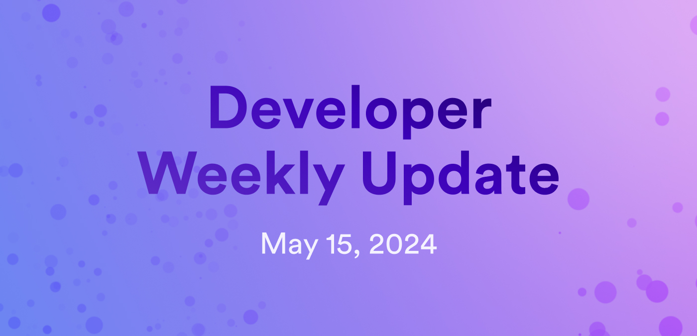

# Developer weekly update May 15, 2024

Hello developers, and welcome to this week's developer weekly update! In this week's update, there is an important community PSA regarding an upcoming Wasm memory change, an NNS update, and a community project to showcase. Let's get started!

## PSA: Upcoming Wasm memory change

Attention developers! In the next few weeks, there will be a proposed change regarding Wasm memory limits. This proposed change would reduce the Wasm memory available to a canister from 4GiB to 3GiB through a new field `wasm_memory_limit`, which will be set to 3GiB by default.

Developers will be able tp opt out of this restriction by setting `wasm_memory_limit=4GiB` your in canister settings using `dfx` version` 0.20.1-beta.0` or higher. Opting out of this restriction is risky, and requires you to program your canister very carefully.

The reason for this change is to protect canisters from unrecoverable memory errors. Wasm memory uses a 32-bit architecture and cannot grow beyond 4Gib. When a canister stores user data in Wasm memory rather than stable memory, the memory usage grows with each new user. Canisters using this design could reach that limit of 4GiB, where they would be unable to allocate additional memory, and thus stop working. If this happens to a canister, both the canister and its data are unrecoverable. Even if user data isn't stored in Wasm memory, memory usage can be filled other ways, such as through memory leak.

The new 3GiB restriction is a soft limit, meaning when a canister exceeds this amount, messages will begin to fall. The developer will be alerted to a potential memory problem and have time to upgrade the canister appropriately.

You can read more about this upcoming change on [the developer forum](https://forum.dfinity.org/t/psa-upcoming-wasm-memory-limit-may-break-your-canisters/30766).

## NNS update May 15, 2024

An important NNS hotfix has been applied on May 15, 2024. This hotfix addressed a security bug in the cycles minting canister (CMC). This vulnerability could be exploited in a scenario such as:

An attacker A sends some ICP to the CMC. The destination subaccount corresponds to controller principal (P), who is authorized to create canisters on restricted subnet (S). Another canister (A), who is not authorized to create canisters on subnet (S), could call the method `CMC.notify_create_canister` and pass (P) via the `NotifyCreateCanister.controller` field. The result would be that the CMC creates a canister on subnet (S), though the CMC should not allow this, because (P) is the one who is authorized. Furthermore, A could specify an arbitrary controller for the new canister by using the `NotifyCreateCanister.settings` field, such that they could make themselves the sole controller of the new canister.

Additional exploitation scenarios can be found on the [forum](https://forum.dfinity.org/t/nns-update-2024-05-15-cycles-minting-canister-hotfix-proposal-129728/30807), which details the source of this vulnerability and how it was resolved.

[Proposal 129728](https://dashboard.internetcomputer.org/proposal/129728) was made and executed to apply the hotfix.

## Community showcase: Circuitz

Circuitz is an Integration Platform as a Service (IPaaS) platform for the IC ecosystem. It is designed to simplify the process of integrating with different canisters, allowing for seamless data exchange. The goal of the project is to simplify data integration and management on ICP.

Key features of the platform are:

- Data mapping.

- Node filtering.

- Node lookup filtering.

Circuitz is designed for users that want to streamline their workflows for building and managing ICP applications, or non-developer individuals, like business analysts, who want to interact with an interface to obtain data from different canisters.

[Learn more or ask questions about Circuitz on the developer forum](https://forum.dfinity.org/t/circuitz-ipaas-on-the-ic/30590).

That'll wrap up this week. Tune back in next week for more developer updates!

-DFINITY
