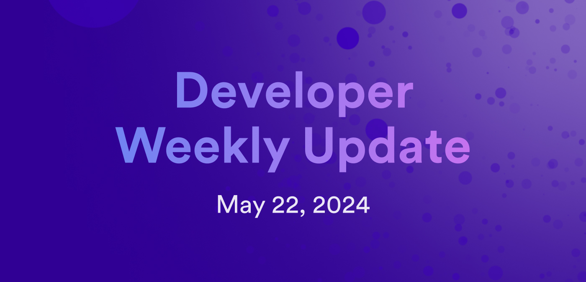

# Developer weekly update May 22, 2024

Hello developers, and welcome to this week's developer weekly update! In this week's update, we talk about ICP's third anniversary celebration, ckUSDC's mainnet launch, several new documentation pages on using the Rosetta 2.0 implementation, and we check out the latest Developer Liftoff video. Let's get started!

## ICP's third anniversary celebration: Beyond the blockchain

To celebrate ICP's third anniversary, DFINITY has organized an all-day event jam packed with keynotes, panels, and demos focusing on cryptography, multi chain, AI, identity, and DAOs. The celebration includes contributions from several team members, ICP.Hubs, partners, builders, and enthusiasts.

Want to learn more about how ICP has been running for the past 3 years? Check out [this video](https://twitter.com/dominic_w/status/1793391153326285102) from Dominic Williams, founder and chief scientist.

## ckUSDC is now live on the mainnet!

The ckUSDC token has been launched on the ICP mainnet! Developers can now integrate and support the token by using the following ledger and index canisters:

- Ledger canister ID: `xevnm-gaaaa-aaaar-qafnq-cai`

- Ledger installed Wasm hash: `4ca82938d223c77909dcf594a49ea72c07fd513726cfa7a367dd0be0d6abc679`

- Index canister ID: `xrs4b-hiaaa-aaaar-qafoa-cai`

- Index installed Wasm hash: `55dd5ea22b65adf877cea893765561ae290b52e7fdfdc043b5c18ffbaaa78f33`

You can view the transaction history and metadata for ckUSDC on the [ckUSDC dashboard](https://sv3dd-oaaaa-aaaar-qacoa-cai.raw.icp0.io/dashboard).

## Rosetta 2.0 documentation

The developer docs recently released new and improved documentation on the ICP Rosetta 2.0 implementation, which features APIs for ICP and ICRC tokens and supports workflows for retrieving data.

The new [ICP Rosetta implementation](https://internetcomputer.org/docs/defi/rosetta/icp_rosetta/) offers two APIs: the Data API and the Construction API for interacting with ICP tokens.

The ICP [Rosetta Data API](https://internetcomputer.org/docs/defi/rosetta/icp_rosetta/data_api/) can be used to:

- Fetch network-specific info and NNS proposal info.

- Query the balance of an account or neuron.

- Return blocks and transactions from the ICP ledger.

- List of all publicly known neurons.

The [ICP Rosetta Construction API](https://internetcomputer.org/docs/defi/rosetta/icp_rosetta/construction_api/) can be used to:

- Transfer ICP.

- Stake ICP and manage neurons.

- Configure voting and following for your neurons.

The [ICRC Rosetta implementation](https://internetcomputer.org/docs/defi/rosetta/icrc_rosetta/) also offers similar APIs for interacting with ICRC tokens instead of ICP tokens. The APIs have the same names, Data and Construction, but have different endpoints and capabilities.

Currently, the ICRC Rosetta Construction API supports one category of transactions, which is the transfer of assets. According to the ICRC-1 and ICRC-2 standards, this can be done using direct transfers, in accordance with the ICRC-1 standard and approving spenders, which uses the ICRC-2 standard to approve a spender to spend your tokens for you.

Check out the ICP [developer docs](https://internetcomputer.org/docs/defi/rosetta/icp_rosetta/) for more info!

## Developer Liftoff 3.4: Introduction to agents

In the latest episode of the ICP Developer Liftoff series, developers learn about what an agent is and how it can be used within their project. This video covers:

- What an agent is.

- What tasks does an agent do, such as structuring data, decoding data, and managing authentication.

- Currently available agents, both developed by DFINITY and community-contributed agents.

- How to use the JavaScript agent to create a simple random maze application.

Check out the [video tutorial on Youtube](https://www.youtube.com/watch?v=8Z_w_JQkxfk) or follow the written tutorial on the [developer docs](/docs/tutorials/developer-liftoff/level-3/3.4-intro-to-agents).

That'll wrap up this week. Tune back in next week for more developer updates!

-DFINITY
