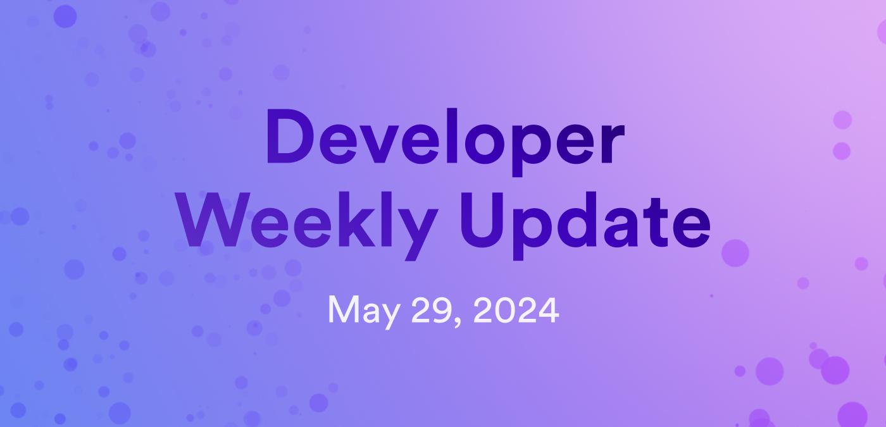

# Developer weekly update May 29, 2024

Hello developers, and welcome to this week's developer weekly update! In this week's update, we're excited to announce the official release of the EVM RPC canister, ICP's plans for Consensus 2024 this week in Austin, TX, and share some docs updates. Let's get started!

## EVM RPC Canister official release

The EVM RPC Canister has officially been released! The EVM RPC Canister provides an onchain API that is used to communicate with smart contracts on Ethereum and other EVM-compatible networks directly from ICP without using an intermediary oracle or bridge. The canister uses JSON-RPC calls to communicate with Ethereum and other EVM networks, managing and rotating the JSON-RPC API keys on the backend, making the interaction for ICP devs seamless and straightforward. All ICP devs need to do is attach cycles to their call, and the EVM RPC Canister takes care of the rest.

For the past few months, the feature has been in beta testing and we've collected lots of great feedback from developers and other community members regarding the canister's functionality, usability, and its associated documentation. The DFINITY engineering teams have been hard at work to polish the feature for release, which included handing over the canister to the NNS. Moving forward, all updates and changes to the canister must go through the NNS proposal and voting process.

You can read the full release announcement on the [DFINITY Medium blog](https://medium.com/dfinity/icp-ethereum-how-icps-evm-rpc-canister-connects-the-networks-b57909efecf6), or you can check out the developer documentation to get started using the EVM RPC Canister today:

- [Overview](/docs/building-apps/chain-fusion/ethereum/evm-rpc/overview): Learn what the EVM RPC canister is and what purpose it serves for ETH development on ICP.

- [How it works](/docs/building-apps/chain-fusion/ethereum/evm-rpc/how-it-works): Learn how the EVM RPC canister works.

- [Costs](/docs/building-apps/chain-fusion/ethereum/evm-rpc/costs): View cost information associated with using the EVM RPC canister.

- [Sample projects](/docs/building-apps/chain-fusion/ethereum/evm-rpc/evm-rpc-canister): Get inspired by viewing some projects using the EVM RPC canister.

## ICP @ Consensus 2024

Attending Consensus 2024 this week in Austin, TX? Look out for the DFINITY team! A few team members will be at the conference, attending the hackathon, and attending side events with our partners and community members, such as ICP.Hubs North America and Mexico!

Want to learn more or connect with the team going? Let us know on [the ICP dev forum](https://forum.dfinity.org/t/icp-at-consensus-2024/31135).

## New documentation

Over the past few weeks, several new documentation pages have been released! Among these new docs are several pages on developer tooling and Chain Fusion workflows:

- [idl2json](/docs/building-apps/interact-with-canisters/idl2json)

- [ic-js](/docs/building-apps/developer-tools/ic-js)

- [Hardware wallet CLI tool](/docs/defi/overview)

- [Token integration](/docs/defi/token-integrations/)

- [Ethereum dev workflow](/docs/building-apps/chain-fusion/ethereum/using-eth/eth-dev-workflow)

- [Bitcoin dev workflow](/docs/building-apps/chain-fusion/bitcoin/using-btc/btc-dev-workflow)

That'll wrap up this week. Tune back in next week for more developer updates!

-DFINITY