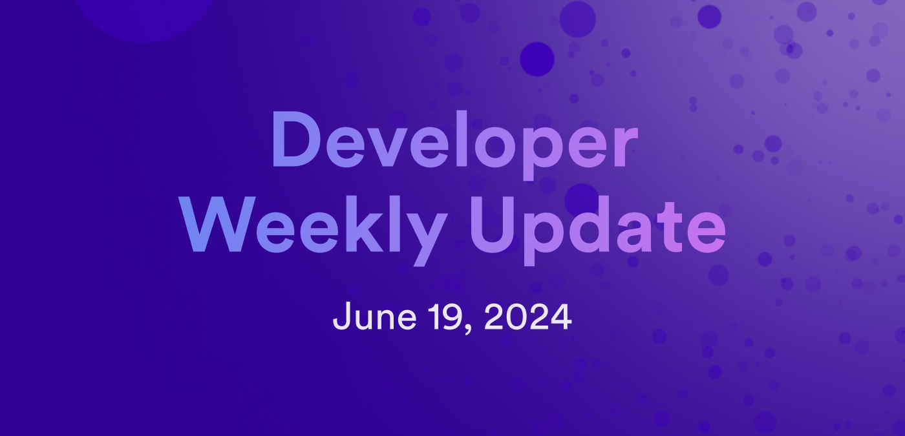

# Developer weekly update June 19, 2024

Hello developers, and welcome to this week's developer weekly update! In this week's update, we have a new beta of `dfx` that introduces support for PocketIC, the release of the Motoko 2024 roadmap, and a community project to showcase. Let's get started!

## `dfx v0.20.2-beta.0`

In the recent beta of `dfx`, version `v0.20.2-beta.0`, the long-awaited support for PocketIC is here! [PocketIC](/docs/building-apps/test/pocket-ic) is a lightweight testing suite designed for creating fine-grained canister tests on your local machine. It supports running tests in parallel and setting specific testing variables, such as stable memory.

To use PocketIC with `dfx`, you can use the new flag `--pocketic` with `dfx start` to start a PocketIC server instead of the local replica. The PocketIC server is more lightweight than the replica, and the execution environment's internals can be interacted with through REST commands.

In addition to PocketIC support, `v0.20.2` includes other new features such as:

- Improved sync command performance, such as `dfx deploy` and `icx-asset sync`.

- A subaccount can now be derived from a principal in `dfx ledger account-id`.

- The command `dfx info candid-ui-url` displays the URL for a canister's Candid UI for an explicitly specific network. The default is the local network.

This release includes the following fixes:

- A fix for `dfx canister delete` failing if it attempts to withdraw too many cycles before the canister is deleted.

- Include the `.well-known` directory by default for asset uploads in frontend canisters.

- A fix for when `dfx ledger create-canister` with the `--next-to` flag would transfer funds too early.

[Read the full release notes](https://github.com/dfinity/sdk/releases/tag/0.20.2).

## Motoko roadmap 2024

The Motoko 2024 roadmap has been [announced on the forum](https://forum.dfinity.org/t/motoko-2024-roadmap/31912)! This roadmap is jam packed with exciting new features and changes to the language, with a focus on addressing feedback the team has received from the Motoko developer community.

Some highlights from the roadmap include:

- Base library 2.0: The team plans to revamp some of the most common base library methods and provide a better template for the community to use when developing base library additions.

- FFI via Wasm component model: An exploration into how to support multi-language canisters, such as a Motoko program using a Rust crate, is planned for 2024.

- VSCode extension enhancements: By popular demand, the VSCode extension will receive several added features and enhancements.

- Canister state snapshots: Support for creating a snapshot of a canister's state that can be used to roll back the canister in the future.

- Actor mixins: This feature would allow a Motoko canister to import an actor when the canister already has an actor defined.

- Enhanced orthogonal persistence: A fundamental change to how the heap and stable memory interact with each other, resulting in a simpler and more seamless experience while working with persistent data.

View the full roadmap on the [dev forum](https://forum.dfinity.org/t/motoko-2024-roadmap/31912).

## Community showcase: MAIA: Medical AI assistant

Introducing MAIA, the medical AI assistant on ICP! This project intends to use AI image classification models to help provide medical professionals with a supporting source when diagnosing certain conditions. In the initial phase of the project, it plans to support analyzing CT scans for brain, kidney, and lung diagnosis purposes, as well as analyze chest x-rays, skin lesion images, and answer basic medical questions.

An initial demo of the project can be seen [on the developer forum](https://forum.dfinity.org/t/introducing-maia-medical-ai-assistant-on-internet-computer/32022).

That'll wrap up this week. Tune back in next week for more developer updates!

-DFINITY
