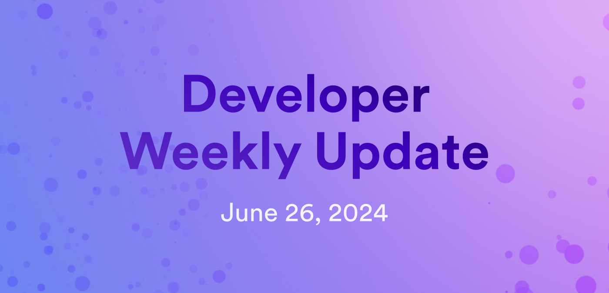

# Developer weekly update June 26, 2024

Hello developers, and welcome to this week's developer weekly update! In this week's update, we're excited to share several new pages of documentation, a proposal for a new ckERC20 token, and provide information about upcoming ICP events. Let's get started!

## New docs

This week, the ICP Dev Docs received several new additions, including digital asset pages for wallets and NFTs, plus new Chain Fusion pages that detail ckERC20 tokens and a list of different chains supported by ICP. Here are the details:

- [Wallet overview](/docs/defi/overview): Learn about types of asset wallets on ICP.

- [NFTs overview](/docs/defi/overview): Learn about ICP's NFT standards, ICRC-7 and ICRC-37.

- [NFT collections](/docs/defi/overview): A tutorial using ICRC-7 to deploy your own NFT collection.

- [NFT marketplaces](/docs/defi/overview): A list of dapps on ICP that support buying and selling NFTs.

- [Supported chains](/docs/building-apps/chain-fusion/supported-chains): A list of chains that ICP can integrate with using native integrations or an RPC service through HTTPS outcalls

- [ckERC20 overview](/docs/defi/chain-key-tokens/ckerc20/overview): Learn about ckERC20 tokens, such as ckUSDC and ckLINK.

- [ckERC20 transactions](/docs/defi/chain-key-tokens/ckerc20/making-transactions): Swap ckERC20 tokens for ERC20 tokens and vice versa.

- [ckERC20 in dapps](/docs/defi/chain-key-tokens/ckerc20/using-ckerc20-in-dapps): Learn how to target a ledger canister in your code for ckERC20 tokens.

## ckPEPE proposal

A new ckERC20 token has been proposed! So far, we've seen the deployment of ckUSDC and ckLINK on ICP, but a third token has been submitted to the NNS for approval: ckPEPE! This would be a chain-key twin token of the PEPE ERC-20 token deployed on Ethereum. PEPE is considered a 'memecoin', meaning it was named after a character, individual, animal, or piece of artwork, and is used for entertainment purposes.

[Vote on the NNS proposal](https://nns.ic0.app/proposal/?u=qoctq-giaaa-aaaaa-aaaea-cai&proposal=130755).

## Upcoming events

Chain Fusion Summer is in full swing with some great in person and virtual events planned over the next few months. Here are some we're excited for:

- Chain Fusion Day in Brussels on July 10th: An in person event at the ETHCC conference. [RSVP](https://lu.ma/ycx0it2u).

- Chain Fusion Day in Nashville on July 26th: An in person event at the Bitcoin Nashville conference. [RSVP](https://lu.ma/cfdnashville).

- ICP Dev Conf: An online conference featuring keynote speakers and developer workshops. [Register here](https://sessionize.com/icp-devconf-2024/).

- Hackernoon writing contest: An online event where writers can enter a piece about AI on ICP and have a chance to win a portion of the $1,000 prize pool. [Enter today](https://hackernoon.com/win-big-in-the-decentralize-ai-writing-contest-by-icp-and-hackernoon).

That'll wrap up this week. Tune back in next week for more developer updates!

-DFINITY