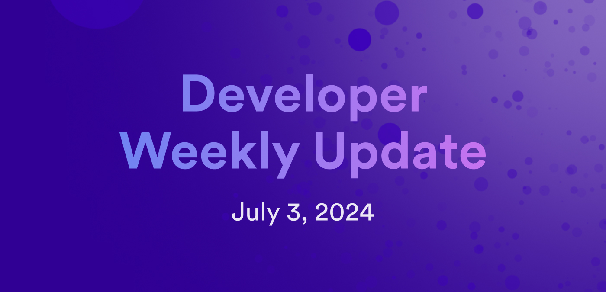

# Developer weekly update July 3, 2024

Hello developers, and welcome to this week's developer weekly update! In this week's update, we have new chain-key tokens live on the mainnet, proposals for updates to the NNS and SNSes, and a request for community feedback on the proposed ICRC-4 standard. Let's get started!

## ckPEPE and ckOCT

This past week, two proposals for new ckERC20 tokens were passed: ckPEPE and ckOCT! ckPEPE is a digital twin of the Ethereum meme token PEPE, while ckOCT is the digital twin of OCT, the native token for Omnity Network, previously known as Octopus Network.

ckPEPE is intended to bring its popular memecoin counterpart to ICP, with the hope of paving the way for other meme chain-key tokens such as ckDOGE in the future. ckOCT intends to migrate the liquidity of OCT onto ICP since Omnity Network is an ICP project. Omnity plans to launch their SNS token later this year, allowing ckOCT to be swapped for the Omnity SNS tokens.

To learn more about creating ckERC20 tokens, check out the [developer documentation](/docs/defi/chain-key-tokens/ckerc20/overview).

## NNS and SNS update proposals

This week's NNS update proposal features the following improvements and enhancements:

- Enhanced API and performance improvements for the `list_neurons` method, now allowing empty neurons to be excluded.

- Improvements to logging.

- `registry_version` is being used to calculate the monthly node provider rewards.

You can view the proposal details on the [developer forum](https://forum.dfinity.org/t/nns-updates-june-28-2024/32493).

Additionally, this week there is a proposal for an SNS update to improve logging for failed upgrades. You can view this proposal on the [developer forum](https://forum.dfinity.org/t/sns-updates-june-28-2024/32494) as well.

## Request for feedback: ICRC-4

The tokenization and ledger working group has announced that the ICRC-4 standard is nearing finalization and is ready for review, comments, and feedback.

ICRC-4 would introduce a standard for batch processing transfers for fungible ICRC-1 tokens. The motivation behind this standard is to optimize and reduce the cost of executing multiple transfers that originate from the same principal.

ICRC-4 would be an extension of ICRC-1 that enables multiple subaccounts owned by a principal to transfer tokens to multiple recipient accounts in a single ledger call. This workflow would reduce the latency and overall cost that the current multi-account token transfer workflow experiences.

Please leave your feedback in the [ICRC-4 discussion forum post](https://forum.dfinity.org/t/icrc4-batch-transfers-nearing-finalization-please-review/27395) or the related [GitHub issue](https://github.com/dfinity/ICRC/issues/4).

If you'd like to participate in the tokenization and ledger working group, consult the [working group events calendar](https://calendar.google.com/calendar/embed?src=c_cgoeq917rpeap7vse3is1hl310%40group.calendar.google.com&ctz=Europe%2FZurich).

That'll wrap up this week. Tune back in next week for more developer updates!

-DFINITY