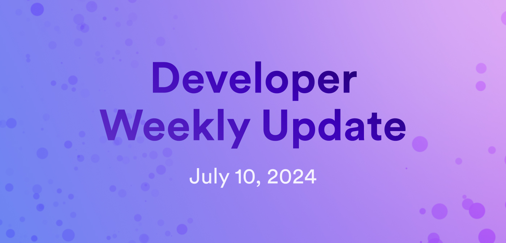

# Developer weekly update July 10, 2024



Hello developers, and welcome to this week's developer weekly update! In this week's update, we have new releases of `dfx`, Motoko, and quill, a new video series called 'NNS Explained', and the release of a new e2e testing plugin for Internet Identity. Let's get started!

## Developer tooling releases: dfx, Motoko, and quill

This week, developer tooling received several updates with new releases of `dfx`, Motoko, and quill. Let's take a look at what each new release includes.

### dfx

A new beta release of `dfx` is available for testing! `v0.22.2-beta` includes several highly anticipated features and bug fixes:

- Asset uploads: If an asset upload returns an HTTP error from the replica, retries are done automatically. Errors that will be retried include:

    - 500: Internal server error

    - 502: Bad gateway

    - 503: Service unavailable

    - 504: Gateway timeout

    - 429: Too many requests

- Cycles ledger: The cycles ledger is supported unconditionally without needing to opt-in to the feature manually.

- Added `dfx` schema support for .json files.

- `dfx extension install`: Uses the extension's `dependencies.json` file to pick the most compatible version.

- Threshold Schnorr support: Enabled Threshold Schnorr signatures for `Bip340Secp256k1`.

- Bug fix: Allow canisters to be deployed even if unrelated canisters in `dfx.json` are malformed.

- Bug fix: Remove the unsafe-eval content security policy from the default starter template.

- Bug fix: `dfx build` no longer requires a password for password-protected identities.

[Read the full release notes](https://github.com/dfinity/sdk/releases/tag/0.22.0-beta.0). 

### Motoko

Motoko `v0.11.2` has been released! Changes in this new version include:

- Deprecation of the base library's ExperimentalStableMemory (ESM). A new flag `--experimental-stable-memory <n> controls the level of deprecation` with the options of:

    - `n < 0`: Error on use of stable memory primitives.
    - `n = 0`: Warn on use of stable memory primitives.
    - `n > 1`: Warning-less use of stable memory primitives (for legacy applications).

Developers using ExperimentalStableMemory should consider migrating their code to use the library `Region.mo` instead.

- Only warn on unused identifiers if type checking is error-free.

- Bug fix: Fix the detection of unused declarations in switch and catch alternatives.

[Read the full release notes](https://github.com/dfinity/motoko/releases/tag/0.11.2).

### quill

A new version of quill, `v0.5.0` has been published. Updates in this release include:

- PEM files are now password-protected by default. PEM files must be used instead of seed files.

- All commands now have human-readable output instead of Candid IDL format. Candid IDL can be provided using the `--raw` flag.

- Support for setting the install mode for UpgradeSnsControlledCanister proposals.

- Removal of the ability to claim GTC neurons via Ledger devices.

[Read the full release notes](https://github.com/dfinity/quill/releases/tag/v0.5.0).

## 'NNS Explained' series

We're excited to announce a new YouTube video series: NNS Explained! This series is designed to provide education around high level NNS concepts, including how to interact with the NNS and how to verify a proposal's authenticity.

This series was created in response to an increased interest in the NNS from the ICP community. Since the NNS is such an important component of ICP, the team felt that this series would be extremely beneficial. 

You can [learn more on the forum](https://forum.dfinity.org/t/announcement-nns-explained-youtube-series/32337) or start the series on [YouTube](https://www.youtube.com/playlist?list=PLuhDt1vhGcrclxfmztDd6OKE80dnrFmG6). 


## Internet Identity e2e testing: Playwright plugin

A new way to execute e2e testing for Internet Identity has been released. The II Playwright plugin was designed to replicate an e2e plugin used to test Metamask authentication workflows, providing the same e2e test format for Internet Identity.

To use the plugin, simply install the package `@dfinity/internet-identity-playwright`, then write your tests:

```
import {testWithII} from '@dfinity/internet-identity-playwright';

testWithII('should sign-in with a new user', async ({page, iiPage}) => {
  await page.goto('/');

  await iiPage.signInWithNewIdentity();
});
```

Want to learn more? Check out the [forum post](https://forum.dfinity.org/t/internet-identity-playwright-plugin/33020).

That'll wrap up this week. Tune back in next week for more developer updates!

-DFINITY